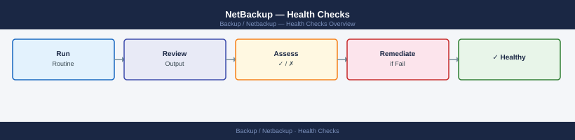

---
tags:
  - netbackup
  - operations
---
# NetBackup — Health Checks


<div class="kb-summary">
Health Checks reference covering Daily Check Flow, Daily Checklist, Job Monitoring, Validation.

*Applies to: NetBackup 10.x*
</div>



## Before you begin

- **Access:** Backup admin role on backup server; target system credentials
- **Timing:** safe to run during business hours unless a step is marked ⚠ (causes interruption)
- **Dependencies:** no active upgrades or migrations on the same infrastructure
- **Logging:** capture command output — paste into the change record on completion

---

## Run This Routine

Run these commands on the NetBackup Primary Server each morning for a complete health snapshot.

1. **NBU services status** — confirm all NetBackup daemons/services are running:
   ```bash
   nbservices
   ```
2. **Job activity summary** — review active and queued job counts:
   ```bash
   bpdbjobs -summary
   ```
3. **Failed jobs (last 24 h)** — list all failed jobs with detail:
   ```bash
   bpdbjobs -filter starttime=-24:00:00,status=FAILED -l | head -50
   ```
4. **Media server connectivity** — test connectivity to each media server (repeat per host):
   ```bash
   bptestbpcd -host <media-server>
   ```
5. **Storage unit status** — confirm all STUs are Online:
   ```bash
   nbdevquery -liststu -U
   ```
6. **MSDP pool status** — check dedup pool free space:
   ```bash
   nbdevquery -listdp -U
   ```
7. **Client connectivity sample** — spot-check critical clients (repeat per host):
   ```bash
   bptestbpcd -host <client>
   ```
8. **Catalog backup recency** — confirm catalog was backed up recently:
   ```bash
   bpbackupdb -h <primary-server> -l | head -5
   ```
9. **Policy compliance** — verify a critical policy completed successfully in the last 24 h:
   ```bash
   bpdbjobs -filter policy=<critical-policy>,starttime=-24:00:00 -l
   ```
10. **License check** — confirm licence keys are valid and not expired:
    ```bash
    nbdevconfig -listconfig | grep -i license
    ```
    Or check Admin Console → Host Properties → License Keys.

## Daily Check Flow


## Daily Checklist

Run these checks each morning to confirm a healthy NetBackup environment.

- [ ] `bpjobs -summary` — review totals; zero failed is the target
- [ ] `bpdbjobs -report -failed -hoursago 24` — investigate each failure
- [ ] Confirm catalog backup job completed successfully
- [ ] `bpstulist` — check `Total Capacity` vs `Free Space` on all disk STUs
- [ ] `nbemmcmd -listhosts` — verify all media servers are registered and reachable
- [ ] OpsCenter / Admin Console — review any active alerts

**Weekly**

- Verify tape media inventory if tape library in use (`tpconfig -d`, `vmquery -b`)
- Review policy schedule calendar for upcoming full backup windows
- Confirm deduplication ratio on OST storage units (Data Domain DDOS UI)

## Job Monitoring

Use this section for practical NetBackup job monitoring notes, checks, troubleshooting, commands, change notes, and field references.

### Common checks

- Confirm current health
- Review active alerts
- Check recent changes
- Confirm dependencies
- Check logs, events, and monitoring
- Capture current state before changes

### Incident notes

Capture:

- Symptom
- Start time
- Impact
- System or service name
- Error message
- What changed
- What was checked
- Next action

### Change notes

- Confirm change approval
- Confirm maintenance window
- Confirm rollback plan
- Capture current state
- Make one change at a time
- Validate after the change

### Useful commands

Add tested commands here.

### Known issues

Add known issues here as they come up.

## Validation

Use this section for practical NetBackup Validation notes, checks, troubleshooting, commands, change notes, and field references.

### Common checks

- Confirm current health
- Review active alerts
- Check recent changes
- Confirm dependencies
- Check logs, events, and monitoring
- Capture current state before changes

### Incident notes

Capture:

- Symptom
- Start time
- Impact
- System or service name
- Error message
- What changed
- What was checked
- Next action

### Change notes

- Confirm change approval
- Confirm maintenance window
- Confirm rollback plan
- Capture current state
- Make one change at a time
- Validate after the change

### Useful commands

Add tested commands here.

### Known issues

Add known issues here as they come up.

---

## Verify

- No jobs in `Failed` or `Incomplete` state in Activity Monitor
- Catalog backup completed within the last 24 hours
- Media server disk pool utilisation is below 85%
- Client connectivity test passes for all protected servers

---

## See also

- [Netbackup — Procedures](../procedures/)
- [Netbackup — CLI Reference](../cli-reference/)
- [Netbackup — Common Issues](../../troubleshooting/common-issues/)
