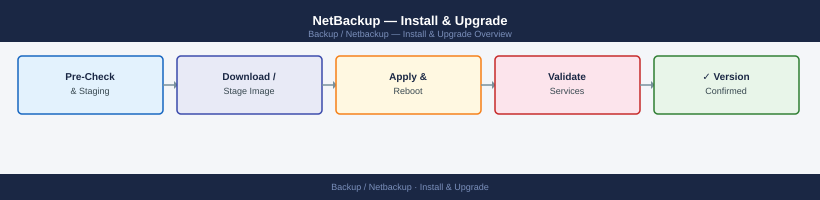

---
tags:
  - netbackup
  - operations
---
# NetBackup — Install & Upgrade


<div class="kb-summary">
Install & Upgrade reference covering Release Cadence, Upgrade Order, Migration: Physical Master to Appliance, License Lifecycle.

*Applies to: NetBackup 10.x*
</div>



```d2
direction: right

plan: "Plan" {shape: oval}
release_cadence: "Release Cadence" {shape: rectangle}
upgrade_order: "Upgrade Order" {shape: rectangle}
migration_physical_master_to_applian: "Migration: Physical Master to Appliance" {shape: rectangle}
license_lifecycle: "License Lifecycle" {shape: rectangle}
verify: "Verify" {shape: rectangle}
validate: "Validate" {shape: oval}

plan -> release_cadence
release_cadence -> upgrade_order
upgrade_order -> migration_physical_master_to_applian
migration_physical_master_to_applian -> license_lifecycle
license_lifecycle -> verify
verify -> validate
```

## Before you begin

- **Access:** Backup admin role on backup server; target system credentials
- **Timing:** safe to run during business hours unless a step is marked ⚠ (causes interruption)
- **Dependencies:** no active upgrades or migrations on the same infrastructure
- **Logging:** capture command output — paste into the change record on completion

---

## Release Cadence

Veritas releases NetBackup on a major.minor cadence, with Long-Term Support (LTS) releases receiving maintenance updates for three years post-GA.

| Version | Type | EOS (check Veritas SORT) |
|---|---|---|
| 10.x | LTS | Check SORT tool |
| 9.1.x | Standard | Check SORT tool |
| 8.3.x | LTS (older) | Likely at or near EOL — review |

Check lifecycle dates at: [sort.veritas.com](https://sort.veritas.com) → EOL dates.

## Upgrade Order

### Upgrade Dependency Chain


## Migration: Physical Master to Appliance

Migrating from physical NetBackup installation to a NetBackup appliance requires catalog migration — do NOT upgrade and migrate in the same maintenance window:

1. Deploy appliance with matching NetBackup version
2. Migrate catalog: run `nbcatutil` to export and import catalog
3. Redirect media servers to new master
4. Decommission old master only after 24-48 hours validation

## License Lifecycle

Track license types:
- **APTARE/IT Analytics licenses**: annual subscription
- **Capacity-based licensing**: TB under management; audit monthly
- **Veritas support contract**: align renewal with SORT lifecycle dates

---

## Verify

- **Job status:** confirm backup job completed with status Success (not Warning)
- **Recovery test:** restore a single file or VM from the new backup to confirm restorability
- **Retention:** verify old recovery points are expiring per the configured retention policy

---

## See also

- [Netbackup — Deploy](../../deploy/)
