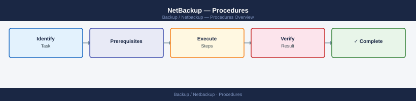

---
tags:
  - netbackup
  - operations
---
# NetBackup — Procedures


<div class="kb-summary">
NetBackup operational procedures: creating and tuning backup policies, storage unit configuration, schedule management, and deduplication pool maintenance.

*Applies to: NetBackup 10.x*
</div>



```d2
direction: right

hub: "NetBackup\nOperations" {shape: hexagon}
backup_policies: "Backup Policies" {shape: rectangle}
run_an_adhoc_backup: "Run an Ad-Hoc Backup" {shape: rectangle}
restore_files_bprestore: "Restore Files (bprestore)" {shape: rectangle}
check_job_status: "Check Job Status" {shape: rectangle}
expire_a_backup_image: "Expire a Backup Image" {shape: rectangle}
import_a_backup_from_tape_catalog_re: "Import a Backup from Tape (Catalog Recovery)" {shape: rectangle}

hub -> backup_policies
hub -> run_an_adhoc_backup
hub -> restore_files_bprestore
hub -> check_job_status
hub -> expire_a_backup_image
hub -> import_a_backup_from_tape_catalog_re
```

## Before you begin

- **Access:** Backup admin role on backup server; target system credentials
- **Timing:** safe to run during business hours unless a step is marked ⚠ (causes interruption)
- **Dependencies:** no active upgrades or migrations on the same infrastructure
- **Logging:** capture command output — paste into the change record on completion

---

## Backup Policies

Use this section for practical NetBackup Policies notes, checks, troubleshooting, commands, change notes, and field references.

### Common checks

- Confirm current health
- Review active alerts
- Check recent changes
- Confirm dependencies
- Check logs, events, and monitoring
- Capture current state before changes

### Incident notes

Capture:

- Symptom
- Start time
- Impact
- System or service name
- Error message
- What changed
- What was checked
- Next action

### Change notes

- Confirm change approval
- Confirm maintenance window
- Confirm rollback plan
- Capture current state
- Make one change at a time
- Validate after the change

### Useful commands

Add tested commands here.

### Known issues

Add known issues here as they come up.

## Run an Ad-Hoc Backup

`bpbackup -p <policy> -s <schedule> -c <client>` or Admin Console → Client Backups → Manual Backup.

```bash
bpbackup -p <policy> -s <schedule> -c <client>
```

## Restore Files (bprestore)

`bprestore -C <client> -p <policy> -s <schedule> -t <start-time> -T <end-time> <file-list>` — restores to original path.

```bash
bprestore -C <client> -p <policy> -s <schedule> -t <start-time> -T <end-time> <file-list>
```

## Check Job Status

`bpdbjobs -summary` for counts; `bpdbjobs -jobid <id> -L` for detail; `bperror -backstat -hoursago 24` for errors.

```bash
bpdbjobs -summary
bpdbjobs -jobid <id> -L
bperror -backstat -hoursago 24
```

## Expire a Backup Image

`bpexpdate -backupid <id> -d 0` — marks image expired; storage reclaimed at next image cleanup.

```bash
bpexpdate -backupid <id> -d 0
```

## Import a Backup from Tape (Catalog Recovery)

`bpimport -create_db_info -Bidfile <bidfile>` — imports catalog info from tape without restoring data.

```bash
bpimport -create_db_info -Bidfile <bidfile>
```

## Manage Tape Media

`vmupdate -rt TLD -rn <drive>` — update tape inventory; `vmchange -res <media-id>` — move media between pools.

```bash
# Update tape inventory
vmupdate -rt TLD -rn <drive>

# Move media between pools
vmchange -res <media-id>
```

## Configure a New Policy

`bppolicynew <policy-name>` → `bpplclients -add <client> <hardware> <OS> <policy>` → `bpplsched -add <policy> <sched-type>`.

```bash
bppolicynew <policy-name>
bpplclients -add <client> <hardware> <OS> <policy>
bpplsched -add <policy> <sched-type>
```

## Check MSDP Dedup Pool Health

`nbdevquery -listdp -U` — check used/free capacity and dedup ratio; `crcontrol --dsstat` — dedup store detail.

```bash
nbdevquery -listdp -U
crcontrol --dsstat
```

## Collect Debug Logs for Support

`vxlogcfg -a -p 51216 -o 6 && nbpemreq -due` — enable verbose logging; `tar czf /tmp/nbu-logs.tgz /usr/openv/netbackup/logs/` — collect.

```bash
vxlogcfg -a -p 51216 -o 6 && nbpemreq -due
tar czf /tmp/nbu-logs.tgz /usr/openv/netbackup/logs/
```

---

## Verify

- **Job status:** confirm backup job completed with status Success (not Warning)
- **Recovery test:** restore a single file or VM from the new backup to confirm restorability
- **Retention:** verify old recovery points are expiring per the configured retention policy

---

## See also

- [Netbackup — Health Checks](../health-checks/)
- [Netbackup — CLI Reference](../cli-reference/)
- [Netbackup — Common Issues](../../troubleshooting/common-issues/)
