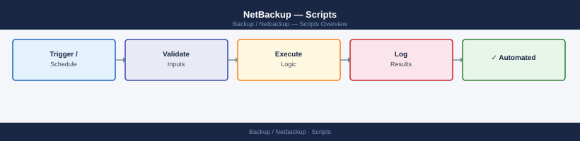

---
tags:
  - netbackup
  - operations
---
# NetBackup — Scripts


<div class="kb-summary">
NetBackup automation scripts — job summary reporting, failed job alerts, STU capacity monitoring, and catalog validation.

*Applies to: NetBackup 10.x*
</div>



Automation scripts for NetBackup use the `admincmd` CLI tools and are typically scheduled via cron on the Master Server. All scripts should write output to a dated log under `/opt/netbackup/scripts/logs/` and send alerts via email or a syslog forwarder when thresholds are breached. Scripts should be owned by `root` and executable only by the backup service account.

| Script | Language | Purpose |
|---|---|---|
| `nb_daily_job_summary.sh` | Bash | Runs `bpdbjobs -report` and emails a formatted summary of pass/fail counts |
| `nb_failed_job_alert.sh` | Bash | Queries failed jobs and posts to a ticketing system or email alias |
| `nb_stu_capacity.sh` | Bash | Iterates `bpstulist` output and alerts when any STU exceeds 80% capacity |
| `nb_client_connectivity.sh` | Bash | Runs `bptestbpcd` against a client list and reports unreachable clients |
| `nb_catalog_verify.sh` | Bash | Confirms the catalog backup job completed in the last 24 hours; pages on-call if absent |

**Script conventions**

- Use `set -euo pipefail` at the top of every script.
- Log rotation: keep 30 days of logs; use `logrotate` or a cron-based cleanup.
- Credentials: service account API keys or passwords must be stored in the vault (CyberArk) and retrieved at runtime — never hard-coded.

```d2
direction: right

center: "NetBackup" {shape: rectangle}
verify: "Verify" {shape: rectangle}

center -> verify
```

## Before you begin

- **Access:** Backup admin role on backup server; target system credentials
- **Timing:** safe to run during business hours unless a step is marked ⚠ (causes interruption)
- **Dependencies:** no active upgrades or migrations on the same infrastructure
- **Logging:** capture command output — paste into the change record on completion

---

---

## Verify

- **Job status:** confirm backup job completed with status Success (not Warning)
- **Recovery test:** restore a single file or VM from the new backup to confirm restorability
- **Retention:** verify old recovery points are expiring per the configured retention policy

---

## See also

- [Netbackup — Procedures](../procedures/)
- [Netbackup — CLI Reference](../cli-reference/)
- [Netbackup — Health Checks](../health-checks/)
