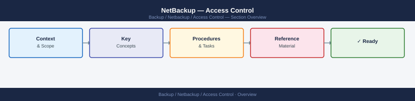

---
tags:
  - netbackup
  - security
---
# NetBackup — Access Control


<div class="kb-summary">
Access Control reference covering NetBackup Access Control (NBAC).

*Applies to: NetBackup 10.x*
</div>



```d2
direction: down

root: "NetBackup\nAccess Control" {shape: hexagon}
administrator: "Administrator" {shape: rectangle}
operator: "Operator" {shape: rectangle}
auditor: "Auditor" {shape: rectangle}
readonly: "Read-Only" {shape: rectangle}
resources: Protected Resources {shape: cylinder}

root -> administrator: role
administrator -> resources: scoped
root -> operator: role
operator -> resources: scoped
root -> auditor: role
auditor -> resources: scoped
root -> readonly: role
readonly -> resources: scoped
```

## Before you begin

- **Access:** Backup admin role on backup server; target system credentials
- **Change management:** security changes require CAB approval in most environments
- **Rollback plan:** document current state before any security control change
- **Testing:** validate in a non-production environment first where possible

---

---

## See also

- [Netbackup — Authentication](../authentication/)
- [Netbackup — Hardening](../hardening/)
- [Netbackup — Encryption](../encryption/)
