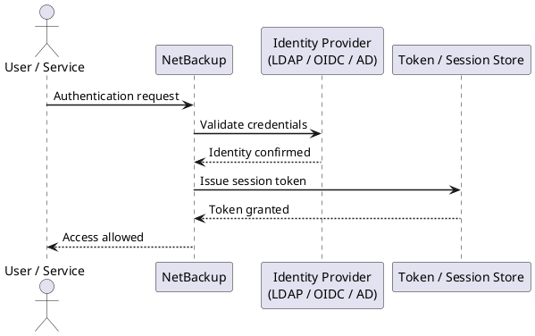

---
tags:
  - netbackup
  - security
---
# NetBackup — Authentication

```bash
# List all certificates in the NetBackup CA
nbcertcmd -listCACertDetails

# Re-issue client certificate (if expired or lost)
nbcertcmd -getCertificate -server <master_server> -force

# Check certificate expiry across all clients
nbcertcmd -listCerts | grep -E "Host|Expiry"
```


```text title="Expected output"
Certificate Authority Details:
  CA Name: NetBackup_CA
  CA Certificate: /usr/openv/var/security/cacert.pem
  Issued Certificates: 47
  CA Expiry Date: 2026-03-15 14:22:33 UTC
  Fingerprint: A7:3F:9E:2C:B1:D4:6A:8F:E9:5C:12:7B:4D:9A:C3:E6

Host: nbmaster01.corp.local
  Certificate Status: Valid
  Expiry Date: 2025-09-12 08:45:22 UTC
  Issued: 2023-09-12 08:45:22 UTC

Host: nbclient-prod-02
  Certificate Status: Valid
  Expiry Date: 2024-11-30 16:33:18 UTC
  Issued: 2022-11-30 16:33:18 UTC

Host: nbclient-backup-05
  Certificate Status: Expired
  Expiry Date: 2024-06-22 12:10:05 UTC
  Issued: 2022-06-22 12:10:05 UTC
...
```

!!! warning "Common errors"
    **`nbcertcmd: command not found`** — Ensure NetBackup is installed and /usr/openv/bin is in your PATH, or use the full path /usr/openv/bin/nbcertcmd.
    **`Error: Unable to connect to master server <master_server>`** — Verify the master server hostname/IP is correct, the NetBackup daemons are running, and network connectivity exists on port 13782.
    **`Error: Certificate request failed - Host already has valid certificate`** — Remove the -force flag if you only want to renew expired certificates, or use -force only when intentionally replacing an active certificate.
```bash
# On each NetBackup host — generate a CSR
nbcertcmd -createCSR -cn <hostname> -out /tmp/<hostname>.csr

# Submit CSR to your CA; retrieve the signed cert and CA chain
# Install the signed certificate
nbcertcmd -enrollCertificate \
  -server <master> \
  -cert /tmp/<hostname>.crt \
  -certChain /tmp/ca-chain.pem

# Verify external cert is in use
nbcertcmd -listCerts -CAType EXTERNAL
```



## Before you begin

- **Access:** Backup admin role on backup server; target system credentials
- **Change management:** security changes require CAB approval in most environments
- **Rollback plan:** document current state before any security control change
- **Testing:** validate in a non-production environment first where possible

---

---

## See also

- [Netbackup — Access Control](../access-control/)
- [Netbackup — Hardening](../hardening/)
- [Netbackup — Encryption](../encryption/)
