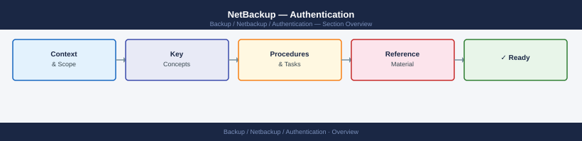

---
tags:
  - netbackup
  - security
---
# NetBackup — Authentication



```bash
# List all certificates in the NetBackup CA
nbcertcmd -listCACertDetails

# Re-issue client certificate (if expired or lost)
nbcertcmd -getCertificate -server <master_server> -force

# Check certificate expiry across all clients
nbcertcmd -listCerts | grep -E "Host|Expiry"
```

```bash
# On each NetBackup host — generate a CSR
nbcertcmd -createCSR -cn <hostname> -out /tmp/<hostname>.csr

# Submit CSR to your CA; retrieve the signed cert and CA chain
# Install the signed certificate
nbcertcmd -enrollCertificate \
  -server <master> \
  -cert /tmp/<hostname>.crt \
  -certChain /tmp/ca-chain.pem

# Verify external cert is in use
nbcertcmd -listCerts -CAType EXTERNAL
```

## Before you begin

- **Access:** Backup admin role on backup server; target system credentials
- **Change management:** security changes require CAB approval in most environments
- **Rollback plan:** document current state before any security control change
- **Testing:** validate in a non-production environment first where possible

---

---

## See also

- [Netbackup — Access Control](../access-control/)
- [Netbackup — Hardening](../hardening/)
- [Netbackup — Encryption](../encryption/)
