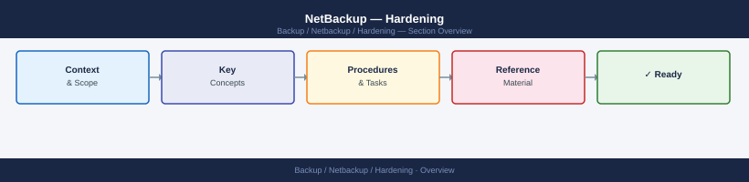

---
tags:
  - netbackup
  - security
---
# NetBackup — Hardening

Hardening reference covering NetBackup Security Architecture, Firewall Ports.

*Applies to: NetBackup 10.x*

## Before you begin

- **Access:** Backup admin role on backup server; target system credentials
- **Change management:** security changes require CAB approval in most environments
- **Rollback plan:** document current state before any security control change
- **Testing:** validate in a non-production environment first where possible

---

## NetBackup Security Architecture

Forward to SIEM: configure `nblog` syslog output or use a log shipper agent pointing to `/usr/openv/netbackup/logs/audit/`.

## Firewall Ports

| Source | Destination | Port | Purpose |
|---|---|---|---|
| Master | Media, Clients | 13724, 13782 | bpcd, bpbrm |
| Clients | Master | 1556 | vnetd |
| OpsCenter | Master | 1556 | Reporting |
| Admin workstation | Admin Console | 1556 | Management |

---

## See also

- [Netbackup — Authentication](../authentication/)
- [Netbackup — Access Control](../access-control/)
- [Netbackup — Encryption](../encryption/)
