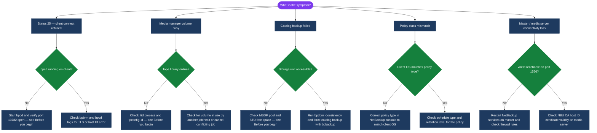

---
tags:
  - netbackup
  - troubleshooting
search:
  boost: 1.5
---
# NetBackup — Common Issues

```bash
# Check bpcd is running on the client
bpps -a | grep bpcd

# Test connectivity from master to client on NetBackup port
telnet <client-hostname> 13782

# Review bpcd log on client
tail -200 /usr/openv/netbackup/logs/bpcd/log.<yyyymmdd>

# Review bpbrm log on master
tail -200 /usr/openv/netbackup/logs/bpbrm/log.<yyyymmdd>
```
```text
┌────────────────────────────────────── NetBackup — Common Issues ──────────────────────────────────────┐
│                                                                                                       │
│   │     Symptom      │   Likely Cause   │    First Check    │       Fix        │      Verify      │   │
│   │    Status 96     │client not respon │ ping + bpps on cl │ restart nbclient │     bpps -x      │   │
│   │   Status 2106    │  MSDP pool full  │ bpexpdate / nbstl │ expand or expire │  nbstlutil list  │   │
│   │    Status 58     │media write error │ check disk/tape h │ new storage unit │   tpconfig -d    │   │
│   │    Status 84     │media manager dow │ check ltid proces │   restart ltid   │     vmquery      │   │
│   └───────────────────────────────────────────────────────────────────────────────────────────────┘   │
│                                                                                                       │
│   ┌───────────────────────────────────────────────────────────────────────────────────────────────┐   │
│   │                                     General Triage Pattern                                    │   │
│   │          Is the issue new or recurring? New = recent change; Recurring = config problem       │   │
│   │             Is it isolated to one source or all? Isolated = agent; All = server/repo          │   │
│   │                                Check logs first: nbpemreq / bpps                              │   │
│   │                    If unresolved in 2h: open vendor case with full log bundle                 │   │
│   └───────────────────────────────────────────────────────────────────────────────────────────────┘   │
│                                                                                                       │
│  Physical Infrastructure:                                                                             │
│  Linux/Windows rack servers · SAN HBAs for tape · 10 GbE NIC · SCSI tape robot connection             │
│  Key terms:                                                                                           │
│                                                                                                       │
│  Master Server = central controller: scheduler, catalog, job manager, policy engine                   │
│  Media Server  = data mover between client and storage; can be co-located with master                 │
│  MSDP          = Media Server Deduplication Pool; inline variable-length block dedup                  │
│  Storage Unit  = logical target: AdvancedDisk, MSDP pool, cloud LSU, or tape robot                    │
│  Policy        = defines what, when, and where to back up; contains schedules and clients             │
│  Schedule      = full / differential-incremental / cumulative-incremental timing within policy        │
│  Retention     = how long an image is kept; set per schedule, enforced by catalog expiry              │
│  Catalog       = internal PostgreSQL DB tracking all image metadata, host IDs, and config             │
│  NBU CA        = auto-issued certificate authority; signs host IDs for secure comms                   │
│  vnetd         = NetBackup network daemon; multiplexes all client-master-media on port 1556           │
│  bpdbjobs      = CLI to query job history: status, duration, exit code, errors                        │
│  bplist        = CLI to list available backup images for a client, policy, or date range              │
│  KMS           = Key Management Service for encryption keys used in backup data encryption            │
│  NDMP          = Network Data Management Protocol; direct NAS-to-storage backup path                  │
│                                                                                                       │
└───────────────────────────────────────────────────────────────────────────────────────────────────────┘
```
```bash
# Check catalog backup job history
bplist -S <master-server> -policy NBU_Catalog -Listdead -d 01/01/1970 00:00:00

# Force an immediate catalog backup
bpbackup -p NBU_Catalog_Backup

# Check catalog database consistency
bpdbm -consistency -verbose
```
```bash
# Check all STU free space
bpstulist -U

# Check disk pool usage (MSDP / AdvancedDisk)
nbdevquery -listdp -stype PureDisk -U

# Expire old images to reclaim space
bpexpdate -policy <policyname> -d 0 -backupid <backup-id>

# Run image cleanup to actually reclaim the space
bpimage -cleanup
```
```bash
# Check MSDP pool status
cacontrol --dsstat -d <msdp-path>

# Check fingerprint database health
cacontrol --dbstat

# Review dedupe log for anomalies
tail -500 /usr/openv/netbackup/logs/spoold/log.<yyyymmdd>
```

## Diagnostic Flow



---

## Before you begin

- **Access:** Backup admin role on backup server; target system credentials
- **Gather first:** recent error message text, event timestamps, and affected object names
- **Scope:** confirm whether the issue affects a single object, host, cluster, or site
- **Escalation:** open a vendor support ticket before running any destructive step
- **Logging:** document each command and output — required if escalation is needed

---

---

## Verify resolution

- Confirm the original symptom no longer occurs
- Check logs for any residual errors related to the issue
- Monitor for 10–15 minutes to confirm the fix is stable

---

## See also

- [Netbackup — Diagnostics](../diagnostics/)
- [Netbackup — Escalation](../escalation/)
- [Netbackup — Health Checks](../../operations/health-checks/)
