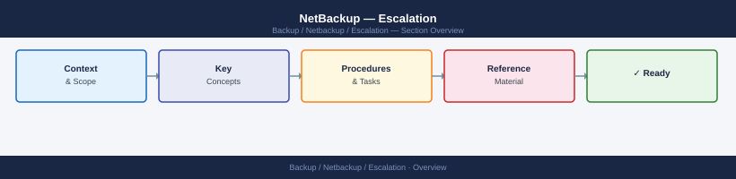
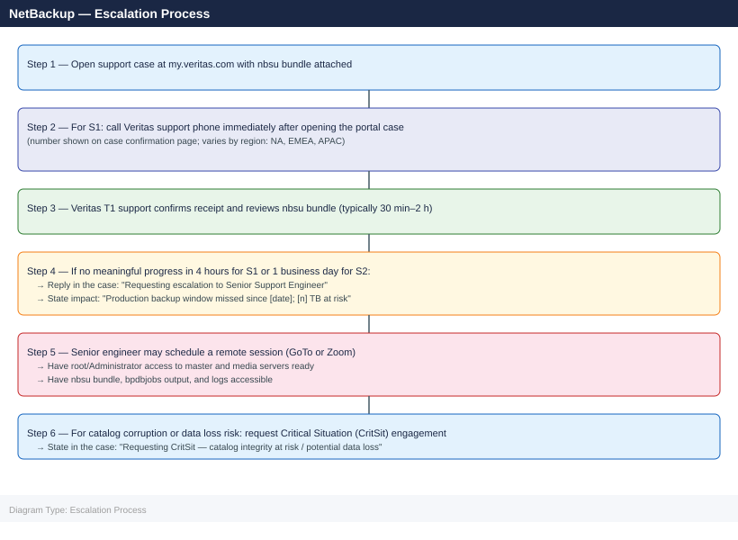

---
tags:
  - netbackup
  - troubleshooting
search:
  boost: 1.5
---
# NetBackup — Escalation

<div class="kb-summary">
NetBackup support escalation: how to collect the nbsu log bundle, open a Veritas support case, set severity, and follow the escalation path for unresolved backup failures, catalog issues, and media errors.

*Applies to: NetBackup 10.x*
</div>



## Before you begin

- **Access:** NetBackup admin account on the master server; root/Administrator on master and affected media servers
- **Gather first:** exact error code from the failed job (bpdbjobs output), affected policy name, and storage unit
- **Scope:** confirm whether the issue affects a single client, a single policy, all jobs, or all media servers
- **Do not retry:** if a catalog backup has failed, do not attempt another until you understand why — a broken catalog can compound into total data loss
- **Logging:** increase log verbosity to 5 for the relevant process before reproducing (`bp.conf: VERBOSE = 5`)

---

## Severity Levels

| Severity | Definition | Response SLA |
|---|---|---|
| S1 — Critical | Master server down; catalog corrupted; production data loss risk; no workaround | 1 hour (24×7) — call Veritas support phone immediately |
| S2 — High | All backup jobs failing; MSDP pool full blocking backups; key policy group missing window | 4 hours (business hours + on-call) |
| S3 — Medium | Single policy failing; intermittent job errors; dedup ratio degraded | 1 business day |
| S4 — Low | Performance tuning question; documentation request; non-critical feature behaviour | 2 business days |

## Pre-Escalation Triage Checklist

| Check | Command | Expected |
|---|---|---|
| NetBackup master service running | `bpps -x` (Linux) / `bpps.exe -x` (Windows) | `bprd`, `bpdbm`, `bpjobd` listed as running |
| Disk pool space adequate | `nbdevquery -listdv -stype PureDisk -U` | Storage unit shows < 80% full |
| Catalog backup current | `bpcatutil -listcat` | Successful catalog backup within last 24 hours |
| All media servers connected | `bpclntcmd -hn <media-server> -ip` | Returns IP address without error |
| Tape robot responding (if applicable) | `tpconfig -d` | Robot inventory returns without `TapeAlert` errors |
| Policy and schedule active | `bppllist <policy-name> -L` | Policy shows `Active` status |
| No duplicate IDs in catalog | `bpdbm -consistency_check` | `0 errors` output |

---

## Step-by-Step Data Collection

Run all the following on the master server as root/Administrator before opening the SR.

### 1. Get NetBackup version

```bash
# Linux
cat /usr/openv/netbackup/bin/version
/usr/openv/netbackup/bin/goodies/nbpem --version 2>/dev/null

# Windows
type "C:\Program Files\Veritas\NetBackup\version.txt"
```

### 2. Collect failing job details

```bash
# List failed jobs in the last 48 hours
bpdbjobs -hoursago 48 -report | grep -i "fail\|error\|status [^0]" | head -30

# Get full report for a specific job ID
bpdbjobs -jobid <jobid> -report -most_columns

# Get the job's detailed log (replace jobid)
cat /usr/openv/netbackup/logs/user_ops/<jobid>

# Get policy and storage unit configuration
bppllist <policy-name> -L > /tmp/policy-config.txt
nbstlutil list -storage_server <stu-name> > /tmp/stu-config.txt
```

### 3. Run the nbsu support utility

```bash
# Run nbsu on the master server — this is the primary artifact for Veritas support
# Takes 5–15 minutes; creates a compressed bundle in /usr/openv/support/
/usr/openv/netbackup/bin/support/nbsu -collect ALL

# Confirm bundle location
ls -lh /usr/openv/support/nbsu_*.tar.gz

# On Windows
"C:\Program Files\Veritas\NetBackup\bin\support\nbsu.exe" -collect ALL
# Bundle in C:\Program Files\Veritas\NetBackup\logs\nbsu_output\
```

### 4. Collect key log files manually (if nbsu fails)

```bash
# Last 500 lines of the backup process manager log
tail -500 /usr/openv/netbackup/logs/bpbrm/log.<today-date> > /tmp/bpbrm.txt

# Last 500 lines of the scheduler log
tail -500 /usr/openv/netbackup/logs/bpsched/log.<today-date> > /tmp/bpsched.txt

# Catalog database consistency
bpdbm -consistency_check 2>&1 > /tmp/catalog-check.txt

# Device and robot status
tpconfig -d 2>&1 > /tmp/tpconfig.txt
vmquery -a 2>&1 | head -50 > /tmp/media-status.txt
```

### 5. Write the timeline

```text
NetBackup version: 10.3.0.1
Master server: nbu-master.example.com (Linux RHEL 8.6)
Media servers: nbu-media-01.example.com, nbu-media-02.example.com
Storage: MSDP pool on PowerStore 1000T, 50 TB allocated

Issue first observed: 2026-06-15 02:00 UTC (scheduled backup window)
Last known good backup: 2026-06-14 02:30 UTC

Error observed:
  Job ID 45231 — Policy: PROD_DB — Status: 58 (can't connect to client)
  Job ID 45232 — Policy: PROD_FS — Status: 96 (unable to allocate new media)

Steps already taken:
  - Verified network connectivity to affected clients
  - Checked media server is reachable
  - Did NOT restart nbwmc or bprd

Blast radius:
  - All backup jobs for PROD_DB policy failing
  - Other policies appear unaffected
```

---

## How to Open a Veritas Support Case

1. Go to **my.veritas.com** and sign in with your Veritas account.
   - If no account: click **Register** and link to your Veritas contract using your company email.

2. Click **Open a Support Case**.

3. Under **Product**, select **Veritas NetBackup**.

4. Under **Version**, enter the exact version string from `version.txt`.

5. Under **Severity**, select:
   - **S1**: Master server down; catalog inaccessible; data loss risk; production backup completely halted
   - **S2**: Major backup jobs failing; backup window being missed; workaround not available
   - **S3**: Single policy failing; performance degraded; workaround available
   - **S4**: Configuration question, feature request, documentation

6. In the **Summary** field: `NetBackup 10.3.0.1 — All PROD_DB backup jobs failing with status 58 since 2026-06-15 02:00 UTC`.

7. In the **Description**, paste:
   - Version and OS
   - Policy name, storage unit type, and client OS
   - Job IDs and exact status codes
   - Timeline (from step 5 above)
   - What you have already tried

8. Upload attachments:
   - `nbsu_<date>.tar.gz` — the full support bundle
   - `bpdbjobs` report output
   - Any manual log files collected

9. Click **Submit**. You receive a case number by email.

10. **S1 only:** On the case confirmation page, a Veritas phone number is shown for your region. Call it immediately — do not wait for an email response.

---

## Escalation Path



---

## What NOT to Do

| Do NOT do this | Why | What to do instead |
|---|---|---|
| Restart `nbwmc` or `bprd` mid-investigation | Clears in-memory job state; Veritas support loses visibility into what the daemons were doing | Wait for Veritas guidance on when it is safe to restart daemons |
| Run `bpimport` or `bpexpdate` to "clean up" failed jobs before opening a case | Modifies catalog state permanently; removes data Veritas support needs to diagnose | Open the case first; run cleanup only after SR guidance |
| Delete expired images manually from the MSDP pool | Can corrupt the dedup fingerprint database | Use `nbdelete` with Veritas guidance; never remove files from the MSDP disk directory |
| Increase `VERBOSE` to 5 globally in `bp.conf` and leave it permanently | Generates gigabytes of logs per hour; can fill disk and crash the master server | Enable verbose logging for the specific process and time window; revert after capturing |
| Restore from an unchecked backup image without `bpverify` | A corrupted image will appear to restore successfully but produce garbled data | Run `bpverify -jobid <id>` to confirm image integrity before relying on it for recovery |

---

## Useful Commands for Case Updates

```bash
# Current daemon status — paste into every case update
bpps -x 2>&1

# Job summary for last 24 hours
bpdbjobs -hoursago 24 -report | awk 'NR<=50'

# Catalog size and health
bpdbm -consistency_check 2>&1
du -sh /usr/openv/db/

# MSDP pool utilisation
nbdevquery -listdv -stype PureDisk -U | grep -E "Disk Type|State|Total|Used|Available"

# Media server connectivity (for each media server)
bpclntcmd -hn <media-server> -ip

# Check current active sessions (who is connected to nbwmc)
bpps -a | grep bpcd

# Recent error status codes from all jobs
bpdbjobs -hoursago 6 -report | awk '{print $NF}' | sort | uniq -c | sort -rn
```

---

## See also

- [NetBackup — Diagnostics](../diagnostics/)
- [NetBackup — Common Issues](../common-issues/)

---

## Verify resolution

- Confirm the failing policy runs successfully with `bpdbjobs -report` showing status 0
- Run `bpcatutil -listcat` to verify catalog backup completed after the fix
- Check that MSDP pool utilisation is within expected bounds (`nbdevquery -listdv -stype PureDisk -U`)
- Monitor backup windows for 2 full cycles (typically 48 hours) before closing the SR
