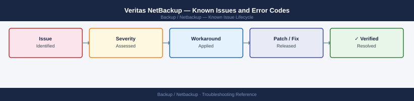

---
tags:
  - troubleshooting
  - netbackup
  - backup
  - known-issues
---
# Veritas NetBackup — Known Issues and Error Codes

<div class="kb-summary">
Catalog of known NetBackup bugs, error codes, and workarounds covering backup policies, media servers, and VMware integration.

*Applies to: NetBackup 10.x*
</div>



```d2
direction: down

symptom: Identify Symptom {shape: diamond}
common_error_codes: "Common Error Codes" {shape: rectangle}
vmware_integration: "VMware Integration" {shape: rectangle}
dd_boost: "DD Boost" {shape: rectangle}
certificates_nbu_8x: "Certificates (NBU 8.x+)" {shape: rectangle}
resolution: Resolve or Escalate {shape: oval}

symptom -> common_error_codes: investigate
symptom -> vmware_integration: investigate
symptom -> dd_boost: investigate
symptom -> certificates_nbu_8x: investigate
common_error_codes -> resolution
vmware_integration -> resolution
dd_boost -> resolution
certificates_nbu_8x -> resolution
```

## Before you begin

- NetBackup error codes are documented at `veritas.com/support` — most codes have a dedicated KB article.
- Run `bpgetconfig` on master server and clients to verify connectivity.
- `nbcertcmd` manages certificate operations in NetBackup 8.x+ (mandatory web certificate).

## Common Error Codes

| Error Code | Description | Cause | Fix |
|---|---|---|---|
| Status 96 | `An error occurred when trying to write to a file` | Disk storage unit full | Free space on storage unit; increase storage unit quota |
| Status 58 | `Can't connect to client` | Client not reachable on port 1556 (VNETD) | Verify TCP 1556 from media server to client; check client NBU service |
| Status 2074 | `Client host is busy` | Too many concurrent streams to client | Reduce concurrent jobs in policy; check client resource limits |
| Status 196 | `Client backup was not attempted because backup window closed` | Job window too short for data size | Extend backup window; or reduce client data size |
| Status 25 | `Cannot connect on socket` | NBU service not running on client | Start `bpcd` on client; verify `netbackup` service status |

## VMware Integration

| Error / Symptom | Affected Versions | Cause | Workaround / Fix | Fixed In |
|---|---|---|---|---|
| VMware policy backup fails: `Snapshot error` | NBU 10.x | ESXi host cannot create snapshot during backup window | Check vCenter events for snapshot failure reason; reduce concurrent VMware jobs | N/A |
| `Discovery failed` for VMware policy | NBU 10.x | vCenter credentials invalid or vCenter not reachable | Update vCenter credentials in NetBackup → Credentials → VMware | N/A |

## DD Boost

| Error / Symptom | Affected Versions | Cause | Workaround / Fix | Fixed In |
|---|---|---|---|---|
| DD Boost backup failing: `Network error` | NBU 10.x | TCP 2052 blocked between NBU media server and Data Domain | Verify TCP 2052 open from all media servers to Data Domain | N/A |
| AIR (Auto Image Replication) not replicating | NBU 10.x | Target domain not reachable via port 1556 | Verify TCP 1556 between source and destination NBU master servers | N/A |

## Certificates (NBU 8.x+)

| Error / Symptom | Affected Versions | Cause | Workaround / Fix | Fixed In |
|---|---|---|---|---|
| Client shows `Certificate error` — not connecting to master | NBU 8.x+ | Host ID-based certificate expired or not enrolled | Re-enroll: `nbcertcmd -enrollCertificate -server <master>` | N/A |

## See also

- [NetBackup — Common Issues](../common-issues/)
- [Dell Data Domain — Known Issues](../../../storage/dell/data-domain/troubleshooting/known-issues.md)
