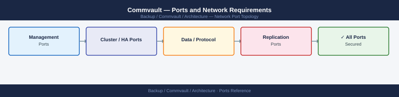

---
tags:
  - commvault
  - networking
  - firewall
  - ports
  - backup
description: "Firewall port reference for Commvault Complete Backup & Recovery. Covers CommServe, Media Agents, IntelliSnap, VSA proxy for VMware, and client data..."
---
# Commvault — Ports and Network Requirements

<div class="kb-summary">
Firewall port reference for Commvault Complete Backup & Recovery. Covers CommServe, Media Agents, IntelliSnap, VSA proxy for VMware, and client data transfer paths.

*Applies to: Commvault 11.x / Commvault Cloud 2024+*
</div>


## Before you begin

- Commvault uses TCP 8400 as its primary inter-component port (CommServe → Media Agent, CommServe → client push, Media Agent ↔ Media Agent)
- Data transfer between client and Media Agent uses port 8403 (dedicated data channel)
- If clients initiate connections to CommServe (pull mode), only 8400 and 8403 need to be open from client to CommServe/MA
- VSA proxy for VMware requires the same ports as a Veeam proxy: 443 to vCenter and 902 to ESXi

---

## Inbound — Admin Access to CommServe / Command Center

| Port | Protocol | Source | Purpose |
|---|---|---|---|
| 443 | TCP | Admin browsers | Commvault Command Center / Web Console (HTTPS) |
| 80 | TCP | Admin browsers | HTTP — redirects to 443 |
| 8400 | TCP | Admin console (Java), Commvault components | CommServe primary communication port |
| 22 | TCP | Jump hosts | SSH — CommServe and Media Agent Linux appliance access |

---

## CommServe to Media Agents

| Port | Protocol | Source | Destination | Purpose |
|---|---|---|---|---|
| 8400 | TCP | CommServe | Media Agent | Primary Commvault service port — job management |
| 8403 | TCP | CommServe | Media Agent | Commvault Tunnel Port — data transfer setup |
| 9000–9100 | TCP | CommServe | Media Agent | Dynamic port range for data transfer (if not using 8403 tunnel) |

---

## CommServe to Clients (Push Install / Job Control)

| Port | Protocol | Source | Destination | Purpose |
|---|---|---|---|---|
| 8400 | TCP | CommServe | Client (Windows/Linux) | Push install of client software and job control |
| 8403 | TCP | CommServe | Client | Data transfer |
| 135 | TCP | CommServe | Windows clients | DCOM/RPC (Windows push install) |
| 445 | TCP | CommServe | Windows clients | SMB (agent deployment) |
| 22 | TCP | CommServe | Linux clients | SSH (Linux client push install) |

---

## Client to Media Agent (Backup Data Transfer)

| Port | Protocol | Source | Destination | Purpose |
|---|---|---|---|---|
| 8400 | TCP | Client | CommServe | Job registration and control |
| 8403 | TCP | Client | Media Agent | Data channel — backup data stream |

---

## VSA Proxy for VMware

The IntelliSnap VSA Proxy acts as a backup proxy for VM-level backups (similar to Veeam's proxy role).

| Port | Protocol | Source | Destination | Purpose |
|---|---|---|---|---|
| 443 | TCP | VSA Proxy | vCenter Server | vCenter API — VM inventory, CBT, VADP snapshot control |
| 902 | TCP | VSA Proxy | ESXi hosts | vmware-authd — hot-add transport mode |
| 8400 | TCP | VSA Proxy | CommServe | Job status reporting |
| 8403 | TCP | VSA Proxy | Media Agent | Data transfer to repository |

---

## Media Agent to Backup Repository / Tape / Cloud

| Port | Protocol | Source | Destination | Purpose |
|---|---|---|---|---|
| 445 | TCP | Media Agent | Windows file share (SMB path) | SMB-based disk library |
| 2049 | TCP | Media Agent | NFS server | NFS-based disk library |
| 443 | TCP | Media Agent | Cloud library (S3, Azure, GCP) | Object storage cloud library |
| 8400 | TCP | Media Agent | Another Media Agent | MA-to-MA data copy (dedup, replication) |

---

## IntelliSnap — Array Integration

| Port | Protocol | Source | Destination | Purpose |
|---|---|---|---|---|
| 443 | TCP | CommServe / MA | NetApp ONTAP mgmt LIF | IntelliSnap — ONTAP REST API for snapshot operations |
| 443 | TCP | CommServe / MA | Pure FlashArray mgmt IP | IntelliSnap — Pure REST API for snapshot |
| 443 | TCP | CommServe / MA | Dell Unity / PowerStore mgmt IP | IntelliSnap — Dell REST API for snapshot |

---

## Commvault SQL Server (CommServe Database)

| Port | Protocol | Between | Purpose |
|---|---|---|---|
| 1433 | TCP | CommServe | SQL Server (if external DB) | CommServe configuration database |

---

## Firewall Zone Summary

| From | To | Ports | Notes |
|---|---|---|---|
| Admin browsers | CommServe / Command Center | 443, 8400 | Web UI and console |
| CommServe | Media Agents | 8400, 8403 | Job control and data setup |
| CommServe | Windows clients | 8400, 8403, 135, 445 | Push install and job control |
| CommServe | Linux clients | 8400, 8403, 22 | Push install and job control |
| Clients | Media Agent | 8403 | Data transfer channel |
| VSA Proxy | vCenter | 443 | VADP backup |
| VSA Proxy | ESXi hosts | 902 | Hot-add transport |
| Media Agent | Cloud/NAS library | 443, 445, 2049 | Repository access |

---

## Verify

```bash
# From admin workstation — test Command Center
curl -sk -o /dev/null -w "%{http_code}" https://<commserve-ip>/commandcenter/

# From CommServe — test Media Agent reachability
nc -zv <media-agent-ip> 8400
nc -zv <media-agent-ip> 8403

# From VSA Proxy — test vCenter API
nc -zv <vcenter-ip> 443

# From VSA Proxy — test ESXi agent port
nc -zv <esxi-ip> 902

# From a Linux client — test CommServe port
nc -zv <commserve-ip> 8400

# From Media Agent — test S3 cloud library
curl -sk -o /dev/null -w "%{http_code}" https://s3.amazonaws.com/
```


```text title="Expected output"
200
Connection to 192.168.1.50 port 8400 (tcp) succeeded!
Connection to 192.168.1.50 port 8403 (tcp) succeeded!
Connection to 10.20.15.100 port 443 (tcp) succeeded!
Connection to 10.20.15.101 port 902 (tcp) succeeded!
Connection to 192.168.1.50 port 8400 (tcp) succeeded!
200
```

!!! warning "Common errors"
    | Error | Fix |
    |---|---|
    | `Connection to <ip> port <port> (tcp) failed: Connection refused` | Verify the target service is running and listening on that port using `netstat -tlnp | grep <port>` on the remote host. |
    | `curl: (60) SSL certificate problem: self signed certificate` | Add the `-k` flag to curl to skip certificate verification, or import the CommServe's CA certificate into your system trust store. |
    | `nc: getaddrinfo: Name or service not known` | Ensure the hostname or IP address is correct and resolvable; test with `ping <commserve-ip>` first to confirm network connectivity. |
---

## See also

- [Commvault — Architecture](../how-it-works/)
- [Commvault — Deploy](../../deploy/)
- [Commvault — Operations](../../operations/)
- [Veeam — Ports](../../veeam/architecture/ports.md)
- [vCenter — Ports](../../../../virtualization/vmware/products/vcenter/architecture/ports.md)
