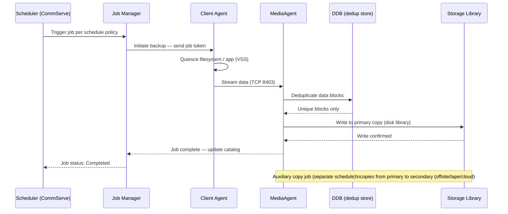

---
tags:
  - commvault
  - operations
description: "CLI Reference reference covering Backup Job Lifecycle, Backup Operations, Restore Operations, Clients & Policies, CommServe Maintenance and 1 more..."
---
# Commvault — CLI Reference

<div class="kb-summary">
CLI Reference reference covering Backup Job Lifecycle, Backup Operations, Restore Operations, Clients & Policies, CommServe Maintenance and 1 more sections.

*Applies to: Commvault 2024.x*
</div>

## Before you begin

- **Access:** Backup admin role on backup server; target system credentials
- **Timing:** safe to run during business hours unless a step is marked ⚠ (causes interruption)
- **Dependencies:** no active upgrades or migrations on the same infrastructure
- **Logging:** capture command output — paste into the change record on completion

---

## Backup Job Lifecycle

From schedule trigger to media write, every CommVault backup job moves through a defined sequence of states.



---

## Restore Operations

### Restore Workflow Decision Tree

```d2
direction: right

q1: "q1" {shape: rectangle}
volumeRestore: "Volume-level restore\nqoperation restore\n-subclient -topath" {shape: rectangle}
vmRestore: "Full VM restore\n(VSA subclient" {shape: rectangle}
appRestore: "Application-aware restore\nPoint-in-time log replay\nor granular item restore" {shape: rectangle}
q2: "q2" {shape: rectangle}
winFlr: "File-level restore\nbrowse from catalog\nqoperation restore -subclient -topath" {shape: rectangle}
linFlr: "File-level restore\nbrowse from catalog\nqoperation restore -subclient -topath" {shape: rectangle}
verifyDest: "Verify destination\nhas sufficient space" {shape: rectangle}
execute: "Execute restore\nMonitor in Job Controller" {shape: rectangle}
validate: "Validate restored\ndata integrity" {shape: rectangle}
restoreStart: "Restore request received" {shape: rectangle}

q1 -> volumeRestore
q1 -> vmRestore
q1 -> appRestore
q2 -> winFlr
q2 -> linFlr
volumeRestore -> verifyDest
vmRestore -> verifyDest
appRestore -> verifyDest
winFlr -> verifyDest
linFlr -> verifyDest
verifyDest -> execute
execute -> validate
```

Always verify destination and time range before executing a restore.

```bash
# Restore to original location at a point in time
qoperation restore -subclient <name> -totime "2024-01-01 12:00:00"

# Restore to alternate path
qoperation restore -subclient <name> -topath /restore/destination

# List recent restore jobs
qlist jobs -d 1 -restore
```


```text title="Expected output"
Commvault Command Line Interface
(c) Commvault Systems, Inc.

Job ID: 12847
Subclient: database_backup_01
Restore Point: 2024-01-01 12:00:00
Status: Submitted
Destination: Original Location
Job submitted successfully.

Job ID: 12848
Subclient: database_backup_01
Restore Path: /restore/destination
Status: Submitted
Job submitted successfully.

Job ID    | Subclient            | Type    | Status      | Start Time          | End Time
-----------|----------------------|---------|-------------|---------------------|---------------------
12848      | database_backup_01   | Restore | Completed   | 2024-01-15 14:22:10 | 2024-01-15 14:35:45
12847      | database_backup_01   | Restore | Running     | 2024-01-15 14:20:00 | -
12846      | web_app_backup       | Restore | Completed   | 2024-01-15 13:15:22 | 2024-01-15 13:28:10
12845      | database_backup_01   | Restore | Failed      | 2024-01-15 12:45:00 | 2024-01-15 12:47:33
```

!!! warning "Common errors"
    **`Error: Invalid subclient name '<name>'`** — Replace `<name>` with the actual subclient name from your backup policy (use `qlist subclients` to list available subclients).
    **`Error: Restore path '/restore/destination' does not exist or is not writable`** — Ensure the destination directory exists and the Commvault service account has write permissions to it.
    **`Error: No restore points available for the specified time '2024-01-01 12:00:00'`** — Verify the restore point exists within your backup retention period using `qlist backupsets -subclient <name>` to check available recovery points.
---

## Clients & Policies

Manage client registration, storage policies, and schedules.

```bash
# List all clients
qlist client

# List storage policies
qlist storagepolicy

# List schedules
qlist schedule

# List deduplication databases
qlist ddb

# Check client connectivity readiness
qoperation execscript -sn QS_CheckReadiness

# List backup sets for a client
qlist backupset -c <client_name>
```


```text title="Expected output"
Client Name                          Client ID    OS Type         Status
================================================================================
prod-db-01.corp.local                2            Windows         Active
prod-web-02.corp.local               3            Linux           Active
backup-vault-01.corp.local           5            Windows         Active
dev-app-03.corp.local                7            Linux           Inactive
nas-storage-01.corp.local            9            Windows         Active

Storage Policy Name                  Type         Copies
================================================================================
Daily_Incremental                    Backup       2
Weekly_Full                          Backup       3
Archive_Policy_90d                   Archive      1
Dedup_Policy_Fast                    Backup       2

Schedule Name                        Policy Name              Frequency
================================================================================
Daily_Incremental_0200               Daily_Incremental       Daily
Weekly_Full_Sunday                   Weekly_Full             Weekly
Monthly_Archive                      Archive_Policy_90d      Monthly

Deduplication Database               Size (GB)    Dedup Ratio    Status
================================================================================
DDB_Pool_Primary                     2847.5       4.2:1          Healthy
DDB_Pool_Secondary                   1563.2       3.8:1          Healthy

Script execution completed successfully.
Job ID: JID-20250117-004521
Status: Ready

Backup Set Name                      Agent Type               Status
================================================================================
FileSystem_Full                      File System              Active
Database_Incremental                 SQL Server               Active
Exchange_Mailbox                     Exchange                 Active
```

!!! warning "Common errors"
    **`qlist: command not found`** — Ensure the CommVault command line tools are installed and the PATH includes the CommVault bin directory (typically `/opt/commvault/Base/bin` on Linux or `C:\Program Files\CommVault\Base\bin` on Windows).
    **`Error: Client '<client_name>' not found`** — Verify the exact client name using `qlist client` first, as client names are case-sensitive and must match the registered hostname exactly.
    **`Error: Access denied - insufficient privileges`** — Run the command with appropriate CommVault admin credentials or ensure your user account has the necessary CommVault administrator role permissions.
---

## CommServe Maintenance

Database backup and health tasks for CommServe.

```bash
# Trigger CommServe database backup
qsystem dbbackup

# Commit pending configuration changes
qcommit

# Check CommServe services status
qlist services

# Check license usage
qlist license
```


```text title="Expected output"
CommServe database backup initiated successfully.
Backup job ID: 123456
Backup destination: /commvault/backup/db_backup_20240115_143022.bkp
Estimated time: 45 minutes

Configuration changes committed successfully.
Commit ID: cv_commit_20240115_143022
Changes applied to all MediaAgents.

Service Name                          Status          PID
CommServe                             Running         2847
EventManager                          Running         3102
CVD                                   Running         3156
MediaAgent                            Running         3201
GxEvMgrC                              Running         3245

License Usage Report
License Type              Total Seats    Used Seats    Expiry Date
CommServe                 100            87            2025-06-30
MediaAgent                 50            48            2025-06-30
Backup Exec               25            12            2025-03-15
```

!!! warning "Common errors"
    **`qsystem: command not found`** — Ensure the CommVault installation directory is in your PATH or source the environment setup script (typically `. /opt/commvault/base/setenv.sh`).
    **`Error: Cannot commit changes - pending validation errors detected`** — Review pending configuration changes with `qlist pendingchanges` and resolve validation issues before running `qcommit`.
    **`License limit exceeded for MediaAgent`** — Purchase additional MediaAgent licenses or deactivate unused agents to free up license seats.
---

## REST API

All operations are also available via REST API for automation.

```bash
# Authenticate and get token
curl -X POST "https://<CommServe>/webconsole/api/Login" \
  -H "Content-Type: application/json" \
  -d '{"username":"admin","password":"<password>","domain":""}'

# List all clients
curl -X GET "https://<CommServe>/webconsole/api/Client" \
  -H "Authtoken: <token>"

# List active jobs
curl -X GET "https://<CommServe>/webconsole/api/Job?jobFilter=Active" \
  -H "Authtoken: <token>"
```


```text title="Expected output"
{"token":"eyJhbGciOiJIUzI1NiIsInR5cCI6IkpXVCJ9eyJleHAiOjE3MDk4MzIwMDB9","userId":1,"userName":"admin"}
{"clients":[{"clientId":2,"clientName":"fileserver-01.corp.local","hostName":"192.168.1.45","osType":"Windows","lastBackupTime":1709745600},{"clientId":3,"clientName":"db-server-prod.corp.local","hostName":"192.168.1.67","osType":"Linux","lastBackupTime":1709829120},{"clientId":5,"clientName":"exchange-01.corp.local","hostName":"192.168.1.89","osType":"Windows","lastBackupTime":1709658900}],"totalClients":3}
{"jobs":[{"jobId":12847,"jobType":"Backup","clientName":"fileserver-01.corp.local","status":"Running","percentComplete":67,"startTime":1709831400},{"jobId":12851,"jobType":"Restore","clientName":"db-server-prod.corp.local","status":"Running","percentComplete":34,"startTime":1709831680}],"totalJobs":2}
```

!!! warning "Common errors"
    **`{"error":{"errorCode":401,"errorMessage":"Invalid credentials"}}`** — Verify the username, password, and domain are correct in the login request.
    **`curl: (60) SSL certificate problem: self signed certificate`** — Add `-k` flag to curl to skip SSL verification, or configure proper CA certificates for the CommServe HTTPS endpoint.
    **`{"error":{"errorCode":403,"errorMessage":"Invalid or expired token"}}`** — Re-authenticate to obtain a fresh token, as the previous token has expired or is malformed.
---

## Verify

- **Job status:** confirm backup job completed with status Success (not Warning)
- **Recovery test:** restore a single file or VM from the new backup to confirm restorability
- **Retention:** verify old recovery points are expiring per the configured retention policy

---

## See also

- [Commvault — Procedures](../procedures/)
- [Commvault — Scripts](../scripts/)
- [Commvault — Health Checks](../health-checks/)
