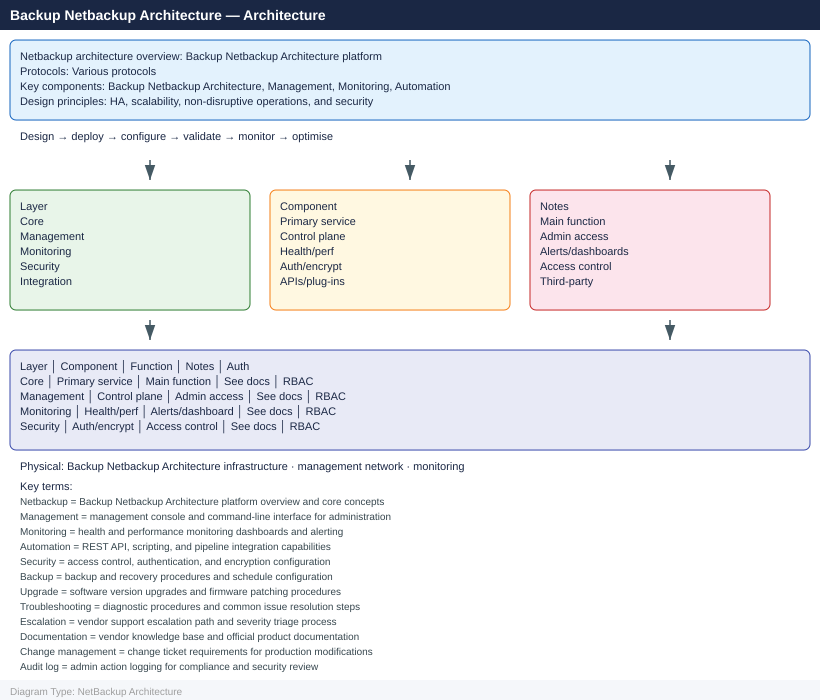
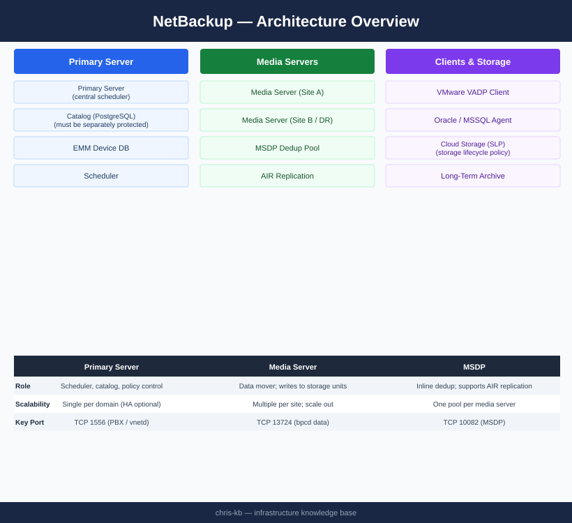

---
tags:
  - architecture
  - netbackup
description: "Veritas NetBackup three-tier architecture — Primary Server catalog and scheduling, Media Servers for data movement, and Clients with backup agents."
---
# NetBackup — Architecture

Veritas NetBackup three-tier architecture — Primary Server catalog and scheduling, Media Servers for data movement, and Clients with backup agents.

*Applies to: NetBackup 10.x*

<a class="kb-card" href="how-it-works/"><strong>How It Works</strong>Three-tier topology, key processes, storage units, catalog backup, and sizing.</a>
<a class="kb-card" href="integrations/"><strong>Integrations</strong>VMware VADP, Oracle RMAN, NDMP, and cloud storage integrations.</a>
<a class="kb-card" href="design-standards/"><strong>Design Standards</strong>Policy naming, retention schedules, MSDP standards, and media server placement.</a>

| Component | Role |
|---|---|
| Primary Server | Central scheduler, catalog DB (PostgreSQL), EMM device database |
| Media Server | Data mover; writes to storage units; runs deduplication (MSDP) |
| Client | Backup agent on protected host; sends data to Media Server via TCP 13724 |
| MSDP | Media Server Deduplication Pool; inline dedup; supports AIR image replication |
| Catalog | Most critical component — tracks all backup images; must be protected separately |

