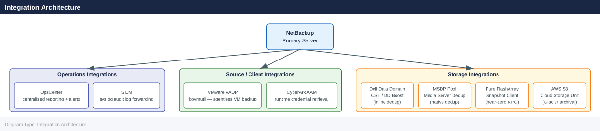

---
tags:
  - architecture
  - netbackup
---
# NetBackup Integration

<div class="kb-summary">
NetBackup Integration reference covering Integration Architecture, SIEM Integration, CyberArk Integration, OpsCenter / IT Analytics.

*Applies to: NetBackup 10.x*
</div>

## Integration Architecture



Alert on: `backup failed`, `policy modified`, `client deleted`, `catalog backup failed`.

## CyberArk Integration

NetBackup retrieves service account passwords from CyberArk at runtime:

1. Install CyberArk AAM (Application Access Manager) agent on master and media servers
2. Configure NetBackup to use CyberArk: Credentials → enable CyberArk CCP integration
3. Create application credential in CyberArk safe mapped to NetBackup service account

## OpsCenter / IT Analytics

Connect OpsCenter to the master server for centralised reporting:

```bash
# Verify master server is connected to OpsCenter
/opt/SYMCOpsCenterServer/bin/opscenteragent status
```


```text title="Expected output"
OpsCenter Agent Status Report
==============================
Agent Version: 8.7.2.1
Agent Status: Running
Master Server Connection: Connected
Connected OpsCenter Host: opscentral.corp.local (192.168.1.45)
Last Heartbeat: 2024-01-15 14:32:18 UTC
Communication Protocol: HTTPS
Certificate Status: Valid (expires 2025-03-22)
Agent Uptime: 18 days, 4 hours, 22 minutes
```

!!! warning "Common errors"
    **`OpsCenter Agent Status Report: command not found`** — Verify the OpsCenter agent is installed at `/opt/SYMCOpsCenterServer/bin/` or adjust the path accordingly.
    **`Agent Status: Not Running`** — Start the OpsCenter agent with `/opt/SYMCOpsCenterServer/bin/opscenteragent start` and check system logs for startup errors.
    **`Master Server Connection: Disconnected`** — Verify network connectivity to the OpsCenter host, check firewall rules for port 443, and confirm the OpsCenter server address in the agent configuration file.
Key reports:
- Job success rate by policy
- Backup window utilisation
- Storage unit fill levels
- Client backup age (identify clients not backed up recently)

---

## See also

- [Netbackup — Design Standards](../design-standards/)
