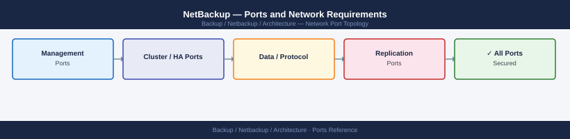

---
tags:
  - netbackup
  - networking
  - firewall
  - ports
  - backup
---
# NetBackup — Ports and Network Requirements

<div class="kb-summary">
Firewall port reference for Veritas NetBackup. Covers the Primary Server (formerly Master), Media Servers, client VNETD communication, REST API, OpsCenter, and VSA proxy for VMware.

*Applies to: NetBackup 10.x / NetBackup IT Analytics 10.x*
</div>


## Before you begin

- All inter-component communication in modern NetBackup (10.x) flows through port 1556 (VNETD / PBX — Process Bus eXchange)
- The REST API and Web Console use 443 — this is separate from the 1556 operational channel
- Clients must be able to reach the Primary Server and Media Server on 1556 for backup and restore operations
- For VMware backups, the Media Server (or dedicated VADP proxy) needs 443 to vCenter and 902 to ESXi hosts

---

## Inbound — Admin to NetBackup Primary Server

| Port | Protocol | Source | Purpose |
|---|---|---|---|
| 443 | TCP | Admin browsers | NetBackup Web Console UI (HTTPS) |
| 443 | TCP | REST API clients, automation | NetBackup REST API (nbwebservices) |
| 1556 | TCP | Admin console (Java), NetBackup components | VNETD / PBX — NetBackup primary communication bus |
| 22 | TCP | Jump hosts | SSH — Primary Server OS access |

---

## Primary Server to Media Servers

| Port | Protocol | Source | Destination | Purpose |
|---|---|---|---|---|
| 1556 | TCP | Primary Server | Media Server | Job dispatch, device management, catalog queries |

---

## Primary Server to Clients

| Port | Protocol | Source | Destination | Purpose |
|---|---|---|---|---|
| 1556 | TCP | Primary Server | NetBackup Client | Job initiation, policy delivery, restore control |

---

## Client to Primary Server and Media Servers

| Port | Protocol | Source | Destination | Purpose |
|---|---|---|---|---|
| 1556 | TCP | NetBackup Client | Primary Server | Backup job reporting, restore requests |
| 1556 | TCP | NetBackup Client | Media Server | Data stream — client pushes backup data to media server |

---

## Media Server to NetBackup Storage (Disk Pools, OST, Tape)

| Port | Protocol | Source | Destination | Purpose |
|---|---|---|---|---|
| 2052 | TCP | Media Server | Dell Data Domain (DD Boost) | OpenStorage Technology (OST) — deduplicated backup |
| 443 | TCP | Media Server | Cloud storage (AWS S3, Azure Blob) | Cloud storage unit for backup copy or long-term retention |
| 2049 | TCP | Media Server | NFS-based disk library | NFS disk unit |
| 445 | TCP | Media Server | SMB-based disk library | SMB disk unit |

---

## VMware Backup — VSA (VADP Proxy)

| Port | Protocol | Source | Destination | Purpose |
|---|---|---|---|---|
| 443 | TCP | NetBackup Media Server / VADP proxy | vCenter Server | vCenter API — VADP, VM inventory, CBT, snapshot operations |
| 902 | TCP | NetBackup Media Server / VADP proxy | ESXi hosts | vmware-authd — hot-add transport mode |

---

## OpsCenter (Reporting and Management)

| Port | Protocol | Source | Purpose |
|---|---|---|---|
| 443 | TCP | Admin browsers | OpsCenter web console (HTTPS) |
| 1556 | TCP | OpsCenter Server | Primary Server | OpsCenter ↔ Primary Server operational data collection |

---

## NetBackup Auto Image Replication (AIR)

For cross-domain or cross-site backup image replication:

| Port | Protocol | Between | Purpose |
|---|---|---|---|
| 1556 | TCP | Source Media Server ↔ Target Media Server | AIR — image replication data |
| 443 | TCP | Source Primary ↔ Target Primary | Cross-domain trust and replication coordination |

---

## Outbound — NetBackup Primary / Media to External

| Port | Protocol | Destination | Purpose |
|---|---|---|---|
| 443 | TCP | *.veritas.com, flex.flexnetoperations.com | License validation, ELA telemetry, APTARE IT Analytics |
| 25 | TCP | SMTP relay | Email job notifications |
| 514 | UDP/TCP | Syslog server | Log forwarding |
| 123 | UDP | NTP server | Time synchronisation |
| 389/636 | TCP | Active Directory DCs | LDAP/LDAPS — admin user authentication |

---

## Firewall Zone Summary

| From | To | Ports | Notes |
|---|---|---|---|
| Admin browsers | Primary Server | 443, 1556 | Web Console and operational port |
| Primary Server | Media Servers | 1556 | All inter-component traffic |
| Primary Server | Clients | 1556 | Job initiation |
| Clients | Primary / Media | 1556 | Data and status reporting |
| Media Server | VADP proxy | 443 (vCenter), 902 (ESXi) | VMware backup |
| Media Server | Data Domain | 2052 | OST / DD Boost |
| Media Server | Cloud storage | 443 | Cloud storage unit |
| OpsCenter | Primary Server | 1556 | Reporting data |

---

## Verify

```bash
# From admin workstation — test REST API
curl -sk -o /dev/null -w "%{http_code}" https://<primary-server>/netbackup/ping

# From client — test VNETD port to Primary Server
nc -zv <primary-server> 1556

# From client — test VNETD port to Media Server
nc -zv <media-server> 1556

# From Media Server — test vCenter VADP port
nc -zv <vcenter-fqdn> 443

# From Media Server — test ESXi agent port
nc -zv <esxi-ip> 902

# From Media Server — test DD Boost port
nc -zv <data-domain-ip> 2052

# From Primary Server CLI — check client status
bpclntcmd -pn -client <client-hostname>
```


```text title="Expected output"
200
Connection to primary-server.corp.local 1556 port [tcp/*] succeeded!
Connection to media-server.corp.local 1556 port [tcp/*] succeeded!
Connection to vcenter.corp.local 443 port [tcp/*] succeeded!
Connection to esxi-prod-01.corp.local 902 port [tcp/*] succeeded!
Connection to dd-boost-01.corp.local 2052 port [tcp/*] succeeded!
Client Name                 Host Name              Status
================================================================================
backup-client-07            backup-client-07       ACTIVE
```

!!! warning "Common errors"
    **`Connection to <primary-server> 1556 port [tcp/*] failed: Connection refused`** — Verify VNETD daemon is running on the primary server with `bpps -a` and restart NetBackup services if needed.
    **`curl: (60) SSL certificate problem: self signed certificate`** — Remove the `-k` flag if using a valid certificate, or ensure the certificate is trusted on the admin workstation.
    **`Client Name                 Host Name              Status`** (no client listed) — Confirm the client hostname matches exactly in NetBackup configuration and that the client has successfully registered with `bpclntcmd -hn`.
---

## See also

- [NetBackup — Architecture](../how-it-works/)
- [NetBackup — Deploy](../../deploy/)
- [NetBackup — Operations](../../operations/)
- [Veeam — Ports](../../veeam/architecture/ports.md)
- [Dell Data Domain — Ports](../../../../storage/products/dell/data-domain/architecture/ports.md)
