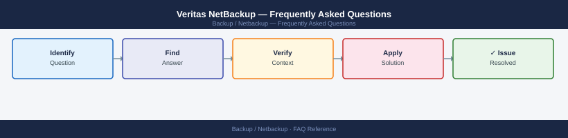

---
tags:
  - netbackup
  - faq
  - operations
---
# Veritas NetBackup — Frequently Asked Questions

*Applies to: NetBackup 10.x*

Common questions about Veritas NetBackup operations, configuration, and troubleshooting. For step-by-step procedures, see the <a href="index.md">Operations</a> section.

## General

**Q: What NetBackup version is recommended for new deployments?**
A: NetBackup 10.3+ for new deployments (supports containerised media servers and REST API v4). Check with `bpgetconfig -g <master> | grep VERSION` or in the Admin Console under Help → About.

**Q: How do I check the current Veritas NetBackup version?**
A: `bpgetconfig -g localhost | grep VERSION`

## Configuration

**Q: What is the default policy schedule type and when should it change?**
A: Full + Differential Incremental is the default. Switch to Cumulative Incremental when recovery time matters more than storage (fewer tapes/disks to restore). Use `Accelerator` for VMware/NDMP.

**Q: How do I enable NetBackup Instant Recovery for fast VM restores?**
A: Configure a AdvancedDisk or snapshot-capable storage unit. Enable `Instant Recovery` in the policy. The VM is made available directly from the backup image while data is migrated in the background.

## Operations

**Q: How do I upgrade NetBackup master and media servers without disrupting jobs?**
A: Upgrade the master server first. Then upgrade media servers one at a time — drain running jobs first. Clients can be upgraded last; older clients work with newer master up to N-2 versions.

**Q: What is the correct procedure to add a new media server?**
A: Install NetBackup on the new server, then run `bpsetconfig` on the master to add it as a media server. Verify with `bpclntcmd -self` from the new host. Add storage units pointing to the new server.

## Troubleshooting

**Q: Job fails with 'Status 96: unable to allocate new media for backup'. What does it mean?**
A: The scratch pool is empty. Add new tapes or disk to scratch pool, or check for expired media that hasn't been recycled. Run `vmquery -blist` to see available media.

**Q: Backup window is being exceeded — where do I start?**
A: Check Media Server utilisation. Increase multiplexing (MPX) on storage units. Add media servers. Review policy schedules — consolidate small clients into fewer larger jobs. Use Accelerator for VMware.

## Backup and Recovery

**Q: How often should I back up the NetBackup catalog?**
A: The catalog auto-backs up after every session. Configure off-host catalog backup (Catalog policy type) to a separate media server. Verify last successful catalog backup daily.

**Q: Can I restore a single file without restoring the full backup image?**
A: Yes — use `bprestore` with the `-f` flag for specific files, or use the BAR (Backup, Archive, Restore) GUI. For VMware, use Instant Recovery and mount the backup as a datastore.

## See Also

- [Veritas NetBackup Operations](index.md)
- [Veritas NetBackup Troubleshooting](../../troubleshooting//)
