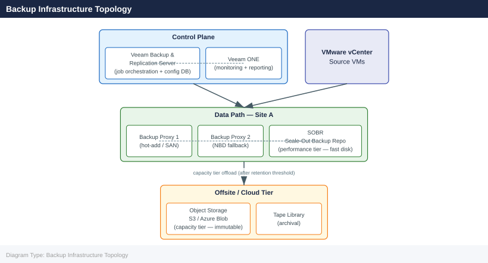

---
tags:
  - operations
  - veeam
description: "CLI Reference reference covering Backup Infrastructure Topology, Sessions & History, Restore Points, VM Restore, Infrastructure and 1 more sections."
---
# Veeam — CLI Reference

<div class="kb-summary">
CLI Reference reference covering Backup Infrastructure Topology, Sessions & History, Restore Points, VM Restore, Infrastructure and 1 more sections.

*Applies to: Veeam 12.x*
</div>

## Before you begin

- **Access:** Backup admin role on backup server; target system credentials
- **Timing:** safe to run during business hours unless a step is marked ⚠ (causes interruption)
- **Dependencies:** no active upgrades or migrations on the same infrastructure
- **Logging:** capture command output — paste into the change record on completion

---

## Backup Infrastructure Topology

The Veeam component hierarchy governs how jobs are routed, where data lands, and which components need to be healthy for a job to succeed.



---

## Restore Points

```powershell
# List restore points for a VM
Get-VBRRestorePoint -Name "vm01" | Select Name, CreationTime, IsCorrupted

# Find latest restore point for a VM
Get-VBRRestorePoint -Name "vm01" | Sort-Object CreationTime -Descending | Select -First 1

# Find restore points for all VMs in a job
Get-VBRBackup -Name "prod-vm-daily" | Get-VBRRestorePoint
```

---

## VM Restore

```powershell
# Instant VM recovery to original location
$rp = Get-VBRRestorePoint -Name "vm01" | Sort-Object CreationTime -Descending | Select -First 1
Start-VBRRestoreVM -RestorePoint $rp -Reason "DR test"

# Full VM restore
Start-VBRVMFLRRestore -RestorePoint $rp

# File-level restore (Windows)
Start-VBRWindowsFileRestore -RestorePoint $rp
```

---

## Infrastructure

```powershell
# List repositories with free/total space
Get-VBRRepository | Select Name,
  @{N="FreeTB"; E={[math]::Round($_.FreeSpace/1TB,2)}},
  @{N="TotalTB"; E={[math]::Round($_.TotalSpace/1TB,2)}}

# List proxies
Get-VBRViProxy

# List protected VMs
Get-VBRProtectedVM
```

---

## Configuration Backup

```powershell
# Export configuration backup
Export-VBRConfiguration -Path "C:\vbr-config-backup.xml"

# Check last config backup
Get-VBRConfigurationDatabaseBackup
```

---

## Verify

- **Job status:** confirm backup job completed with status Success (not Warning)
- **Recovery test:** restore a single file or VM from the new backup to confirm restorability
- **Retention:** verify old recovery points are expiring per the configured retention policy

---

## See also

- [Veeam — Procedures](../procedures/)
- [Veeam — Scripts](../scripts/)
- [Veeam — Health Checks](../health-checks/)
