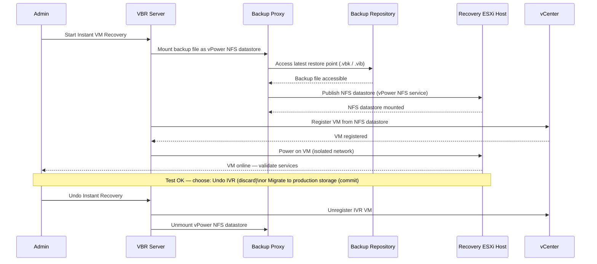

---
tags:
  - operations
  - veeam
---
# Veeam — Procedures

<div class="kb-summary">
Operational procedures covering backup job creation, copy job setup, SOBR management, and restore testing.

*Applies to: Veeam 12.x*
</div>

## Before you begin

- **Access:** Backup admin role on backup server; target system credentials
- **Timing:** safe to run during business hours unless a step is marked ⚠ (causes interruption)
- **Dependencies:** no active upgrades or migrations on the same infrastructure
- **Logging:** capture command output — paste into the change record on completion

---

## Instant VM Recovery Flow

The Instant VM Recovery (IVR) sequence mounts the backup file directly as an NFS datastore — the VM starts from the backup without waiting for a full restore.



---

## Configure Veeam Backup Job (Granular Options)

The backup job wizard exposes advanced options beyond the defaults — configure these for production workloads to meet RPO and retention requirements.

1. In the VBR console, navigate to **Home > Jobs > Backup** and click **Backup Job > Virtual Machine**.
2. Name the job using the site naming convention (e.g., `BKP-PROD-VCSA01-Daily`) and select **VMware vSphere** as the platform.
3. Add VMs or containers (VM folder, resource pool, tag) — prefer tag-based selection so the job auto-includes new VMs.
4. On the **Storage** step, select the target backup repository (or SOBR) and set the **Restore Points to Keep** to match the retention policy (e.g., `14` for two weeks of daily recovery points).
5. Click **Advanced > Backup** and configure:
   - **Backup mode**: Incremental with synthetic full on Sunday.
   - **Storage optimisation**: Local target (16 TB+ block size) for dedup appliances; LAN for standard repositories.
   - **Enable inline dedup and compression**: Deduplicate and compress (Optimal).
6. On the **Guest Processing** tab, enable **Application-Aware Processing** and configure guest OS credentials for application-consistent backups (SQL, Exchange, Active Directory).
7. Set the **Schedule** — configure daily at 22:00 with a retry window of 3 attempts every 10 minutes.
8. Save and run the job immediately to confirm connectivity and the first full backup completes without errors.

---

## Run Instant VM Recovery

Instant VM Recovery (IVR) starts a VM directly from a backup file in seconds, enabling rapid RTO without waiting for a full restore. The VM runs on the backup proxy (vPower NFS) until migrated to production storage.

1. In the VBR console, navigate to **Home > Backups > Disk** and locate the VM to recover.
2. Right-click the restore point and select **Instant Recovery > VMware vSphere**.
3. On the **Restore Point** step, select the desired restore point — the most recent is pre-selected.
4. On the **Destination** step:
   - Set the **Target Host** to a clean-room or quarantine ESXi host (for DR testing) or a production host (for production recovery).
   - Set the **Target Datastore** — the VM runs from the vPower NFS datastore; set a permanent datastore only if migrating immediately.
   - Connect to an **isolated network** for testing; production network only after validation.
5. Enable **Restore VM tags** and **Restore VM to the original configuration** if replacing the original.
6. Click **Finish** — the VM registers in vCenter and powers on within 30–60 seconds.
7. Validate application health on the recovered VM; if the VM is healthy, use **Storage vMotion** in vCenter to migrate from vPower NFS to permanent storage (committing the recovery).
8. If recovery is not needed, right-click the IVR session in **Home > Instant Recovery** and select **Stop Publishing** to unmount the datastore.

---

## Restore Individual Files (Guest File Restore)

Guest file restore (GFR) retrieves individual files or folders from a VM backup without restoring the entire VM.

1. In the VBR console, go to **Home > Backups > Disk**, right-click a restore point for the target VM, and select **Restore Guest Files > Microsoft Windows** (or **Linux**).
2. Veeam mounts the backup VMDK and opens the **File Level Restore** browser.
3. Navigate the virtual file system in the FLR browser to locate the file or folder to recover.
4. Right-click the target file and choose:
   - **Restore** — overwrites the original file at its original path (requires guest OS credentials and network access).
   - **Copy To** — saves the file to a specified network share or local path (e.g., `\\filsrv01\restore-staging\`).
5. For Linux VMs, Veeam mounts the backup via a helper VM — ensure a Linux helper appliance is configured in **Backup Infrastructure > Helper Appliances**.
6. Monitor the file transfer progress in the FLR status bar.
7. After copying files, click **Close** in the FLR browser — Veeam automatically unmounts the backup within 15 minutes.
8. Confirm the restored file at the destination: verify size, last-modified timestamp, and content integrity.

---

## Restore Application Items (SQL / Exchange)

Veeam Explorers enable granular application-item recovery (individual databases, mailboxes, emails, or table rows) directly from a VM backup.

1. In the VBR console, go to **Home > Backups > Disk** and right-click a restore point for the application VM.
2. Select **Restore Application Items** and choose the application type:
   - **Microsoft SQL Server** — opens Veeam Explorer for SQL.
   - **Microsoft Exchange** — opens Veeam Explorer for Exchange.
3. For **SQL restore**: Veeam Explorer mounts the backup; browse the database tree, right-click the target database, and select **Restore Database** (to original or custom instance) or **Export Schema** for table-level recovery.
4. For **Exchange restore**: browse mailboxes, folders, and individual items. Right-click an item (email, calendar, contact) and choose **Restore to** (original mailbox) or **Export to PST**.
5. Provide target SQL Server or Exchange Server credentials when prompted — the account must have `sysadmin` (SQL) or `Organization Management` (Exchange) rights.
6. Monitor the restore progress in the Veeam Explorer status pane.
7. After restoring, verify the item at the application level — reconnect to the SQL instance or open Outlook to confirm the item is present.
8. Log the recovery details (item name, restore point used, timestamp) in the incident ticket.

---

## Run SureBackup Verification Job

SureBackup automatically starts recovered VMs in an isolated virtual lab and runs application-specific tests to verify that backup restore points are usable.

1. In the VBR console, navigate to **Home > Jobs > SureBackup** and click **SureBackup Job**.
2. Name the job (e.g., `SUREBACKUP-PROD-CRITICAL`) and select an existing **Virtual Lab** (isolated sandbox environment with simulated network).
3. On the **Application Group** step, add VMs to test — select the backup jobs or individual restore points to verify.
4. Configure test scripts per VM under **VM Settings > Test Scripts**:
   - **Heartbeat test**: confirms the VM powers on and VMware Tools responds.
   - **Ping test**: confirms network connectivity within the isolated lab.
   - **Application test**: select pre-built tests for DNS, DHCP, Exchange, SQL, or use a custom script.
5. Set the **Maximum allowed boot time** (e.g., 300 seconds) and **Startup memory limit** per VM.
6. Schedule the job — run weekly during off-hours (e.g., Sunday 01:00) to avoid contention.
7. After each run, review results in **Home > Last 24 Hours > SureBackup** — each VM shows **Success**, **Warning**, or **Failed** for each test type.
8. On test failure, investigate the application-specific log in the job session detail and raise a change to fix the underlying backup issue before the next run.

---

## Configure Veeam Replication Job

Replication creates a ready-to-power-on VM replica at the DR site, enabling near-zero RTO failover without a full restore.

1. In the VBR console, navigate to **Home > Jobs > Replication** and click **Replication Job > Virtual Machine**.
2. Name the job (e.g., `REPL-PROD-VCSA01-DR`) and select the source VMs to replicate.
3. On the **Destination** step:
   - Set the **Host** to the DR ESXi host or cluster.
   - Set the **Datastore** to the DR storage target.
   - Add the suffix `_replica` to replica VM names to distinguish them in vCenter.
4. On the **Job Settings** step, set **Restore Points to Keep** (e.g., `3`) — these are crash-consistent checkpoints on the replica.
5. Enable **Network Mapping** — map each production network to the corresponding DR network so the replica is pre-configured for DR networking.
6. On the **Guest Processing** tab, enable application-aware processing if replicating application VMs (SQL, Exchange).
7. Set the schedule to run every 1 hour (or match the RPO target) — click **Apply** and enable the job.
8. After the first run, verify the replica VM exists in the DR vCenter under the replicas folder and confirm the replication session completed without errors.

---

## Perform Planned Failover (Replica)

Planned failover migrates workloads from production to the DR replica with minimal data loss. Use this for planned maintenance or controlled DR exercises.

1. Confirm the replication job has run successfully within the RPO window — check **Home > Last 24 Hours > Replication** for the most recent successful run.
2. Place the production VM in maintenance mode or gracefully shut it down to allow the final replication sync to complete.
3. In the VBR console, navigate to **Home > Replicas > Ready** and right-click the target replica.
4. Select **Planned Failover** — VBR triggers a final incremental sync from the source VM to the replica, then powers off the source VM and powers on the replica at the DR site.
5. Monitor the planned failover job in **Home > Running** — it progresses through: sync, source shutdown, replica power-on.
6. Once the replica is powered on at the DR site, validate application health — confirm services respond and data is intact.
7. Update DNS or load balancer records to redirect client traffic to the DR IP (or use the DR network pre-mapped in the replication job).
8. To complete the failover permanently, right-click the replica and select **Failover Now** to confirm DR as the new production; or select **Undo Failover** to roll back to the original production VM.

---

## Rescan Infrastructure and Update Credentials

When credentials are rotated or new infrastructure is added, VBR must be rescanned to update its internal inventory and reconnect to managed resources.

1. In the VBR console, navigate to **Backup Infrastructure > Managed Servers** and identify the server or vCenter whose credentials have changed.
2. Right-click the managed server and select **Edit** — update the credentials in the **Credentials** field by selecting the new credential from the managed credentials store, or clicking **Add** to create a new entry.
3. After updating credentials, right-click the managed server and select **Rescan** — VBR re-authenticates and refreshes the inventory of VMs, datastores, and hosts.
4. For backup repositories with rotated credentials, navigate to **Backup Infrastructure > Backup Repositories**, right-click the repository, select **Edit**, update the access credentials, and click **Finish**.
5. Rescan the repository: right-click and select **Rescan** — VBR updates the repository inventory and confirms backup chain integrity.
6. Navigate to **Home > Backups > Disk** and confirm no backup chains are showing orphaned or inaccessible status after the rescan.
7. Run a test backup job on an affected VM to confirm end-to-end connectivity with the updated credentials.
8. Update the credentials record in the team password manager and document the rotation in the change log.

---

## SOBR Capacity Management

### Offload Policy

In **Backup Infrastructure > Scale-Out Repositories**, select the SOBR and open **Properties > Capacity Tier**. Configure:

- **Move backups older than N days** — set based on how long backups should remain on fast storage before offloading to object storage.
- **Copy backups to object storage as soon as they are created** — use this for a continuous offload model (no delay).
- **Encrypt data uploaded to object storage** — always enable for cloud targets.

```powershell
# Trigger SOBR offload (capacity tier upload)
$sobr = Get-VBRScaleOutBackupRepository -Name "SOBR-Primary"
Invoke-VBRScaleOutBackupRepositoryOffload -ScaleOutBackupRepository $sobr
```

### Sealing Extents

When an extent needs to be decommissioned:

1. Right-click the extent and select **Set to Seal** — Veeam will evacuate data to other extents during the next job run.
2. Monitor evacuation progress in **Backup Infrastructure** until the extent shows 0 restore points.
3. Remove the extent only after it is fully evacuated.

---

## Verify

- **Job status:** confirm backup job completed with status Success (not Warning)
- **Recovery test:** restore a single file or VM from the new backup to confirm restorability
- **Retention:** verify old recovery points are expiring per the configured retention policy

---

## See also

- [Veeam — Health Checks](../health-checks/)
- [Veeam — CLI Reference](../cli-reference/)
- [Veeam — Common Issues](../../troubleshooting/common-issues/)
