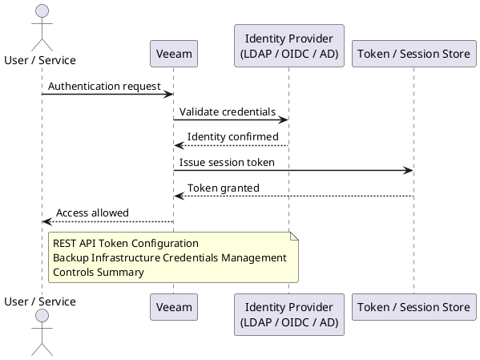

---
tags:
  - security
  - veeam
---
# Veeam — Authentication

Authentication reference covering Multi-Factor Authentication, CyberArk Integration, VBR Windows Authentication Modes, Service Account Requirements, REST API Authentication and 3 more sections.

*Applies to: Veeam 12.x*

## REST API Token Configuration

### Token Expiry

| Token Type | Default Lifetime | Notes |
|---|---|---|
| Access token | 15 minutes | Passed in every API request header |
| Refresh token | 24 hours | Exchange for a new access token without re-authenticating |

Use `grant_type=refresh_token` with the refresh token to get a new access token before expiry. Automate token refresh in scripts to avoid mid-run failures.

---

## Before you begin

- **Access:** Backup admin role on backup server; target system credentials
- **Change management:** security changes require CAB approval in most environments
- **Rollback plan:** document current state before any security control change
- **Testing:** validate in a non-production environment first where possible

---

## Backup Infrastructure Credentials Management

VBR stores credentials for managed infrastructure components (proxies, repositories, tape servers, etc.) in its configuration database.

### Managing Credentials

- VBR console → **Credentials** — central store for all managed account credentials
- Credentials are encrypted using the VBR configuration database encryption key
- Rotate passwords in **Credentials** first, then push changes to affected components

### Encryption Key Warning

> **Critical:** If the VBR configuration backup encryption key is lost, encrypted backups created with that key become permanently unrecoverable. There is no key escrow or recovery mechanism.

Best practices:

- Store the encryption password in a secrets manager (CyberArk, HashiCorp Vault) or a sealed, access-controlled document
- Enable **Encrypt configuration backup** under General Options and document the passphrase at the time of setup
- Test configuration restore annually — include the passphrase in your DR documentation

---

## Controls Summary

| Control | Configuration | Notes |
|---|---|---|
| MFA for Enterprise Manager | Settings → Users → TOTP or SAML | Required for all admin accounts |
| CyberArk credential retrieval | Credentials → Add → CyberArk; CCP URL + safe | Credentials never persisted in VBR DB |
| AD authentication | Users and Roles → assign AD groups | Prefer group assignment over individual accounts |
| VBR service account | Scoped local admin + vCenter role | No Domain Admin; use dedicated `svc-veeam` account |
| REST API token expiry | Access: 15 min / Refresh: 24 hr | Automate refresh in any scripted API consumers |
| Configuration backup encryption | General Options → Encrypt config backup | Store passphrase in secrets manager; test restore annually |
| Guest credential scope | Per-job credentials, local admin on guest | Limit to jobs requiring application-aware processing |
---

## Related Reference

- [Standard LDAP Integration](../../../../../security/ldap-integration/index.md) — field reference, service account standards, TLS requirements, and connectivity testing
- [Standard SAML Configuration](../../../../../security/saml-configuration/index.md) — SP/IdP setup, Azure AD and Okta steps, attribute mapping, and security requirements

---

## See also

- [Veeam — Access Control](../access-control/)
- [Veeam — Hardening](../hardening/)
- [Veeam — Encryption](../encryption/)
