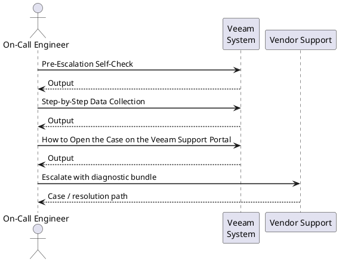
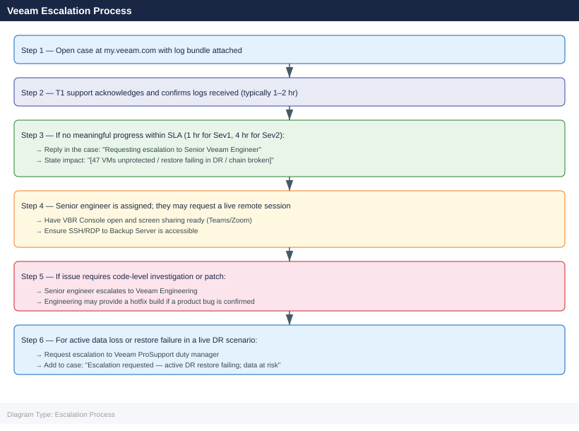

---
tags:
  - troubleshooting
  - veeam
search:
  boost: 1.5
description: "How to escalate Veeam backup issues to Veeam support: what data to collect, how to export the log bundle, step-by-step case creation on the Veeam portal..."
---
# Veeam — Escalation

<div class="kb-summary">
How to escalate Veeam backup issues to Veeam support: what data to collect, how to export the log bundle, step-by-step case creation on the Veeam portal, and the escalation path when progress stalls.

*Applies to: Veeam 12.x*
</div>

---



## Before you begin

- **Access required:** Backup Administrator role on the Veeam Backup Server; access to VBR Console; Veeam support account (my.veeam.com) with active support entitlement
- **Do this first:** collect all data below before retrying the job or changing configuration. Veeam will ask for the log bundle in their first response
- **Do NOT retry the failing job** repeatedly — each retry session overwrites the most recent session log and makes it harder to diagnose the root cause
- **Do NOT clear VBR logs** or job history during an active investigation — the logs are the primary diagnostic data

---

## Pre-Escalation Self-Check

Run these before opening the case. Many Veeam issues are resolvable without vendor support.

| Check | Where to look | Expected result |
|---|---|---|
| Veeam version | VBR Console → Help → About | Note full version string (e.g. 12.1.2.172) |
| Job failure error | VBR Console → Jobs → select job → Session → scroll to failed task | Read exact error text |
| Proxy status | VBR Console → Backup Infrastructure → Backup Proxies | All proxies show Available |
| Repository space | VBR Console → Backup Infrastructure → Backup Repositories | Free space > 15% |
| Backup Server Windows Event Log | Event Viewer → Application + System logs around failure time | Note any unexpected errors |
| vSphere connectivity | VBR Console → Managed Servers → right-click vCenter → Rescan | Completes without error |
| CBT status (if incremental failing) | PowerShell: `Get-VM <vmname> | Select Name, @{N='CBT';E={$_.ExtensionData.Config.ChangeTrackingEnabled}}` | Should be True for tracked VMs |
| Repository path accessible | From Backup Server: test-path the repository UNC path | Path resolves and is writable |

---

## Step-by-Step Data Collection

### 1. Get the Veeam version and build number

In VBR Console: click the **Help** menu → **About**. Note the full version string (example: `Veeam Backup & Replication 12.1.2.172`). Include this in the case description.

### 2. Get the job session ID and exact error text

1. In VBR Console, click **Jobs** (left panel) → right-click the failing job → **Statistics**.
2. In the session view, click the failed task (the VM or workload that failed).
3. Copy the full error message including error code (example: `Error: The process cannot access the file because it is being used by another process. Failed to read CBT data.`).
4. Note the **Session ID** shown at the top of the session statistics window.

### 3. Export the Veeam log bundle

1. In VBR Console: click the **Help** menu (hamburger/menu icon in top left) → **Support Information**.
2. Click **Export Logs**.
3. In the Export Wizard:
   - Select **Backup Server** and any **Backup Proxy** involved in the failing job
   - Select the **Time Range** that covers the period of the failure (set start time to 1 hour before the first failure)
   - Click **Export**
4. Wait for the wizard to collect logs from the Backup Server and Proxy nodes.
5. The log bundle ZIP is saved to `C:\ProgramData\Veeam\Backup\` by default. Note the exact path.

This ZIP file is the most important attachment for the support case. It contains all service logs, job session data, and configuration snapshots.

### 4. Write the timeline

```text
Veeam version: 12.1.2.172
Backup Server: veeam-backup-01.corp.local
Job name: VMware_Gold_Production
Session ID: a7f2c4b1-...
Error text: "Failed to read CBT data (code 10040)" — exact copy from session stats
Issue first observed: 2026-06-14 02:15 UTC (nightly backup run)
Last known good backup: 2026-06-13 02:30 UTC (all VMs successful)
Changes in the 24h before the issue:
  - 2026-06-13 18:00: vCenter 8.0 U2b → U2c patched
  - 2026-06-14 01:00: SOBR performance tier capacity extended
Steps already taken:
  - Manually triggered a retry: failed with same error
  - Checked repository space: 22% free
  - Proxy shows Available in console
Blast radius: 47 VMs in the backup job failed; no successful backup for 24h
```

---

## How to Open the Case on the Veeam Support Portal

1. Go to **my.veeam.com** and sign in with your Veeam account. If you do not have one: click **Register** and use your company email — entitlement is linked to your Veeam license.

2. Click **Open a Case** or navigate to **Support Cases** → **New Case**.

3. Under **Product**, select **Veeam Backup & Replication**.

4. Under **Version**, select your exact version from the drop-down (e.g. `12.1`).

5. Under **Platform / Hypervisor**, select your environment (VMware vSphere, Hyper-V, Physical, etc.).

6. Under **Severity**, select:
   - **Severity 1 — Critical**: Active data loss (backup data known corrupt); restore is failing in an active DR scenario; entire backup infrastructure is offline; no workaround exists
   - **Severity 2 — High**: All backup jobs failing; backup chain broken; significant data protection gap but no immediate data loss
   - **Severity 3 — Medium**: Some jobs failing; single VM or job affected; workaround exists or impact is limited
   - **Severity 4 — Low**: How-to question, configuration advice, or non-urgent inquiry

7. In the **Summary** field: product + symptom + scope. Example: `VBR 12.1 — CBT read error on 47 VMware VMs since nightly run 2026-06-14 02:15 UTC; no backup for 24h`.

8. In the **Description** field, paste:
   - The Veeam version and build from Step 1
   - The job name and Session ID from Step 2
   - The exact error text from Step 2
   - The timeline from Step 4
   - Steps already tried

9. Under **Attachments**, upload the log bundle ZIP from Step 3. If the file exceeds 200 MB, the portal will provide an FTP upload link — use that.

10. Click **Submit**. You will receive a case number immediately by email.

11. **Severity 1 only:** call Veeam support immediately after submission:
    - North America: +1-888-VEEAM-7U (check my.veeam.com for current numbers)
    - EMEA: check my.veeam.com → Support → Contact Us for your regional number
    - State "Severity 1 — active DR restore failing" at the start of the call.

---

## Escalation Path



---

## What NOT to Do

| Do NOT do this | Why | What to do instead |
|---|---|---|
| Delete failed restore points to "fix" the chain | Permanent data loss if those are your only backups for that period | Let Veeam support guide the chain repair procedure |
| Re-run the failing job multiple times | Creates multiple failed sessions; each retry can overwrite diagnostic log state | Run once to confirm the failure, then stop and open a case |
| Run Health Check on the failing chain mid-incident | Can attempt reads that fail and extend the incident | Wait for Veeam support to advise on Health Check timing |
| Clear VBR log files from the Backup Server | Destroys diagnostic data that Veeam support needs | Leave logs in place; export via the Support Information wizard |
| Reset CBT without Veeam guidance | Forces full backup; may not fix underlying issue | Let Veeam confirm whether CBT reset is the correct action |
| Upgrade Veeam mid-incident | Adds variables; may change log format for the case | Freeze all changes until the case is resolved |

---

## Useful Commands for Case Updates

```powershell
# From Veeam Backup Server PowerShell (run as Administrator)
# Connect to VBR server
Connect-VBRServer -Server localhost

# List failed sessions in last 24 hours
Get-VBRSession | Where-Object {$_.Result -eq "Failed" -and $_.CreationTime -gt (Get-Date).AddHours(-24)} |
  Select-Object Name, CreationTime, EndTime, Result | Format-Table -AutoSize

# Show the exact error for a specific session
Get-VBRSession | Where-Object {$_.Id -eq '<session-id>'} | Select-Object -ExpandProperty Log |
  Where-Object {$_.Status -eq 'EFailed'} | Select-Object -ExpandProperty Title

# Check CBT status for VMs in a job
Get-VBRJob -Name "<job-name>" | Get-VBRJobObject | ForEach-Object {
  $vm = Find-VBRObject -Entity $_.Object
  [PSCustomObject]@{VM=$_.Name; CBT=$vm.ExtensionData.Config.ChangeTrackingEnabled}
}

# Proxy and repository availability
Get-VBRViProxy | Select-Object Name, Host, Enabled, Type
Get-VBRBackupRepository | Select-Object Name, FriendlyPath, IsOutOfDate
```

---

## Support Tiers and SLA Reference

| Tier | Sev 1 SLA | Availability | Notes |
|---|---|---|---|
| Standard | 4 hours | Business hours | For non-production environments |
| Production | 2 hours | 24×7 | Standard enterprise support |
| ProSupport | 1 hour | 24×7 | Designated senior engineer; proactive health checks |
| ProSupport Plus | 30 minutes | 24×7 | TAM + proactive monitoring + quarterly reviews |

Check your support tier under **My Contracts** at my.veeam.com.

---

## See also

- [Veeam — Diagnostics](../diagnostics/)
- [Veeam — Common Issues](../common-issues/)

---

## Verify resolution

- The failing job runs successfully and all expected VMs complete with status `Success`
- Check the latest session statistics: no tasks in `Warning` or `Failed` state
- Verify the backup chain integrity: VBR Console → Backup → right-click repository → Check → verify restore points are consistent
- Confirm last restore point timestamp is within the expected RPO window
- Run a test restore of one VM from the new restore point and confirm it powers on successfully
- Monitor the next 2 backup runs to confirm the fix is stable
