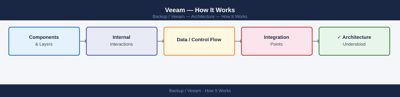
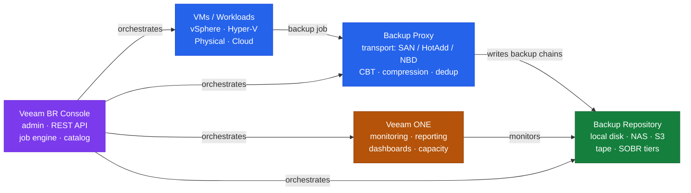

---
tags:
  - architecture
  - veeam
---
# Veeam — How It Works

How It Works reference covering Overview, Architecture, Supported Platforms, Retention Schedule, Sizing Guidelines and 1 more sections.

*Applies to: Veeam Backup & Replication 12.x*

## Overview

Veeam Backup & Replication provides backup, replication, recovery, and disaster recovery for virtual, physical, and cloud workloads. The Backup Server manages scheduling and configuration. Backup Proxies perform data movement via VMware VADP or agent-based reads. The Scale-Out Backup Repository (SOBR) provides tiered storage — fast disk for short-term, object storage for long-term.

## Architecture

## Supported Platforms

| Platform | Method |
|---|---|
| VMware vSphere | VADP, agentless |
| Microsoft Hyper-V | HV provider, agentless |
| Physical Windows | Veeam Agent for Windows (VAW) |
| Physical Linux | Veeam Agent for Linux (VAL) |
| AWS EC2 | Veeam Backup for AWS (separate appliance) |
| Azure VMs | Veeam Backup for Azure (separate appliance) |

## Retention Schedule

| Level | Restore Points | Schedule | Repository |
|---|---|---|---|
| Daily | 14 | Incremental (synthetic full weekly) | Performance tier (fast disk) |
| Weekly | 8 | Synthetic full | Performance tier |
| Monthly | 12 | Active full (monthly) | SOBR capacity tier offload |
| Yearly | 7 | Active full (yearly) | Object storage archive |

## Sizing Guidelines

| Scale | Backup Server | Proxies per Site |
|---|---|---|
| < 100 VMs | 4 vCPU, 8 GB RAM | 1–2 |
| 100–500 VMs | 8 vCPU, 16 GB RAM | 2–4 |
| 500–2,000 VMs | 16 vCPU, 32 GB RAM (+ full SQL) | 4–8 |

## Instant VM Recovery RTO Targets

| Application Tier | Target RTO |
|---|---|
| Tier 1 (critical DB, ERP) | < 15 minutes via Instant VM Recovery |
| Tier 2 (business apps) | < 1 hour |
| Tier 3 (dev/test) | < 4 hours |

---

## See also

- [Veeam — Design Standards](../design-standards/)
- [Veeam — Integrations](../integrations/)
- [Veeam — Deploy](../../deploy/)
