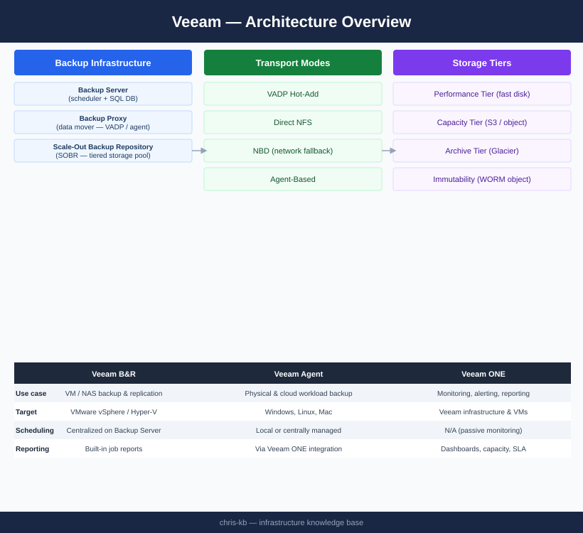

# Veeam — Architecture

<div class="kb-summary">
Veeam Backup & Replication architecture — Backup Server manages scheduling, Proxies handle data movement via VADP or agent, and SOBR provides tiered storage with immutable object offload.
</div>

```text
┌──────────────────────────────────────── Veeam — Architecture ─────────────────────────────────────────┐
│                                                                                                       │
│   ┌───────────────────────────────────────────────────────────────────────────────────────────────┐   │
│   │                                 Veeam — Component Architecture                                │   │
│   │           Veeam Backup Server — scheduler, job engine, catalog, REST API (port 9419)          │   │
│   │       Backup Proxy        — data mover; VMware VADP for CBT snapshots; SAN/NAS/LAN modes      │   │
│   │        Backup Repository   — target storage: SOBR, CIFS/NFS, S3 object, dedup appliance       │   │
│   │               Ports: 9419 (Veeam REST API) · 6160 (Veeam Agent) · 443 (vCenter)               │   │
│   └───────────────────────────────────────────────────────────────────────────────────────────────┘   │
│                                                                                                       │
│    Three-tier component model — control plane, data plane, and management                             │
│                                                                                                       │
│                          ▼                        ▼                        ▼                          │
│                                                                                                       │
│   ┌─────────────────────────────┐  ┌─────────────────────────────┐  ┌─────────────────────────────┐   │
│   │        Control Plane        │  │          Data Plane         │  │          Management         │   │
│   │ Veeam Backup Server — schedu│  │ Backup Proxy        — data m│  │ Mount Server        — used f│   │
│   │          Scheduling         │  │      Replication/Backup     │  │    9419 (Veeam REST API)    │   │
│   │         Policy mgmt         │  │        Data movement        │  │           REST API          │   │
│   │          Catalog/DB         │  │        Dedup/compress       │  │             RBAC            │   │
│   │          Job engine         │  │      6160 (Veeam Agent)     │  │           Alerting          │   │
│   └─────────────────────────────┘  └─────────────────────────────┘  └─────────────────────────────┘   │
│                                                                                                       │
│  Physical Infrastructure:                                                                             │
│  Windows Server (Backup Server) · Proxy VMs on ESXi · Backup storage (NAS/SAN) · Management LAN       │
│  Key terms:                                                                                           │
│                                                                                                       │
│  Backup Server = central Veeam component: scheduler, job engine, catalog, REST API                    │
│  Backup Proxy  = data mover between vSphere and repository; runs in virtual-appliance mode or H       │
│  CBT           = Changed Block Tracking; VMware VADP mechanism to track changed disk sectors          │
│  VADP          = VMware vSphere APIs for Data Protection; enables agentless VM backup                 │
│  SOBR          = Scale-Out Backup Repository; tiers extents; moves cold data to object storage        │
│  Instant Recovery= mounts VM disks from backup directly to ESXi; VM live in seconds                   │
│  SureBackup    = automated backup verification; test-restores VM in isolated virtual lab              │
│  Replication   = creates VM replica at DR site; enables failover without full restore time            │
│  GFS Retention = Grandfather-Father-Son retention: daily, weekly, monthly, yearly restore points      │
│  Immutable Repo= object storage (S3 WORM) or Linux XFS (immutable flag) repo; ransomware protec       │
│  Mount Server  = Windows host presenting backup as iSCSI/NFS datastore for instant recovery           │
│  VeeamZIP      = ad-hoc compressed portable backup of a single VM; no job required                    │
│  Health Check  = periodic backup integrity scan; verifies restore points are readable                 │
│  Forward Incremental= default mode; one full + daily incrementals; synthetic full created perio       │
│                                                                                                       │
└───────────────────────────────────────────────────────────────────────────────────────────────────────┘
```


<div class="kb-grid kb-grid-3">
<a class="kb-card" href="how-it-works/"><strong>How It Works</strong><span>Proxy transport modes, SOBR tiers, supported platforms, retention schedule, and sizing.</span></a>
<a class="kb-card" href="integrations/"><strong>Integrations</strong><span>VMware vSphere, Hyper-V, physical agents, and cloud (AWS/Azure) integrations.</span></a>
<a class="kb-card" href="design-standards/"><strong>Design Standards</strong><span>Job naming, retention schedule, SOBR design, proxy placement, and immutability settings.</span></a>
</div>

| Component | Role |
|---|---|
| Backup Server | Management, scheduler, config DB; Windows Server + SQL |
| Backup Proxy | Data mover; reads VM data via VADP (hot-add, Direct NFS, NBD) or agent |
| Backup Repository | Target storage for .vbk/.vib backup files |
| Scale-Out Backup Repository (SOBR) | Tiered pool: performance extent (fast disk) + capacity tier (object storage) |
| Veeam ONE | Monitoring, alerting, and reporting; separate server |


