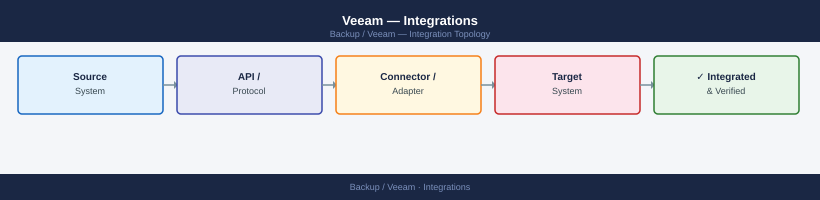

---
tags:
  - architecture
  - veeam
---
# Veeam — Integrations

Veeam integration with VMware vSphere, Nutanix, Azure, object storage repositories, and monitoring platforms.

*Applies to: Veeam Backup & Replication 12.x*

Veeam integrates with virtualisation, storage, cloud, and monitoring platforms through native plugins and APIs. VMware vSphere is the primary integration: Veeam connects to vCenter (or individual ESXi hosts for standalone), uses VADP for snapshot-based backups, and leverages Changed Block Tracking (CBT) for incremental efficiency. Storage integrations use vendor-specific plugins for hardware snapshot-based backups, reducing backup windows and eliminating I/O impact on production.

| Integration | Method | Notes |
|---|---|---|
| VMware vSphere | VADP, vCenter API | vCenter credentials; CBT for incrementals |
| Microsoft Hyper-V | Hyper-V VSS / RCT | Direct Hyper-V integration |
| Pure FlashArray | Veeam Plugin for Pure | NFS/iSCSI repository or snapshot integration |
| Dell PowerMax | Veeam Plugin for Dell EMC | Hardware snapshot-based backup |
| AWS S3 | Cloud repository / capacity tier | Object Lock for immutable backups |
| Azure Blob | Cloud repository / capacity tier | Azure AD service principal auth |
| GCP Cloud Storage | Cloud repository | Service account key auth |
| Active Directory | Windows auth for VBR console | AD groups mapped to Veeam roles |
| Veeam ONE | VBR API | Monitoring, alerting, and reporting |
| ServiceNow | Custom PowerShell integration | Incident creation on job failure |

---

## See also

- [Veeam — Design Standards](../design-standards/)
