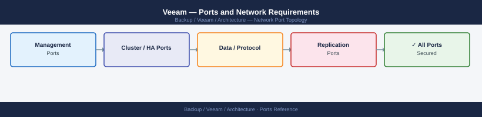

---
tags:
  - veeam
  - networking
  - firewall
  - ports
  - backup
---
# Veeam — Ports and Network Requirements

<div class="kb-summary">
Firewall port reference for Veeam Backup & Replication. Covers VBR server, backup proxies, repositories, VMware infrastructure access, guest processing, and Veeam ONE monitoring.

*Applies to: Veeam Backup & Replication v12.x*
</div>



## Before you begin

- Veeam B&R uses a dynamic data mover port range (2500–5000 TCP) for backup data transfer — this range must be open between proxies, repositories, and VBR server
- Guest processing for Windows VMs uses VBR → guest VM on 6160 (Veeam Installer Service) and 6162 (Veeam Data Mover); for Linux VMs, SSH is used
- If using a DMZ or isolated network for backup, all ports below must be open inbound on the backup network interface
- Windows repositories may require DCOM/RPC ports (135 + ephemeral range); Linux repositories only need 22

---

## Inbound — Client to VBR Server

| Port | Protocol | Source | Purpose |
|---|---|---|---|
| 9392 | TCP | Admin consoles, automation | VBR Console and component communication |
| 9396 | TCP | REST API clients, Kasten, automation | Veeam REST API (v12) |
| 9401 | TCP | Veeam Enterprise Manager | EM-to-VBR communication |
| 9419 | TCP | Veeam agents (Windows/Linux) | Veeam Agent Management |

---

## VBR Server to Backup Infrastructure

| Port | Protocol | Source | Destination | Purpose |
|---|---|---|---|---|
| 9392 | TCP | VBR Server | Backup Proxy | VBR ↔ Proxy component communication |
| 9392 | TCP | VBR Server | Backup Repository | VBR ↔ Repository communication |
| 2500–5000 | TCP | VBR Server | Proxy / Repository | Data mover — backup job data transfer |
| 135 | TCP | VBR Server | Windows Proxy / Repository | Microsoft RPC Endpoint Mapper |
| 445 | TCP | VBR Server | Windows Proxy / Repository | SMB — deployment, component push |
| 22 | TCP | VBR Server | Linux Proxy / Repository | SSH — deployment and management |

---

## Backup Proxy to VMware Infrastructure

| Port | Protocol | Source | Destination | Purpose |
|---|---|---|---|---|
| 443 | TCP | Backup Proxy | vCenter Server | vCenter API — VM inventory, VADP snapshot management |
| 902 | TCP | Backup Proxy | ESXi hosts | vmware-authd — hot-add and network data transfer modes |
| 903 | TCP | Backup Proxy | ESXi hosts | VMRC (remote console, used by some proxy modes) |

---

## Backup Proxy to Backup Repository (Data Transfer)

| Port | Protocol | Between | Purpose |
|---|---|---|---|
| 2500–5000 | TCP | Proxy ↔ Repository | Veeam Data Mover — backup data stream |
| 445 | TCP | Proxy → Windows Repository | SMB (Direct to repository share, if SMB repo) |
| 22 | TCP | Proxy → Linux Repository | SSH + SFTP (Linux repository data path) |

---

## Guest Processing (Application-Aware)

### Windows Guest VMs

| Port | Protocol | Source | Destination | Purpose |
|---|---|---|---|---|
| 6160 | TCP | VBR Server / Proxy | Guest VM IP | Veeam Installer Service — push/install guest agent |
| 6162 | TCP | VBR Server / Proxy | Guest VM IP | Veeam Data Mover (within guest) |
| 445 | TCP | VBR Server | Guest VM IP | SMB — fallback for agent push without VBS |
| 135 | TCP | VBR Server | Guest VM IP | DCOM/RPC (WMI-based application discovery) |

### Linux Guest VMs

| Port | Protocol | Source | Destination | Purpose |
|---|---|---|---|---|
| 22 | TCP | VBR Server / Proxy | Guest VM IP | SSH — guest script execution, pre/post freeze scripts |

---

## Scale-Out Backup Repository (SOBR) — Object Storage (Capacity Tier)

| Port | Protocol | Source | Destination | Purpose |
|---|---|---|---|---|
| 443 | TCP | VBR Server / Repository | S3-compatible endpoint or Azure Blob | Object storage offload |
| 443 | TCP | VBR Server / Repository | AWS S3 / Azure endpoint | Cloud tier — immutable backups |

---

## Veeam ONE Monitoring

| Port | Protocol | Source | Destination | Purpose |
|---|---|---|---|---|
| 9394 | TCP | Veeam ONE Server | VBR Server | Veeam ONE ↔ VBR data collection |
| 1239 | TCP | Veeam ONE Agent | Veeam ONE Server | Agent-based monitoring (Veeam ONE agents on managed hosts) |
| 443 | TCP | Veeam ONE Server | vCenter Server | vCenter API for infrastructure data |

---

## Enterprise Manager

| Port | Protocol | Source | Purpose |
|---|---|---|---|
| 9080 | TCP | Admin workstations | Enterprise Manager web UI (HTTP) |
| 9443 | TCP | Admin workstations | Enterprise Manager web UI (HTTPS) |
| 9401 | TCP | Enterprise Manager | VBR Servers | EM management of VBR |

---

## Outbound — Veeam to External Services

| Port | Protocol | Destination | Purpose |
|---|---|---|---|
| 443 | TCP | veeam.com, my.veeam.com | License activation, update check |
| 443 | TCP | S3/Azure/cloud endpoints | Object storage targets (if configured) |
| 25 | TCP | SMTP relay | Email notifications |

---

## Firewall Zone Summary

| From | To | Ports | Notes |
|---|---|---|---|
| Admin consoles | VBR Server | 9392, 9396 | VBR console + REST API |
| VBR Server | Backup Proxy | 9392, 2500-5000, 135, 445 | Or 22 for Linux proxy |
| VBR Server | Backup Repository | 9392, 2500-5000, 445 | Or 22 for Linux repo |
| Backup Proxy | vCenter | 443 | VADP snapshot control |
| Backup Proxy | ESXi hosts | 902 | Hot-add and NBD data transfer |
| Proxy | Repository | 2500-5000 | Data mover; this range must be fully open |
| VBR Server | Windows guest VMs | 6160, 6162, 445 | Application-aware processing |
| VBR Server | Linux guest VMs | 22 | Guest script execution |
| VBR / Repository | S3 endpoint | 443 | Object storage / cloud tier |
| Veeam ONE | VBR Server | 9394 | Monitoring data collection |

---

## Verify

```bash
# From admin workstation — test VBR REST API
curl -sk -o /dev/null -w "%{http_code}" https://<vbr-server>:9396/api/v1/serverInfo

# From VBR Server — test proxy reachability
Test-NetConnection -ComputerName <proxy-hostname> -Port 9392

# From proxy — test vCenter API port
nc -zv <vcenter-fqdn> 443

# From proxy — test ESXi agent port
nc -zv <esxi-ip> 902

# From proxy — test repository data mover port
Test-NetConnection -ComputerName <repo-server> -Port 2500

# From VBR Server — test guest processing port (Windows guest)
Test-NetConnection -ComputerName <vm-ip> -Port 6160
```

---

## See also

- [Veeam — Architecture](how-it-works/)
- [Veeam — Deploy](../deploy/)
- [Veeam — Operations](../operations/)
- [Veeam — Troubleshooting](../troubleshooting/)
