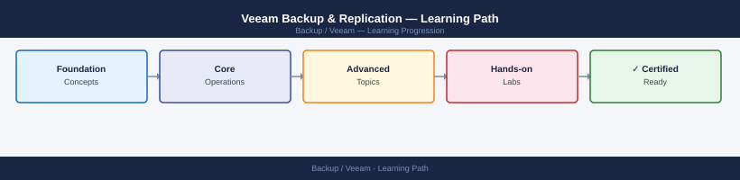

---
tags:
  - learning-path
  - veeam
---
# Veeam Backup & Replication — Learning Path

<div class="kb-summary">
Recommended reading order for Veeam Backup & Replication. Follow these stages in order to build a complete mental model before working with it in production.

*Applies to: Veeam Backup & Replication 12.x*
</div>



```d2
direction: right

stage_1_architecture: "Stage 1 — Architecture" {shape: rectangle}
stage_2_deployment: "Stage 2 — Deployment" {shape: rectangle}
stage_3_operations: "Stage 3 — Operations" {shape: rectangle}
stage_4_security: "Stage 4 — Security" {shape: rectangle}
stage_5_troubleshooting: "Stage 5 — Troubleshooting" {shape: rectangle}

stage_1_architecture -> stage_2_deployment: next
stage_2_deployment -> stage_3_operations: next
stage_3_operations -> stage_4_security: next
stage_4_security -> stage_5_troubleshooting: next
```

## Stage 1 — Architecture

**Goal**: Understand the Veeam data movement model — backup jobs vs replication jobs, the role of proxies and repositories, and how SOBR extends capacity.

**Read in this order**:

- [How It Works](../architecture/how-it-works/) — Veeam Backup & Replication architecture: VBR server as orchestrator, VMware/Hyper-V backup proxies for data movement, backup repositories as landing targets, Scale-Out Backup Repository (SOBR) for tiered storage; backup job vs replication job vs backup copy job differentiation
- [Design Standards](../architecture/design-standards/) — Proxy sizing (vCPU, RAM, concurrent tasks), repository selection (Windows vs Linux hardened repository), SOBR extent design (performance tier vs capacity tier), RPO/RTO matrix for job scheduling, tape integration for long-term retention
- [Integrations](../architecture/integrations/) — vCenter and vSphere integration (VADP), Hyper-V integration, NetApp SnapMirror/SnapVault storage snapshot integration, object storage integration for capacity tier, Veeam ONE for monitoring, SureBackup virtual lab for automated recovery verification

**Why first**: Veeam's proxy-repository-SOBR data path determines backup throughput and recovery speed — designing this correctly before deployment avoids performance bottlenecks and RPO misses.

---

## Stage 2 — Deployment

**Goal**: Install VBR, configure proxies and repositories, and create the first backup jobs.

**Read**:

- [Deploy](../deploy/) — VBR server installation, vCenter credential configuration, backup proxy deployment (managed agent on Windows/Linux), repository creation (SMB/NFS/dedup appliance), SOBR creation with performance and capacity extents, license activation
- [Install & Upgrade](../operations/install-upgrade/) — VBR version upgrade sequence, component update (proxies, agents, plugins), database backup before upgrade, post-upgrade job validation

---

## Stage 3 — Operations

**Goal**: Monitor backup job results, manage repository capacity, execute restores, and validate backup health via SureBackup.

**Read in this order**:

- [Health Checks](../operations/health-checks/) — Run the routine first on every shift; review session results for failures and warnings, check repository free space, validate SOBR capacity tier offload, review SureBackup results
- [CLI Reference](../operations/cli-reference/) — Veeam PowerShell module: `Get-VBRJob`, `Start-VBRJob`, `Get-VBRRestorePoint`, `Start-VBRInstantRecovery`, `Get-VBRRepository`; REST API v1 endpoints for job control
- [Procedures](../operations/procedures/) — Instant Recovery (mount VM directly from backup), full VM restore, guest-level file/folder restore, application item restore (SQL, Exchange, Active Directory), SureBackup lab run for restore verification
- [Backup & Restore](../operations/backup-restore/) — Full restore workflow, instant recovery to production, cross-platform restore (VMware to Hyper-V), restore from tape, SOBR capacity tier recall for restore
- [Scripts](../operations/scripts/) — Automated job result reporting, repository capacity alerts, SureBackup schedule automation, backup copy verification scripts

---

## Stage 4 — Security

**Goal**: Harden the backup infrastructure as a last line of defence, enforce immutability, and control access to restore capabilities.

**Read**:

- [Access Control](../security/access-control/) — Veeam RBAC roles (Veeam Backup Administrator, Restore Operator, Veeam Backup Viewer), security for backup console access, vCenter credential least-privilege
- [Authentication](../security/authentication/) — AD integration for Veeam console login, MFA for VBR server access, backup proxy service account management, encrypted credentials database
- [Encryption](../security/encryption/) — Backup file encryption (AES-256) for at-rest and tape encryption, HTTPS for Veeam console and REST API, Linux hardened repository immutability (immutable flag via XFS)
- [Hardening](../security/hardening/) — Isolated backup network for proxy traffic, Linux hardened repository as single-use backup target, 3-2-1-1-0 rule implementation, disable VBR console RDP from production networks

---

## Stage 5 — Troubleshooting

**Goal**: Diagnose failed backup jobs, restore failures, and repository issues.

**Read**:

- [Common Issues](../troubleshooting/common-issues/) — Backup job failing with proxy error, repository out of space, instant recovery VM not booting, SureBackup test failing for known-good backup, SOBR capacity tier offload stuck
- [Diagnostics](../troubleshooting/diagnostics/) — VBR session logs in console, `C:\ProgramData\Veeam\Backup` job logs, VMware VADP error codes, proxy task trace logging, repository health check
- [Escalation](../troubleshooting/escalation/) — Veeam support case process, log export via Veeam Log Collector tool, vSphere support for VADP-level issues, storage vendor support for storage snapshot integration failures

**Why last**: Troubleshooting Veeam requires knowing the expected data path (proxy → repository → SOBR) and normal job sequence — both established in the Architecture and Operations stages.

---

## See also

- [Veeam — Deploy](../deploy/)
- [Veeam — Procedures](../operations/procedures/)
- [Veeam — Common Issues](../troubleshooting/common-issues/)
