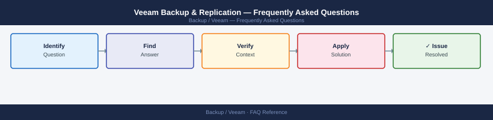

---
tags:
  - veeam
  - faq
  - operations
---
# Veeam Backup & Replication — Frequently Asked Questions

Common questions about Veeam Backup & Replication operations, configuration, and troubleshooting. For step-by-step procedures, see the <a href="index.md">Operations</a> section.

## General

**Q: What Veeam version is recommended for new deployments?**
A: Veeam v12.1+ is the current recommendation. Check under Main Menu → Help → About. Keep the VBR server updated — older agents and proxies continue to work with newer VBR servers.

**Q: How do I check the current Veeam Backup & Replication version?**
A: `Get-VBRVersion  # in Veeam PowerShell console`

## Configuration

**Q: What is the difference between SOBR and a simple repository, and when to use each?**
A: Scale-Out Backup Repository (SOBR) spans multiple extents and supports capacity tier offload to object storage. Use SOBR for large environments. Simple repositories suit small setups or dedicated extents within a SOBR.

**Q: How do I enable immutability on a Linux hardened repository?**
A: During repository configuration, select 'Make recent backups immutable for X days'. The Linux host must run as a non-root single-use account. SSH key auth is required; password auth is blocked for hardened repos.

## Operations

**Q: How do I perform a rolling upgrade of Veeam proxies without disrupting jobs?**
A: Upgrade VBR server first. Then upgrade proxies via VBR Console → Backup Infrastructure → right-click proxy → Upgrade. VBR will drain jobs from the proxy before upgrading. Upgrade one proxy at a time.

**Q: What is the correct procedure to add a new backup proxy?**
A: In VBR Console, go to Backup Infrastructure → Backup Proxies → Add VMware Backup Proxy. Provide the server credentials. Set transport mode (Direct SAN, HotAdd, or NBD). Assign to backup jobs.

## Troubleshooting

**Q: Job shows 'Warning: Backup file is located on the same datastore as the processed VM'. What does it mean?**
A: The target repository is on the same datastore as source VMs. This reduces resilience and can cause storage contention. Move the repository to a separate storage device.

**Q: Synthetic full backup takes much longer than expected — where do I start?**
A: Check repository disk I/O (synthetic full reads all increments). Consider switching to Active Full if repository IOPS are a bottleneck. Review proxy transport mode — Direct SAN is fastest for synthetic operations.

## Backup and Recovery

**Q: How often should I run SureBackup verification?**
A: Weekly for critical VMs, monthly for non-critical. SureBackup uses an isolated virtual lab — it does not affect production. Results are emailed and logged in VBR reports.

**Q: Can I restore a single file from a VM backup without restoring the full VM?**
A: Yes — use Instant File-Level Recovery (FLR). In VBR Console, right-click the restore point → Restore Guest Files. Supports Windows, Linux (via helper appliance), and application-aware extracts.

## See Also

- [Veeam Backup & Replication Operations](index.md)
- [Veeam Backup & Replication Troubleshooting](../../troubleshooting//)
