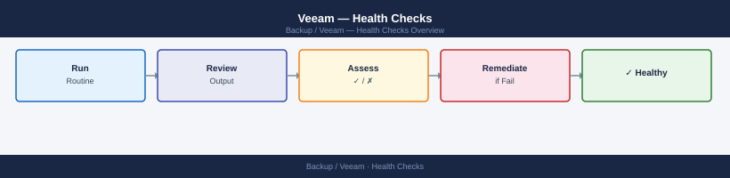
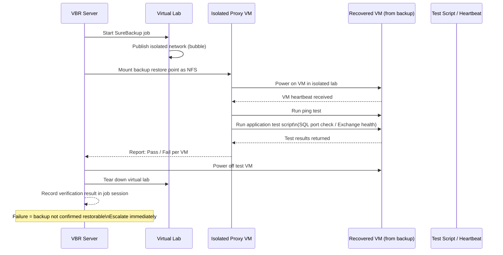

---
tags:
  - operations
  - veeam
---
# Veeam — Health Checks


<div class="kb-summary">
The primary review surface is the **Home** view in the VBR console, which shows job counts grouped by status (Running, Success, Warning, Failed). Work through this list top-to-bottom every morning.

*Applies to: Veeam 12.x*
</div>



## Before you begin

- **Access:** Backup admin role on backup server; target system credentials
- **Timing:** safe to run during business hours unless a step is marked ⚠ (causes interruption)
- **Dependencies:** no active upgrades or migrations on the same infrastructure
- **Logging:** capture command output — paste into the change record on completion

---

## SureBackup Verification Sequence

SureBackup starts VMs in an isolated virtual lab and runs application-level tests — it is the only way to confirm a backup is truly restorable.




## Run This Routine

Run these commands on the VBR server each morning for a complete health snapshot.

1. **VBR service status** — confirm the core service is running:
   ```powershell
   Get-Service -Name VeeamBackupSvc | Select Status,DisplayName
   ```
2. **Backup job status (last 24 h)** — check every scheduled job's last result:
   ```powershell
   Get-VBRJob | Where {$_.IsScheduleEnabled} | Select Name,@{n='LastResult';e={$_.GetLastResult()}}
   ```
3. **Repository free space** — flag any repo below 10 % free:
   ```powershell
   Get-VBRBackupRepository | Select Name,@{n='FreeGB';e={[math]::Round($_.GetContainer().CachedFreeSpace/1GB,1)}}
   ```
4. **Failed backup sessions** — list all failures in the last 24 h:
   ```powershell
   Get-VBRSession | Where {$_.Result -eq 'Failed' -and $_.CreationTime -gt (Get-Date).AddHours(-24)} | Select JobName,CreationTime,Result
   ```
5. **Proxy connectivity** — verify all proxies are reachable:
   ```powershell
   Get-VBRViProxy | Select Name,Host,@{n='Status';e={$_.Host.GetConnectionStatus()}}
   ```
6. **Tape library health** (if applicable) — confirm all drives are online:
   ```powershell
   Get-VBRTapeLibrary | Select Name,State,DriveCount
   ```
7. **Veeam ONE alarms** (if deployed) — surface the latest errors:
   ```powershell
   Get-VBRAAuditEntry | Where {$_.Severity -eq 'Error'} | Select -First 20
   ```
8. **License expiry** — verify the licence is valid and not near expiry:
   ```powershell
   Get-VBRInstalledLicense | Select Edition,ExpirationDate,Status
   ```
9. **Replica health** (if replication jobs exist) — check last result for every replica job:
   ```powershell
   Get-VBRJob -Type Replica | Select Name,@{n='LastResult';e={$_.GetLastResult()}}
   ```
10. **VBR database connection** — confirm the configuration database is reachable:
    ```powershell
    Get-VBRDatabaseConnection | Select ServerName,DatabaseName
    ```

Flag any extent below 10% free space for immediate action (offload trigger or capacity expansion).

### Tape Check (if applicable)

- Confirm the daily tape job completed and media was ejected on schedule.
- Verify the **Tape** node shows no **Error** state for the library or drives.
- Confirm physical tapes are noted for offsite transport per the media rotation policy.

### Daily Checklist Summary

- [ ] Home view — review Success / Warning / Failed job counts
- [ ] Investigate all Failed jobs — document error and remediation
- [ ] Review all Warning jobs — identify root cause, escalate if recurring
- [ ] SOBR extents — confirm no Sealed or Unavailable extent
- [ ] Repository free space — flag any extent below 10% free
- [ ] Active sessions — confirm no job is running more than 2x its normal duration
- [ ] Tape eject — confirm tapes are offsite (if applicable)

---

## Weekly Checks

### SureBackup Verification Job Review

Run or review the scheduled SureBackup job for critical VM groups. In **Home > Last 24 Hours** (adjust filter to last 7 days), locate SureBackup sessions and check the **Verification** column.

A SureBackup failure means the backup is not confirmed restorable — escalate immediately.

```powershell
# List SureBackup sessions from the last 7 days
Get-VBRBackupSession | Where-Object {
    $_.JobType -eq "SureBackup" -and $_.CreationTime -gt (Get-Date).AddDays(-7)
} | Select-Object JobName, Result, CreationTime, EndTime
```

### Repository Capacity Trend

Pull weekly capacity snapshots and compare against the previous week to identify jobs with abnormal data growth.

```powershell
# Capacity across all repositories
Get-VBRBackupRepository | Select-Object Name,
    @{N="FreeGB";E={[math]::Round($_.FreeSpace/1GB,1)}},
    @{N="TotalGB";E={[math]::Round($_.TotalSpace/1GB,1)}},
    @{N="UsedPct";E={[math]::Round((1 - $_.FreeSpace/$_.TotalSpace)*100,1)}}
```

Flag any repository trending to reach capacity within 30 days at current growth rate.

### Retention Compliance

Verify that restore point counts match the configured retention for each job.

```powershell
# Count restore points per backup job
Get-VBRBackup | ForEach-Object {
    $rp = Get-VBRRestorePoint -Backup $_
    [PSCustomObject]@{
        Job        = $_.JobName
        Points     = $rp.Count
        Oldest     = ($rp | Sort-Object CreationTime | Select-Object -First 1).CreationTime
        Newest     = ($rp | Sort-Object CreationTime -Descending | Select-Object -First 1).CreationTime
    }
}
```

---

## Verify

- **Job status:** confirm backup job completed with status Success (not Warning)
- **Recovery test:** restore a single file or VM from the new backup to confirm restorability
- **Retention:** verify old recovery points are expiring per the configured retention policy

---

## See also

- [Veeam — Procedures](../procedures/)
- [Veeam — CLI Reference](../cli-reference/)
- [Veeam — Common Issues](../../troubleshooting/common-issues/)
