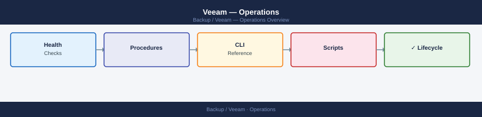

---
tags:
  - operations
  - veeam
---
# Veeam — Operations

Veeam day-to-day operations — backup job management, restore procedures, scale-out repository, and immutability settings.

*Applies to: Veeam 12.x*

<a class="kb-card" href="cli-reference/">
  <strong>CLI Reference</strong>
  qcommand, qlist, qoperation, REST API, and job management.
</a>

<a class="kb-card" href="health-checks/">
  <strong>Health Checks</strong>
  Daily checks, job review, MediaAgent health, and DDB monitoring.
</a>

<a class="kb-card" href="procedures/">
  <strong>Procedures</strong>
  Change readiness, maintenance windows, and operational procedures.
</a>

<a class="kb-card" href="install-upgrade/">
  <strong>Install &amp; Upgrade</strong>
  Version matrix, upgrade workflow, and lifecycle management.
</a>

<a class="kb-card" href="backup-restore/">
  <strong>Backup &amp; Restore</strong>
  Backup policies, restore procedures, and recovery validation.
</a>

<a class="kb-card" href="scripts/">
  <strong>Scripts</strong>
  Automation scripts for health checks and operations.
</a>

<a class="kb-card" href="morning-health-check/">
  <strong>Morning Health-Check</strong>
  Daily Veeam job and repository health-check runbook — takes ~5 minutes.
</a>

  <a class="kb-card" href="faq/"><strong>FAQ</strong>Frequently asked questions, common issues, and quick answers for day-to-day operations.</a>

---

## See also

- [Backup — DR Operations](../../dr-operations/)
- [VMware — Operations Runbooks](../../../virtualization/vmware/operations/runbooks/)
