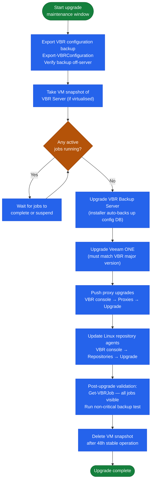

---
tags:
  - operations
  - veeam
---
# Veeam — Install & Upgrade


<div class="kb-summary">
Install & Upgrade reference covering Release Cadence, Decommission Procedure.

*Applies to: Veeam 12.x*
</div>

## Before you begin

- **Access:** Backup admin role on backup server; target system credentials
- **Timing:** safe to run during business hours unless a step is marked ⚠ (causes interruption)
- **Dependencies:** no active upgrades or migrations on the same infrastructure
- **Logging:** capture command output — paste into the change record on completion

---

## Release Cadence

Veeam releases major versions (VBR 12, 12.1, 12.2) annually with cumulative patches (P-releases) throughout the year.

### Upgrade Component Order


```text
┌────────────────────────────────────── Veeam — Install & Upgrade ──────────────────────────────────────┐
│                                                                                                       │
│   ┌───────────────────────────────────────────────────────────────────────────────────────────────┐   │
│   │                               Veeam — Installation Prerequisites                              │   │
│   │             OS: supported Linux or Windows Server (see vendor compatibility matrix)           │   │
│   │        Network: 9419 (Veeam REST API) · 6160 (Veeam Agent) — ensure firewall allows these     │   │
│   │  Auth: Windows/AD auth for Veeam console; service account with vSphere admin; repo credentials│   │
│   │          Storage: Windows Backup Server · Proxy VMs on ESXi · Backup storage (NAS/SAN)        │   │
│   └───────────────────────────────────────────────────────────────────────────────────────────────┘   │
│                                                                                                       │
│                                                   ▼                                                   │
│                                                                                                       │
│   ┌───────────────────────────────────────────────────────────────────────────────────────────────┐   │
│   │                                        Install Sequence                                       │   │
│   │                  1  Deploy control plane component and configure network access               │   │
│   │                          2  Configure storage and network connectivity                        │   │
│   │                        3  Install agent/proxy/splitter on protected hosts                     │   │
│   │                      4  Register sources and configure protection policies                    │   │
│   │                        5  Run first job; verify completion; test restore                      │   │
│   └───────────────────────────────────────────────────────────────────────────────────────────────┘   │
│                                                                                                       │
│   ┌───────────────────────────────────────────────────────────────────────────────────────────────┐   │
│   │                                        Upgrade Sequence                                       │   │
│   │                 1  Review release notes and compatibility matrix before upgrade               │   │
│   │                   2  Snapshot or backup the control plane VM before upgrading                 │   │
│   │                  3  Upgrade control plane first, then proxies/agents/appliances               │   │
│   │                       4  Validate jobs resume automatically after upgrade                     │   │
│   │                        5  Document version change and update CMDB record                      │   │
│   └───────────────────────────────────────────────────────────────────────────────────────────────┘   │
│                                                                                                       │
│  Physical Infrastructure:                                                                             │
│  Windows Server (Backup Server) · Proxy VMs on ESXi · Backup storage (NAS/SAN) · Management LAN       │
│  Key terms:                                                                                           │
│                                                                                                       │
│  Backup Server = central Veeam component: scheduler, job engine, catalog, REST API                    │
│  Backup Proxy  = data mover between vSphere and repository; runs in virtual-appliance mode or H       │
│  CBT           = Changed Block Tracking; VMware VADP mechanism to track changed disk sectors          │
│  VADP          = VMware vSphere APIs for Data Protection; enables agentless VM backup                 │
│  SOBR          = Scale-Out Backup Repository; tiers extents; moves cold data to object storage        │
│  Instant Recovery= mounts VM disks from backup directly to ESXi; VM live in seconds                   │
│  SureBackup    = automated backup verification; test-restores VM in isolated virtual lab              │
│  Replication   = creates VM replica at DR site; enables failover without full restore time            │
│  GFS Retention = Grandfather-Father-Son retention: daily, weekly, monthly, yearly restore points      │
│  Immutable Repo= object storage (S3 WORM) or Linux XFS (immutable flag) repo; ransomware protec       │
│  Mount Server  = Windows host presenting backup as iSCSI/NFS datastore for instant recovery           │
│  VeeamZIP      = ad-hoc compressed portable backup of a single VM; no job required                    │
│  Health Check  = periodic backup integrity scan; verifies restore points are readable                 │
│  Forward Incremental= default mode; one full + daily incrementals; synthetic full created perio       │
│                                                                                                       │
└───────────────────────────────────────────────────────────────────────────────────────────────────────┘
```

Store the config backup off the Backup Server — it is useless if the server hosting it is lost.

## Decommission Procedure

When retiring a Veeam Backup Server:
1. Export and archive all backup job configuration
2. Migrate retention-period backups to a new repository or archive
3. Un-register all proxies and repositories
4. Deregister vCenter credentials
5. Update CMDB to reflect decommission
