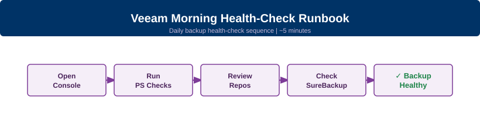

---
tags:
  - veeam
  - backup
  - health-checks
  - operations
search:
  boost: 2
---
# Veeam Morning Health-Check Runbook

<div class="kb-summary">
Daily Veeam Backup &amp; Replication health-check sequence — takes ~5 minutes. Run this every morning before starting any operational work.
</div>



---

## Before You Begin

**Prerequisites:**

- Veeam Backup & Replication console access (or PowerShell with Veeam snap-in loaded)
- At minimum Veeam Operator role — required to view job sessions and repository status
- PowerShell: load the Veeam snap-in once per session with `Add-PSSnapin VeeamPSSnapIn` (v12 and earlier) or it auto-loads on v12.1+
- No active full backups running — wait for them to complete before reviewing session results

**Timing:** Safe to run during business hours. All commands are read-only. The UI checks in step 1 take 60 seconds; the PowerShell steps take under 2 minutes total.

---

## Run This Routine

Work through steps 1–7 in order. Each step takes under a minute. Flag anything that does not match the expected result.

**Step 1 — Scan Last 24 Hours in the console**

Open Veeam Backup & Replication console. Navigate to **Home → Last 24 Hours** in the left pane.

Expected output: all job entries show a green tick (Success). Any Warning (yellow) or Failed (red) entry must be investigated. Note the job name and failure time before proceeding.

---

**Step 2 — Query failed or warning sessions via PowerShell**

```powershell
Get-VBRJob | Get-VBRJobSession | Where-Object { $_.Result -ne "Success" } | Select-Object JobName, Result, EndTime | Sort-Object EndTime -Descending
```

Expected output: no rows. Any row returned identifies a backup job that did not complete successfully. Cross-reference with the console view from step 1.

---

**Step 3 — Check repository free space**

```powershell
Get-VBRBackupRepository | Select-Object Name, FriendlyPath, @{
    Name = 'FreeGB'
    Expression = { [math]::Round($_.GetContainer().CachedFreeSpace / 1GB, 1) }
} | Sort-Object FreeGB
```

Expected output: all repositories show free space above the warning threshold (see table below). Sort order puts the most constrained repository first — review that one first. A repository at or below 10% free is critical and may cause jobs to fail tonight.

---

**Step 4 — Check backup copy job sessions**

```powershell
Get-VBRBackupCopyJob | Get-VBRJobSession | Select-Object JobName, Result, EndTime | Sort-Object EndTime -Descending | Select-Object -First 10
```

Expected output: all recent copy job sessions show `Success`. Any `Failed` or `Warning` result on a copy job means your off-site or secondary backup may be behind — check the target repository separately.

---

**Step 5 — Review SureBackup results (last 7 days)**

In the Veeam console navigate to **Home → Jobs → SureBackup**. Check the session history for any job run in the last 7 days.

Expected output: all SureBackup jobs completed with `Success`. A `Failed` or `Warning` result on a SureBackup job means a restore point has not been verified — treat this as high priority and investigate immediately. If SureBackup is not deployed in your environment, skip this step.

---

**Step 6 — Review Veeam ONE alerts (if deployed)**

Open Veeam ONE Monitor or the Veeam ONE Reporter web console. Navigate to **Alarms → Active Alarms**.

Expected output: no active alarms above Warning severity. Any Critical alarm in Veeam ONE indicates a configuration or performance issue that requires action today. If Veeam ONE is not deployed, skip this step.

---

**Step 7 — Check tape library media status (if applicable)**

In the Veeam console navigate to **Tape → Libraries** (visible only if tape is configured).

Expected output: all tape libraries show `Online` status. All media pools have sufficient free tape. Any `Offline` library or `No Free Media` warning means tonight's tape jobs will fail — resolve before end of business day. If tape is not used in your environment, skip this step.

---

## Health Thresholds

| Resource | Warning | Critical | Action |
|---|---|---|---|
| Backup repository free | <20% | <10% | Extend repository, archive old restore points, or add storage |
| Job success rate (24h) | <95% | <80% | Investigate failed jobs — check proxy, network, and source VM |
| Restore point age | >24h since last success | >48h | Retry failed jobs immediately; check schedule and proxy load |
| Backup copy job lag | >1 copy cycle behind | >2 copy cycles behind | Investigate WAN link, target repository, and copy job schedule |
| SureBackup result | Any Warning | Any Failure | Investigate immediately — restore confidence is compromised |
| Tape library status | Any Warning | Any Offline | Resolve before end of day or tonight's tape jobs will fail |

---

## See Also

- [Veeam Health Checks](../health-checks/index.md) — broader health-check reference for Veeam infrastructure
- [Veeam Procedures](../procedures/index.md) — step-by-step procedures for common backup admin tasks
- [Veeam Backup and Restore](../backup-restore/index.md) — backup configuration and restore procedures
- [Veeam Troubleshooting](../../troubleshooting/index.md) — common issues and diagnostic steps
- [Veeam Operations](../index.md) — all Veeam operations pages
