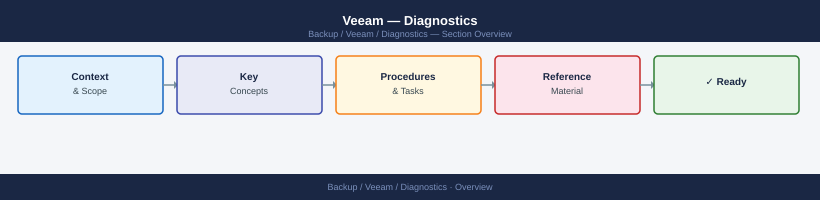
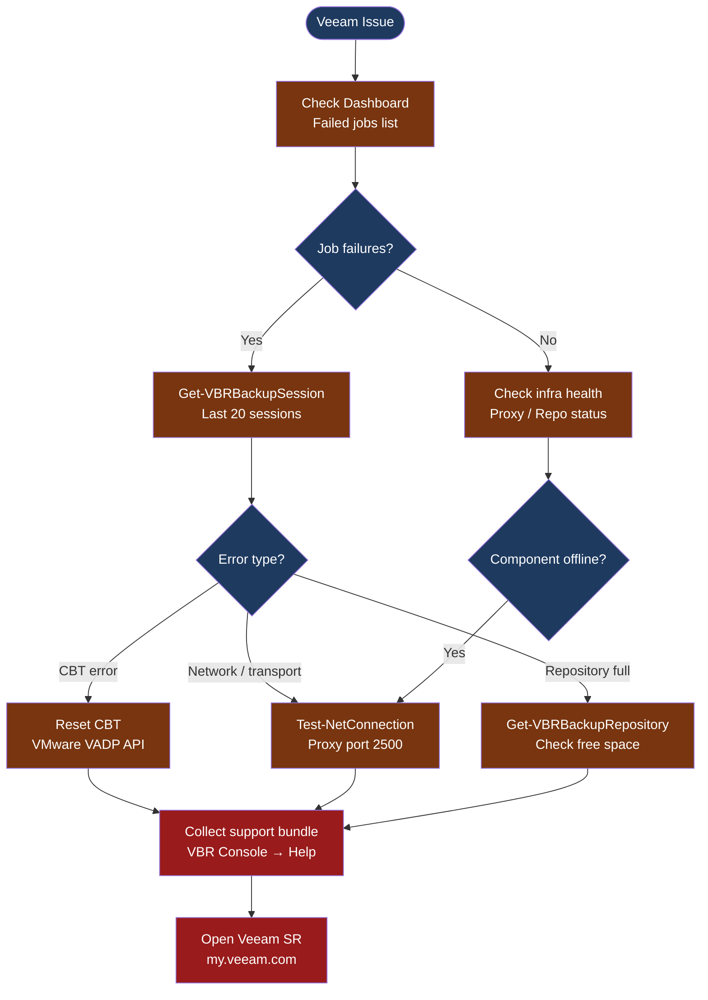

---
tags:
  - troubleshooting
  - veeam
search:
  boost: 1.5
---
# Veeam — Diagnostics

<div class="kb-summary">
Veeam diagnostic commands: check job status and session history with PowerShell, identify proxy and repository issues, collect the support bundle, and gather log files for Veeam B&R and Veeam ONE cases.

*Applies to: Veeam Backup & Replication 12.x*
</div>





## Before you begin

- **Access:** Veeam Backup & Replication console (local admin or Veeam Administrator role); PowerShell with Veeam snap-in (`Add-PSSnapin VeeamPSSnapIn`)
- **Gather first:** the failing job name, last successful run time, and the exact error message from the job session log
- **Scope:** confirm whether the issue affects a single VM, a single job, all jobs on one proxy, or all jobs platform-wide
- **CBT caution:** resetting CBT forces a full VM scan on the next backup run — only do this for a single VM, not all VMs at once
- **Logging:** export the job session log from VBR console before contacting support — it contains the specific error code Veeam support needs

---

## Step 1 — Check job and session status

Run these commands in PowerShell on the Backup Server with the Veeam snap-in loaded:

```powershell
# Load Veeam PowerShell snap-in (if not auto-loaded)
Add-PSSnapin VeeamPSSnapIn -ErrorAction SilentlyContinue

# List all jobs with last result and last run time
Get-VBRJob | Select-Object Name, JobType, LastResult,
  @{n='LastRun'; e={$_.LatestRunTime}} |
  Sort-Object LastRun -Descending | Format-Table -AutoSize
# Expected: LastResult = "Success" for all healthy jobs

# Recent backup sessions (last 20)
Get-VBRBackupSession | Sort-Object EndTime -Descending | Select-Object -First 20 |
  Select-Object JobName, Result, State, CreationTime, EndTime, Progress |
  Format-Table -AutoSize
# Result column: Success, Failed, Warning

# Get session log for a specific failed job
$session = Get-VBRBackupSession | Where-Object {$_.JobName -eq "<job-name>"} |
  Sort-Object EndTime -Descending | Select-Object -First 1
$session.GetTaskSessions() | ForEach-Object {
  Write-Host "VM: $($_.Name) — $($_.Status)"
  $_.Logger.GetLog().UpdatedRecords | Where-Object {$_.Status -ne "ESucceed"} |
    Select-Object -Last 30 | ForEach-Object { Write-Host $_.Title }
}
```

---

## Step 2 — Check proxy and repository health

```powershell
# List all backup proxies and their current state
Get-VBRViProxy | Select-Object Name, Type,
  @{n='Host'; e={$_.Host.Name}},
  @{n='MaxTasks'; e={$_.Options.MaxTasksCount}} |
  Format-Table -AutoSize
# Type: HotAdd, SAN, NBD

# List all repositories with free space
Get-VBRBackupRepository | Select-Object Name, Type,
  @{n='FreeGB'; e={[math]::Round($_.GetContainer().CachedFreeSpace / 1GB, 1)}},
  @{n='TotalGB'; e={[math]::Round($_.GetContainer().CachedTotalSpace / 1GB, 1)}},
  @{n='AvailPct'; e={
    $t = $_.GetContainer().CachedTotalSpace
    if ($t -gt 0) { [math]::Round(($_.GetContainer().CachedFreeSpace / $t) * 100, 0) }
    else { 0 }
  }} | Format-Table -AutoSize
# Alert if AvailPct < 10%

# SOBR extent status (if Scale-Out Backup Repository in use)
Get-VBRBackupRepository -ScaleOut | ForEach-Object {
  $_.Extents | Select-Object @{n='SOBR';e={$_.Repository.Name}},
    @{n='FreeGB';e={[math]::Round($_.Repository.GetContainer().CachedFreeSpace/1GB,1)}}
}
```

---

## Step 3 — Test network connectivity to proxies and repositories

```powershell
# Test Veeam data transport port (2500) to each proxy
Get-VBRViProxy | ForEach-Object {
  $result = Test-NetConnection -ComputerName $_.Host.Name -Port 2500 -WarningAction SilentlyContinue
  [PSCustomObject]@{
    Proxy  = $_.Host.Name
    Port2500 = $result.TcpTestSucceeded
  }
} | Format-Table -AutoSize
# Expected: all TcpTestSucceeded = True

# Test Veeam transport port to repository (if remote repo)
Test-NetConnection -ComputerName <repo-hostname> -Port 2500

# For SMB/CIFS repositories: also test port 445
Test-NetConnection -ComputerName <repo-hostname> -Port 445

# Check Veeam Transport service on a proxy or repo
# (Run on the proxy/repo Windows host)
Get-Service "VeeamTransportSvc" | Select-Object Name, Status, StartType
```

---

## Step 4 — Check CBT status and reset if needed

CBT (Changed Block Tracking) failures cause "Failed to read changed block tracking data" errors in backup jobs.

```powershell
# Check CBT state for all VMs in a job
$job = Get-VBRJob -Name "<job-name>"
$job.GetObjectsInJob() | ForEach-Object {
  $vm = Find-VBRViEntity -Name $_.Name
  [PSCustomObject]@{
    VM   = $vm.Name
    CBT  = $vm.ExtendedDetails.IsCBTEnabled
  }
} | Format-Table -AutoSize

# Reset CBT for a specific VM (forces full scan on next run)
$vm = Find-VBRViEntity -Name "<vm-name>"
Disable-VBRViChangeTracking -Entity $vm
Enable-VBRViChangeTracking -Entity $vm
# Run active full backup after reset to establish a new CBT baseline
```

**When to reset CBT:**
- Error: `"Failed to read CBT data"` or `"CBT is unsupported"`
- After a vSphere host crash or storage vMotion without snapshot removal
- After reverting a VM to snapshot outside of Veeam

---

## Step 5 — Collect the support bundle

```text
Method 1: VBR Console (recommended)
  1. Open VBR Console → Main Menu → Help → Technical Support
  2. Select "Export Logs" in the Support Information wizard
  3. Select the relevant job(s) and time range
  4. Click "Save" — the wizard creates a ZIP: VeeamSupport_<date>.zip
  5. The ZIP includes: Backup Server logs, database log excerpts, and proxy logs for the selected job

Method 2: Manual log collection
  - Backup Server logs: C:\ProgramData\Veeam\Backup\
  - Proxy logs:        C:\ProgramData\Veeam\Backup\ (on the proxy Windows host)
  - Veeam ONE logs:    C:\ProgramData\Veeam\Veeam ONE\ (if Veeam ONE is deployed)
```

---

## Log locations

| Component | Path | What to look for |
|---|---|---|
| Backup Server | `C:\ProgramData\Veeam\Backup\Backup.log` | Job errors, transport errors |
| Transport service | `C:\ProgramData\Veeam\Backup\Svc.VeeamTransport.log` | Data mover connection failures |
| Veeam ONE server | `C:\ProgramData\Veeam\Veeam ONE\Veeam.ONE.log` | Reporting / monitoring errors |
| Windows Event log | Application log: source = `Veeam Backup` | Service crashes, disk errors |
| Configuration DB | SQL: `VeeamBackup` database → `Jobs` table | Job configuration and history |

```powershell
# Windows Event log for Veeam errors (last 24 hours)
Get-WinEvent -LogName Application -StartTime (Get-Date).AddHours(-24) |
  Where-Object { $_.ProviderName -like "Veeam*" -and $_.LevelDisplayName -in "Error","Warning" } |
  Select-Object TimeCreated, LevelDisplayName, Message | Format-List
```

---

## See also

- [Veeam — Common Issues](../common-issues/)
- [Veeam — Escalation](../escalation/)
- [Veeam — Health Checks](../../operations/health-checks/)

## Verify resolution

- `Get-VBRJob | Select Name, LastResult` shows `Success` for all affected jobs after next scheduled run
- `Get-VBRBackupRepository` shows free space above 10% for all repositories
- No `VeeamTransportSvc` errors in Windows Event log on proxies
- Run one manual active full backup on a previously failing VM to confirm CBT baseline is healthy
- Monitor for 2 job cycles before closing the incident
