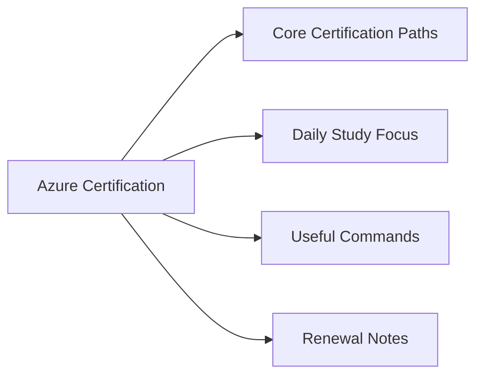

# Azure Certification


<div class="kb-grid kb-grid-1">

<a class="kb-card" href="exam-tracking/">
  <strong>Exam Tracking</strong>
  <span>Exam scheduling, scores, and certification tracking.</span>
</a>

<a class="kb-card" href="practice-notes/">
  <strong>Practice Notes</strong>
  <span>Practice exam notes and study materials.</span>
</a>

<a class="kb-card" href="review-plan/">
  <strong>Review Plan</strong>
  <span>Study plan and review schedule.</span>
</a>

<a class="kb-card" href="weak-areas/">
  <strong>Weak Areas</strong>
  <span>Topics needing additional study and focus.</span>
</a>

</div>



## Overview

Azure certifications validate skills in managing Microsoft Azure infrastructure, networking, storage, and identity services.

## Core Certification Paths

- AZ-900 Fundamentals
- AZ-104 Administrator
- AZ-305 Architect
- AZ-500 Security

## Daily Study Focus

- Review Azure resource management
- Practice virtual networking scenarios
- Study identity and access management
- Review monitoring and backup services

## Useful Commands

```bash
az login
az vm list
az network vnet list
az storage account list
```

## Renewal Notes

Azure certifications typically require renewal annually through online assessment.
