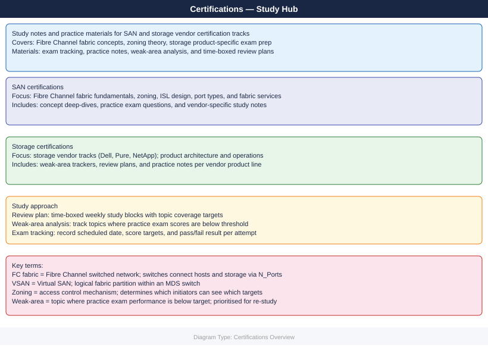

---
tags:
  - certifications
description: "Study notes, practice exam materials, review plans, and weak-area trackers for every certification track in this KB — SAN, storage, VMware, AWS, Azure..."
---
# Certifications

Study notes, practice exam materials, review plans, and weak-area trackers for every certification track in this KB — SAN, storage, VMware, AWS, Azure, and cloud AI.

<a class="kb-card" href="san/">
  <strong>SAN Certifications</strong>
  Fibre Channel fabric concepts, zoning study notes, practice questions, and review plan.
</a>

<a class="kb-card" href="storage/">
  <strong>Storage Certifications</strong>
  Storage vendor tracks, product-specific practice notes, weak areas, and review plan.
</a>

<a class="kb-card" href="vmware/">
  <strong>VMware Certifications</strong>
  VCP-DCV exam blueprint mapped to KB pages, worked sample questions, exam tracking, and review plan.
</a>

<a class="kb-card" href="aws/">
  <strong>AWS Certifications</strong>
  Cloud Practitioner study plan with daily practice Q&A, exam tracking, weak areas, and review plan.
</a>

<a class="kb-card" href="azure/">
  <strong>Azure Certifications</strong>
  Azure certification study notes — exam tracking, practice notes, weak areas, and review plan.
</a>

<a class="kb-card" href="ai/">
  <strong>Cloud AI Certifications</strong>
  AI and ML certification study notes — platforms, model concepts, security, and review plan.
</a>

