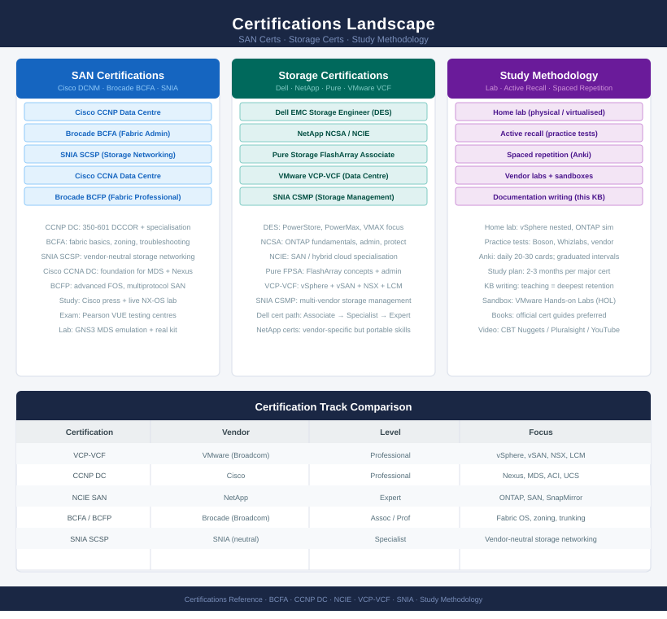

# Certifications

<div class="kb-summary">
Study notes, practice exam materials, review plans, and weak-area trackers for SAN and storage vendor certifications.
</div>



```text
┌───────────────────────────────────── Certifications — Study Hub ──────────────────────────────────────┐
│                                                                                                       │
│   Study notes and practice materials for SAN and storage vendor certification tracks                  │
│   Covers: Fibre Channel fabric concepts, zoning theory, storage product-specific exam prep            │
│   Materials: exam tracking, practice notes, weak-area analysis, and time-boxed review plans           │
│                                                                                                       │
│   SAN certifications                                                                                  │
│   Focus: Fibre Channel fabric fundamentals, zoning, ISL design, port types, and fabric services       │
│   Includes: concept deep-dives, practice exam questions, and vendor-specific study notes              │
│                                                                                                       │
│   Storage certifications                                                                              │
│   Focus: storage vendor tracks (Dell, Pure, NetApp); product architecture and operations              │
│   Includes: weak-area trackers, review plans, and practice notes per vendor product line              │
│                                                                                                       │
│   Study approach                                                                                      │
│   Review plan: time-boxed weekly study blocks with topic coverage targets                             │
│   Weak-area analysis: track topics where practice exam scores are below threshold                     │
│   Exam tracking: record scheduled date, score targets, and pass/fail result per attempt               │
│                                                                                                       │
│   Key terms:                                                                                          │
│   FC fabric    = Fibre Channel switched network; switches connect hosts and storage via N_Ports       │
│   VSAN         = Virtual SAN; logical fabric partition within an MDS switch                           │
│   Zoning       = access control mechanism; determines which initiators can see which targets          │
│   Weak-area    = topic where practice exam performance is below target; prioritised for re-study      │
└───────────────────────────────────────────────────────────────────────────────────────────────────────┘
```

<div class="kb-grid kb-grid-2">

<a class="kb-card" href="san/">
  <strong>SAN Certifications</strong>
  <span>Fibre Channel fabric concepts, zoning study notes, practice questions, and review plan.</span>
</a>

<a class="kb-card" href="storage/">
  <strong>Storage Certifications</strong>
  <span>Storage vendor tracks, product-specific practice notes, weak areas, and review plan.</span>
</a>

</div>
