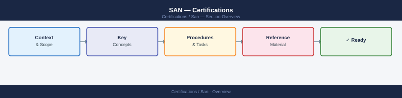

# SAN — Certifications

SAN certifications tracker: Brocade BCSM, Cisco CCNP Storage, and related SAN-track certifications with exam objectives, study resources, and progress notes.

<a class="kb-card" href="fabric-concepts/">
  <strong>Fabric Concepts</strong>
  Fabric Concepts notes, checks, references, and validation.
</a>

<a class="kb-card" href="zoning/">
  <strong>Zoning</strong>
  Zoning notes, checks, references, and validation.
</a>

<a class="kb-card" href="troubleshooting/">
  <strong>Troubleshooting</strong>
  Troubleshooting notes, checks, references, and validation.
</a>

<a class="kb-card" href="practice-notes/">
  <strong>Practice Notes</strong>
  Practice Notes notes, checks, references, and validation.
</a>

<a class="kb-card" href="review-plan/">
  <strong>Review Plan</strong>
  Review Plan notes, checks, references, and validation.
</a>

