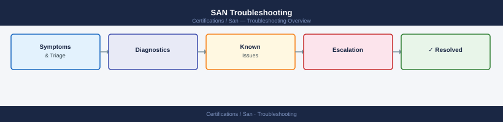

---
tags:
  - certifications
  - san
  - troubleshooting
search:
  boost: 1.5
---
# SAN Troubleshooting


<div class="kb-summary">
SAN Troubleshooting reference covering Diagnostic Scenario Reference, FLOGI Failure — Troubleshooting Sequence, Zone Not Active — Troubleshooting Sequence, ISL Down — Troubleshooting Sequence, Key CLI Commands and 1 more sections.
</div>



```d2
direction: down

symptom: Identify Symptom {shape: diamond}
diagnostic_scenario_reference: "Diagnostic Scenario Reference" {shape: rectangle}
flogi_failure_troubleshooting_sequen: "FLOGI Failure — Troubleshooting Sequence" {shape: rectangle}
zone_not_active_troubleshooting_sequ: "Zone Not Active — Troubleshooting Sequence" {shape: rectangle}
isl_down_troubleshooting_sequence: "ISL Down — Troubleshooting Sequence" {shape: rectangle}
key_cli_commands: "Key CLI Commands" {shape: rectangle}
study_checklist: "Study Checklist" {shape: rectangle}
resolution: Resolve or Escalate {shape: oval}

symptom -> diagnostic_scenario_reference: investigate
symptom -> flogi_failure_troubleshooting_sequen: investigate
symptom -> zone_not_active_troubleshooting_sequ: investigate
symptom -> isl_down_troubleshooting_sequence: investigate
symptom -> key_cli_commands: investigate
symptom -> study_checklist: investigate
diagnostic_scenario_reference -> resolution
flogi_failure_troubleshooting_sequen -> resolution
zone_not_active_troubleshooting_sequ -> resolution
isl_down_troubleshooting_sequence -> resolution
key_cli_commands -> resolution
study_checklist -> resolution
```

## Before you begin

- **Access:** Storage admin credentials (cluster admin or equivalent)
- **Gather first:** recent error message text, event timestamps, and affected object names
- **Scope:** confirm whether the issue affects a single object, host, cluster, or site
- **Escalation:** open a vendor support ticket before running any destructive step
- **Logging:** document each command and output — required if escalation is needed

---

## Diagnostic Scenario Reference

| Symptom | First Check | Root Cause Candidates |
|---|---|---|
| Host not logging into fabric | FLOGI status on switch port | Link down, SFP failure, speed mismatch, Domain ID conflict |
| Host visible in fabric but cannot see LUN | Active zone set, LUN masking | WWPN not in zone, zone set not activated, LUN not masked to host |
| Zone exists but I/O not working | Zone set activation | Correct zone set must be active — adding a zone to the DB does not take effect until zone set activation |
| ISL went down | Physical layer, BB_Credit | SFP failure, cable, E_Port speed mismatch, trunk misconfiguration |
| Fabric segmented into two | Domain ID conflict | Check domain ID of each switch; one must be changed and re-merged |
| RSCN storm | Link or HBA flapping | Check for unstable HBA, bad SFP, or misconfigured link |
| I/O latency spike | ISL congestion, credit starvation | Check ISL utilization, verify buffer credits per port, check for slow drain devices |

## FLOGI Failure — Troubleshooting Sequence

1. Confirm physical link is up: check port LED, SFP insertion, fiber connectivity
2. Check speed/duplex auto-negotiation — FC does not use duplex but speed must match
3. Verify VSAN (Cisco) or Virtual Fabric (Brocade) assignment on the port
4. Check for Domain ID conflict: `switchshow` (Brocade) or `show flogi database` (Cisco)
5. Verify port is configured as F_Port (not disabled or in wrong mode)
6. Check Name Server registration: `nsshow` (Brocade) or `show fcns database` (Cisco)

## Zone Not Active — Troubleshooting Sequence

1. Confirm which zone set is currently active: `cfgshow` (Brocade), `show zone active` (Cisco)
2. Verify that both the initiator WWPN and target WWPN are in the same zone
3. Check if zone changes were made to the zone DB but the zone set was never re-activated
4. Confirm zone DB is consistent across all switches in the fabric (verify no segmentation)
5. After making zone changes, explicitly activate the zone set: `cfgenable <cfgname>` (Brocade), `zone commit vsan <id>` (Cisco)

## ISL Down — Troubleshooting Sequence

1. Check physical: SFP, cable, patch panel — reseat or swap SFP
2. Verify E_Port or TE_Port mode on both sides
3. Check that ISL speed matches on both ends (auto-neg can fail between vendors)
4. Check for Domain ID conflict if the ISL came up and then went to a segmented state
5. Verify trunk configuration matches if using ISL trunking
6. Check BB_Credit configuration — mismatched long-distance buffer credit settings cause link instability

## Key CLI Commands

| Platform | Command | Purpose |
|---|---|---|
| Brocade | `switchshow` | Port status, WWPN, link state |
| Brocade | `nsshow` | Name Server registrations |
| Brocade | `cfgshow` | Zone database and active configuration |
| Brocade | `portlogshow` | Port event log — shows FLOGI/LOGO events |
| Cisco MDS | `show flogi database` | FLOGI registrations per VSAN |
| Cisco MDS | `show zone active vsan <id>` | Active zone set members |
| Cisco MDS | `show fcns database vsan <id>` | Fabric Name Server entries |
| Cisco MDS | `show interface fc <x/y>` | Port state, counters, BB_Credit |

## Study Checklist

- [ ] Walk through FLOGI failure troubleshooting sequence without reference
- [ ] Explain why a zone change requires zone set activation to take effect
- [ ] Describe three causes of ISL instability
- [ ] Know Brocade CLI commands: switchshow, nsshow, cfgshow, portlogshow
- [ ] Know Cisco MDS CLI commands: show flogi database, show zone active, show fcns database
- [ ] Explain the impact of a Domain ID conflict on fabric behavior
- [ ] Describe how to identify and resolve a slow drain device causing I/O latency

---

## Verify resolution

- Confirm the original symptom no longer occurs
- Check logs for any residual errors related to the issue
- Monitor for 10–15 minutes to confirm the fix is stable

## See also

- [Fabric Concepts](../fabric-concepts/)
- [Practice Notes](../practice-notes/)
- [Review Plan](../review-plan/)
- [Zoning](../zoning/)
- [SAN Certifications — Overview](../)
