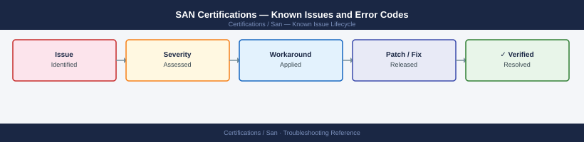

---
tags:
  - troubleshooting
  - san
  - certifications
  - known-issues
---
# SAN Certifications — Known Issues and Error Codes

<div class="kb-summary">
Catalog of known issues related to SAN certification exam preparation — covering common exam topic misunderstandings, lab environment issues, and practice test discrepancies.

*Applies to: Brocade BCFP, Cisco CCNP Data Center (SAN track), CompTIA Storage+*
</div>



```d2
direction: down

symptom: Identify Symptom {shape: diamond}
lab_environment_issues: "Lab Environment Issues" {shape: rectangle}
exam_preparation: "Exam Preparation" {shape: rectangle}
resolution: Resolve or Escalate {shape: oval}

symptom -> lab_environment_issues: investigate
symptom -> exam_preparation: investigate
lab_environment_issues -> resolution
exam_preparation -> resolution
```

## Before you begin

- SAN certification labs require access to physical or virtual FC switch environments — GNS3 / EVE-NG do not emulate FC.
- Practice exams vary widely in quality — cross-reference with official study guides for discrepancies.

## Lab Environment Issues

| Issue | Cause | Workaround |
|---|---|---|
| Brocade Virtual Fabric OS trial expired | 30-day trial license | Use Brocade vFOS OVA; register for free trial reset; or use GNS3 community images |
| Cannot access Cisco DCNM in lab | DCNM licensing required for full features | Use Cisco dCloud for free lab access to DCNM |
| Zoning changes not persisting in practice lab | Lab environment resetting between sessions | Save configuration: `cfgsave` (Brocade) or `copy running-config startup-config` (Cisco MDS) |

## Exam Preparation

| Issue | Cause | Workaround |
|---|---|---|
| Practice exam question contradicts official guide | Third-party practice exam outdated or incorrect | Trust official Brocade/Cisco documentation; verify via official study guides |
| FC protocol questions mixing FC-SW and FCoE | FCoE is a separate protocol — exam questions distinguish them | Review FC-SW (native FC) vs FCoE (FC over Ethernet) as separate topics |

## See also

- [SAN — Common Issues](index.md)
- [Brocade Fabric OS — Known Issues](../../../san/brocade/fabric-os/troubleshooting/known-issues.md)
- [Cisco MDS — Known Issues](../../../san/cisco/mds/troubleshooting/known-issues.md)
