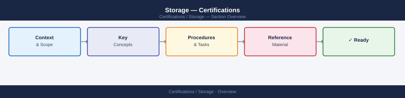

---
tags:
  - certifications
---
# Storage — Certifications

Storage certifications tracker: NetApp NCSA, Pure Storage PSE, Dell SC, and related exam objectives with study plans and progress notes.

<a class="kb-card" href="vendor-tracks/">
  <strong>Vendor Tracks</strong>
  Vendor Tracks notes, checks, references, and validation.
</a>

<a class="kb-card" href="products/">
  <strong>Products</strong>
  Products notes, checks, references, and validation.
</a>

<a class="kb-card" href="practice-notes/">
  <strong>Practice Notes</strong>
  Practice Notes notes, checks, references, and validation.
</a>

<a class="kb-card" href="weak-areas/">
  <strong>Weak Areas</strong>
  Weak Areas notes, checks, references, and validation.
</a>

<a class="kb-card" href="review-plan/">
  <strong>Review Plan</strong>
  Review Plan notes, checks, references, and validation.
</a>

