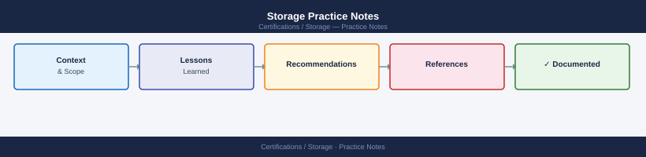

---
tags:
  - certifications
---
# Storage Practice Notes


<div class="kb-summary">
Storage Practice Notes reference covering RAID Level Quick Reference, Thin vs Thick Provisioning, Deduplication vs Compression, Replication Types, Snapshot vs Clone and 1 more sections.
</div>



```d2
direction: right

center: "Practice Notes" {shape: hexagon}
raid_level_quick_reference: "RAID Level Quick Reference" {shape: rectangle}
thin_vs_thick_provisioning: "Thin vs Thick Provisioning" {shape: rectangle}
deduplication_vs_compression: "Deduplication vs Compression" {shape: rectangle}
replication_types: "Replication Types" {shape: rectangle}
snapshot_vs_clone: "Snapshot vs Clone" {shape: rectangle}
study_checklist: "Study Checklist" {shape: rectangle}

center -> raid_level_quick_reference
center -> thin_vs_thick_provisioning
center -> deduplication_vs_compression
center -> replication_types
center -> snapshot_vs_clone
center -> study_checklist
```

## RAID Level Quick Reference

| RAID Level | Min Disks | Fault Tolerance | Overhead | Performance | Use Case |
|---|---|---|---|---|---|
| RAID 0 | 2 | None | 0% | Best read/write | Temp data, no tolerance needed |
| RAID 1 | 2 | 1 disk failure | 50% | Good read | OS volumes, small datasets |
| RAID 5 | 3 | 1 disk failure | 1/n | Good read, slower write | General purpose, cost-efficient |
| RAID 6 | 4 | 2 disk failures | 2/n | Good read, slowest write | Large capacity groups, compliance |
| RAID 10 | 4 | 1 disk per mirror | 50% | Best all-around | High-performance databases |
| RAID 50 | 6 | 1 disk per RAID-5 set | Variable | High | Large-scale mixed workloads |
| RAID 60 | 8 | 2 disks per RAID-6 set | Variable | High | Very large, high-availability |

Exam gotcha: RAID is NOT a backup. RAID 5 rebuilds become risky on large drives (long rebuild = second failure window). RAID 6 or RAID 10 preferred for modern large-capacity drives.

## Thin vs Thick Provisioning

| Feature | Thin Provisioned | Thick Provisioned (Eager Zeroed) | Thick (Lazy Zeroed) |
|---|---|---|---|
| Space allocation | On-demand as data is written | Full allocation at creation, zeros written | Full allocation at creation, zeros on demand |
| Array side | Space from pool allocated as needed | All space reserved immediately | All space reserved immediately |
| Oversubscription | Possible (monitor carefully) | Not possible | Not possible |
| VM performance | Slightly lower initial write | Best (zeros already written) | Slight overhead on first write |
| Use case | Dev/test, general workloads | High-performance VMs, Fault Tolerance | Standard VMs |

## Deduplication vs Compression

| Feature | Deduplication | Compression |
|---|---|---|
| Mechanism | Removes duplicate data blocks | Encodes data with fewer bits |
| Granularity | Block-level (4KB–8KB typical) | Block or byte level |
| Best data type | Virtual machines, VDI, backups | Databases, logs, general files |
| CPU overhead | Higher (hash comparison) | Moderate |
| Inline | Before write — no extra capacity needed | Before write |
| Post-process | After write — needs extra space temporarily | After write |
| Typical savings | 2:1 to 10:1 (VDI) | 1.5:1 to 3:1 (general) |

## Replication Types

| Type | Direction | RPO | Use Case |
|---|---|---|---|
| Synchronous | Write acknowledged only after target confirms | Zero (0 RPO) | Tier-1 databases, short distance (<100km) |
| Asynchronous | Write acknowledged before target confirms | Non-zero (minutes to hours) | DR across long distances |
| Snapshot-based | Periodic snapshots sent to remote | Snapshot interval | Cost-effective DR, longer RPO acceptable |
| Continuous Data Protection (CDP) | Every I/O journaled | Seconds | Highest protection, any point-in-time recovery |

Latency impact: Synchronous replication adds round-trip latency to every write. At 100km, speed of light latency ≈ 0.5ms one-way = 1ms RTT added to write response time.

## Snapshot vs Clone

| Feature | Snapshot | Clone (Full Copy) |
|---|---|---|
| Creation time | Near-instant (pointer/metadata) | Minutes to hours (full data copy) |
| Space usage | Incremental (redirect-on-write or copy-on-write) | Full copy of source |
| Independence | Dependent on source — source deletion impacts snapshot | Fully independent |
| Use case | Recovery points, testing on short timescale | Independent dev/test copy, migration |
| I/O overhead | Yes (CoW penalty on source writes) | None after creation |

## Study Checklist

- [ ] State the fault tolerance and overhead of RAID 0, 1, 5, 6, and 10 from memory
- [ ] Explain thin provisioning oversubscription risk and how to monitor it
- [ ] Differentiate deduplication from compression — give best use case for each
- [ ] Compare synchronous vs asynchronous replication RPO impact
- [ ] Explain snapshot CoW overhead and when a clone is preferable
- [ ] Know that RAID is not a backup and explain why
