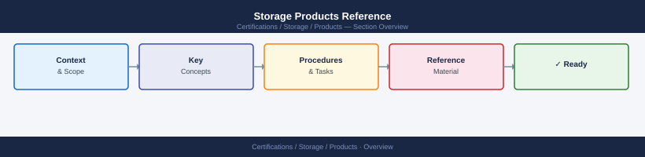

---
tags:
  - certifications
---
# Storage Products Reference


<div class="kb-summary">
Storage Products Reference reference covering Dell Technologies Storage Portfolio, NetApp Storage Portfolio, Pure Storage Portfolio, Product Comparison by Use Case, Study Checklist.
</div>



```d2
direction: right

center: "Products" {shape: hexagon}
dell_technologies_storage_portfolio: "Dell Technologies Storage Portfolio" {shape: rectangle}
netapp_storage_portfolio: "NetApp Storage Portfolio" {shape: rectangle}
pure_storage_portfolio: "Pure Storage Portfolio" {shape: rectangle}
product_comparison_by_use_case: "Product Comparison by Use Case" {shape: rectangle}
study_checklist: "Study Checklist" {shape: rectangle}

center -> dell_technologies_storage_portfolio
center -> netapp_storage_portfolio
center -> pure_storage_portfolio
center -> product_comparison_by_use_case
center -> study_checklist
```

## Dell Technologies Storage Portfolio

| Product | Category | Key Characteristics |
|---|---|---|
| PowerMax | All-Flash Enterprise Array | NVMe end-to-end; SRDF replication; 99.9999% availability; Mainframe support |
| PowerStore | Midrange All-Flash | Scale-up and scale-out; AppsON (run VMs on array); NVMe-oF |
| PowerScale (Isilon) | Scale-Out NAS | OneFS OS; petabyte scale; HDFS, NFS, SMB, S3 |
| Unity XT | Midrange | Hybrid or all-flash; block + file; simple management |
| PowerVault | Entry-level | Direct-attached; RAID controller; SMB use cases |
| ECS (Elastic Cloud Storage) | Object Storage | S3-compatible; multi-petabyte scale; geo-distribution |
| PowerProtect | Backup/Recovery | DD (Data Domain) integration; instant access recovery |

Key Dell exam points:
- PowerMax uses SRDF (Symmetrix Remote Data Facility) for replication
- PowerScale/Isilon uses OneFS — a single distributed filesystem across all nodes
- PowerStore AppsON allows running vSphere VMs directly on the storage controller

## NetApp Storage Portfolio

| Product | Category | Key Characteristics |
|---|---|---|
| ONTAP (AFF / FAS) | All-Flash/Hybrid | Unified NAS+SAN; SnapMirror replication; dedupe, compression |
| Cloud Volumes ONTAP | Cloud | ONTAP in AWS/Azure/GCP; same feature set as on-prem |
| Element (formerly SolidFire) | All-Flash SAN | QoS per-volume guarantees; uniform performance; used in HCI |
| StorageGRID | Object Storage | S3-compatible; policy-driven tiering; erasure coding |
| ONTAP Select | Software-defined | ONTAP on commodity hardware / VMware |

Key NetApp exam points:
- SnapMirror: async or sync replication between ONTAP systems
- SnapVault: backup-optimized replication (disk-to-disk); more retention copies
- FlexClone: instant space-efficient clone of a volume; depends on source snapshot
- FabricPool: auto-tier cold data to object storage (S3) based on access patterns

## Pure Storage Portfolio

| Product | Category | Key Characteristics |
|---|---|---|
| FlashArray//X | Enterprise All-Flash | NVMe; Evergreen subscription; non-disruptive upgrades |
| FlashArray//C | Capacity-optimized All-Flash | QLC flash; Evergreen; lower cost per TB |
| FlashArray//E | Archive tier | High capacity, lower cost; DirectFlash modules |
| FlashBlade//S | Scale-Out File+Object | NFS, SMB, S3; AI/ML and analytics workloads |
| FlashBlade//E | High-capacity file+object | Capacity-oriented version of FlashBlade |
| Portworx | Kubernetes storage | Container-native storage; PersistentVolume orchestration |

Key Pure exam points:
- Evergreen model: hardware upgrades without downtime or data migration
- DirectFlash: Pure's proprietary NVMe module — eliminates SSD translation layer
- ActiveCluster: symmetric active-active stretch cluster for zero RPO/RTO
- Pure1: cloud-based management and AI-driven predictive analytics

## Product Comparison by Use Case

| Use Case | Dell | NetApp | Pure |
|---|---|---|---|
| Tier-1 enterprise block | PowerMax | AFF A-series | FlashArray//X |
| Midrange unified storage | Unity XT / PowerStore | FAS / AFF C-series | FlashArray//C |
| Scale-out NAS | PowerScale | StorageGRID + ONTAP NAS | FlashBlade//S |
| Object storage | ECS | StorageGRID | FlashBlade//S |
| Cloud-integrated | PowerProtect + CCP | Cloud Volumes ONTAP | Pure Cloud Block Store |

## Study Checklist

- [ ] Name Dell's top-tier enterprise array and its replication technology
- [ ] Explain what ONTAP SnapMirror does and how it differs from SnapVault
- [ ] Describe Pure Storage's Evergreen model
- [ ] Know what workload FlashBlade is designed for
- [ ] Explain the difference between Dell PowerScale and Dell PowerMax
- [ ] Know what NetApp FabricPool does and what it requires
