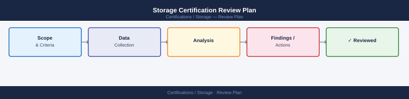

---
tags:
  - certifications
---
# Storage Certification Review Plan

Storage Certification Review Plan reference covering Certification Tracks Overview, 8-Week Study Plan (NCDA / ONTAP Track), Vendor Certification Resources, Hands-On Lab Options, SNIA Resources and 1 more sections.

## Certification Tracks Overview

| Certification | Vendor | Code | Level |
|---|---|---|---|
| NetApp Certified Data Administrator ONTAP | NetApp | NCDA | Associate/Professional |
| NetApp Certified Implementation Engineer — SAN | NetApp | NCIE-SAN | Professional |
| Dell Technologies Certified — Information Storage | Dell | DCS-IE | Associate |
| Dell Technologies Certified — Systems Administrator | Dell | DCS-SA | Professional |
| Pure Storage Certified FlashArray Professional | Pure | PSCP-FA | Professional |
| SNIA Certified Storage Professional | SNIA | SCSP | Professional |
| SNIA Certified Storage Engineer | SNIA | SCSE | Expert |

## 8-Week Study Plan (NCDA / ONTAP Track)

| Week | Focus | Topics |
|---|---|---|
| Week 1 | ONTAP fundamentals | SVM, aggregates, volumes, qtrees, FlexVol |
| Week 2 | Data protection | Snapshots, SnapMirror, SnapVault, SVM DR |
| Week 3 | NAS protocols | NFS export policies, CIFS shares, Active Directory integration |
| Week 4 | SAN protocols | iSCSI, FC, NVMe-oF; LUN creation, igroups, portsets |
| Week 5 | Storage efficiency | Deduplication, compression, compaction, FlexClone |
| Week 6 | Tiering and cloud | FabricPool, ONTAP S3, Cloud Volumes ONTAP |
| Week 7 | Cluster management | ONTAP CLI and System Manager, HA pairs, storage takeover |
| Week 8 | Practice exams | NetApp practice tests + targeted review |

## Vendor Certification Resources

| Vendor | Resource | URL |
|---|---|---|
| NetApp | NetApp Learning Center | learning.netapp.com |
| NetApp | ONTAP 9 Documentation | docs.netapp.com |
| Dell | Dell Learning (Credential Manager) | learning.dell.com |
| Dell | Dell Technologies Education | education.dell.com |
| Pure Storage | Pure Storage University | university.purestorage.com |
| SNIA | SNIA Education | snia.org/education |

## Hands-On Lab Options

| Option | Notes |
|---|---|
| NetApp ONTAP Simulator | Free download; full ONTAP 9.x lab environment on VMware |
| NetApp Lab on Demand | Free guided labs via partner/customer portal |
| Dell Technologies Education Labs | Available with training courses |
| Pure Storage Purity Lab | Access via Pure Storage University with account |
| TryVMware + storage plugins | vSphere lab with software iSCSI/NFS for basic concepts |

## SNIA Resources

- SNIA Dictionary (snia.org/forums/sssi/dictionary) — authoritative storage terminology
- SNIA Technical White Papers — cover RAID, storage networking, cloud storage
- SNIA Storage Networking Fundamentals course — recommended baseline
- SNIA SCSP exam blueprint — download from snia.org/education/certifications

## Study Checklist

- [ ] Select target certification and download exam objectives/blueprint
- [ ] Complete vendor-provided learning path (NetApp, Dell, or Pure)
- [ ] Set up a hands-on lab environment (simulator or lab on demand)
- [ ] Practice CLI commands for the target platform until fluent
- [ ] Complete 3 full practice exam sets with domain-level scoring
- [ ] Review SNIA Dictionary for terminology questions
- [ ] Book exam date once consistently scoring 80%+ on practice tests
