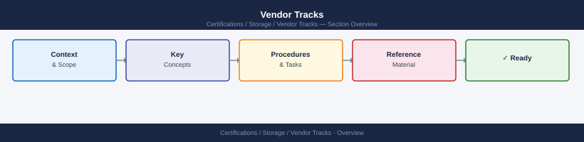

---
tags:
  - certifications
---
# Vendor Tracks


<div class="kb-summary">
Vendor Tracks reference covering Purpose, Common checks, Incident notes, Change notes, Useful commands or references and 1 more sections.
</div>



```d2
direction: right

center: "Vendor Tracks" {shape: hexagon}
purpose: "Purpose" {shape: rectangle}
common_checks: "Common checks" {shape: rectangle}
incident_notes: "Incident notes" {shape: rectangle}
change_notes: "Change notes" {shape: rectangle}
useful_commands_or_references: "Useful commands or references" {shape: rectangle}
known_issues: "Known issues" {shape: rectangle}

center -> purpose
center -> common_checks
center -> incident_notes
center -> change_notes
center -> useful_commands_or_references
center -> known_issues
```

## Purpose

Use this page for practical Storage Vendor Tracks notes, checks, troubleshooting, commands, standards, and field references.

## Common checks

- Confirm current state
- Review recent changes
- Check logs, alerts, or history
- Confirm dependencies
- Capture findings
- Document next action

## Incident notes

Capture:

- Symptom
- Start time
- Impact
- System or service
- What changed
- What was checked
- Action taken
- Follow-up owner

## Change notes

- Confirm approval
- Confirm scope
- Confirm rollback plan
- Capture current state
- Validate after the change

## Useful commands or references

Add tested commands, links, or notes here.

## Known issues

Add known issues here as they come up.
