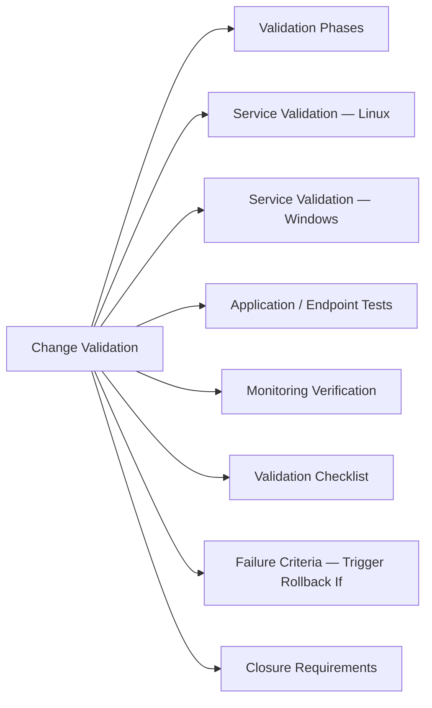

# Change Validation

Post-implementation checks to confirm a change achieved its intent, introduced no regressions, and the system is in a known-good state.



## Validation Phases

| Phase | Timing | Purpose |
|---|---|---|
| Immediate validation | During change window | Confirm core function restored |
| Smoke tests | First 15 min post-change | Catch obvious regressions |
| Monitoring soak | 30–60 min post-change | Detect latent issues before closing |
| Closure validation | End of window | Sign-off criteria met |

## Service Validation — Linux

```bash
# Service running
systemctl status <service-name>

# Process exists
pgrep -a <process-name>

# Port listening
ss -tlnp | grep <port>

# Recent errors in logs
journalctl -u <service-name> --since "10 minutes ago" | grep -i error

# HTTP endpoint health
curl -sf http://localhost:<port>/health && echo "OK"
```

## Service Validation — Windows

```powershell
# Service running
Get-Service -Name <service-name>

# Event log — errors since change started
Get-WinEvent -FilterHashtable @{LogName='Application'; Level=2; StartTime=(Get-Date).AddMinutes(-60)} |
  Select-Object TimeCreated, Id, Message | Format-List

# Port listening
Test-NetConnection -ComputerName localhost -Port <port>
```

## Application / Endpoint Tests

```bash
# HTTP response code
curl -o /dev/null -sw "%{http_code}" https://<endpoint>

# TLS certificate valid
openssl s_client -connect <host>:443 </dev/null 2>/dev/null | openssl x509 -noout -dates

# DNS resolution
dig +short <hostname>

# Database connectivity
psql -h <host> -U <user> -c "SELECT 1 AS alive;"
mysql -h <host> -u <user> -e "SELECT 1 AS alive;"
```

## Monitoring Verification

```bash
# Check no active alerts after change
# In Prometheus / Alertmanager:
curl -s http://alertmanager:9093/api/v2/alerts | jq '[.[] | select(.status.state=="firing")]'

# Check dashboard shows no anomalies — look for:
# - Error rate spike
# - Latency increase > 20% above baseline
# - Resource utilisation jump (CPU, memory, disk I/O)
```

## Validation Checklist

- [ ] Target service/application is responding correctly
- [ ] All dependent services confirmed healthy
- [ ] No new errors in application logs since change
- [ ] No new alerts firing in monitoring system
- [ ] Performance metrics within normal baseline (CPU, latency, error rate)
- [ ] Replication/HA status healthy (if applicable)
- [ ] User acceptance confirmed (if user-facing change)
- [ ] Rollback criteria: change stays implemented (not rolled back)

## Failure Criteria — Trigger Rollback If

| Condition | Threshold |
|---|---|
| Service fails health check | Immediate |
| Error rate above baseline | > 3× sustained for 5 min |
| Critical alert fires | Any P1/P2 alert |
| Key metric degraded | CPU > 95% / latency > 3× SLO / disk full |
| Replication broken | Replica lag > 5 min or stopped |

## Closure Requirements

Before closing the ITSM change ticket:

1. All validation checklist items ticked
2. Monitoring soak period completed (min 30 min for Normal changes)
3. Stakeholders notified of completion
4. Change outcome recorded: `Success / Partial success / Rolled back`
5. Lessons learned noted (for High-risk or rolled-back changes)
