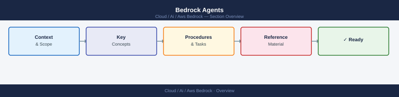

---
tags:
  - aws
  - ai
---
# Bedrock Agents


<div class="kb-summary">
AWS Bedrock Agents enable multi-step reasoning and action execution using foundation models. Agents can call APIs, query knowledge bases, and orchestrate complex workflows autonomously without custom orchestration code.

*Applies to: AWS Bedrock*
</div>



```d2
direction: right

center: "AWS Bedrock" {shape: hexagon}
creating_an_agent: "Creating an Agent" {shape: rectangle}
action_groups: "Action Groups" {shape: rectangle}
lambda_integration: "Lambda Integration" {shape: rectangle}
testing_agents: "Testing Agents" {shape: rectangle}
agent_aliases_and_versioning: "Agent Aliases and Versioning" {shape: rectangle}
troubleshooting: "Troubleshooting" {shape: rectangle}

center -> creating_an_agent
center -> action_groups
center -> lambda_integration
center -> testing_agents
center -> agent_aliases_and_versioning
center -> troubleshooting
```

## Creating an Agent

Each agent requires a foundation model, an instruction prompt, an IAM execution role, and optionally action groups and knowledge bases.

```bash
aws bedrock-agent create-agent \
  --agent-name "support-agent" \
  --agent-resource-role-arn "arn:aws:iam::123456789012:role/AmazonBedrockExecutionRoleForAgents" \
  --foundation-model "anthropic.claude-3-sonnet-20240229-v1:0" \
  --instruction "You are a support agent. Use tools to look up orders, accounts, and tickets." \
  --region us-east-1

# Prepare a working draft after every config change
aws bedrock-agent prepare-agent --agent-id "AGENTID123" --region us-east-1
```

The execution role must trust `bedrock.amazonaws.com` and have `bedrock:InvokeModel` on the chosen model ARN.

## Action Groups

Action groups map the API operations an agent can call to an OpenAPI schema and a Lambda function. Keep schemas focused — overly broad schemas cause the model to hallucinate tool calls.

```bash
aws bedrock-agent create-agent-action-group \
  --agent-id "AGENTID123" \
  --agent-version "DRAFT" \
  --action-group-name "OrderActions" \
  --action-group-executor '{"lambda":"arn:aws:lambda:us-east-1:123456789012:function:order-actions"}' \
  --api-schema '{"s3":{"s3BucketName":"my-schemas","s3ObjectKey":"order-actions.json"}}' \
  --region us-east-1
```

## Lambda Integration

The Lambda receives a structured event and must return a response in the Bedrock-expected format.

```python
def lambda_handler(event, context):
    action_group = event["actionGroup"]
    api_path      = event["apiPath"]
    http_method   = event["httpMethod"]
    params        = {p["name"]: p["value"] for p in event.get("parameters", [])}

    if api_path == "/get-order":
        order = fetch_order(params["orderId"])
        body  = {"orderId": order["id"], "status": order["status"]}
    else:
        body = {"error": "unknown path"}

    return {
        "messageVersion": "1.0",
        "response": {
            "actionGroup": action_group,
            "apiPath": api_path,
            "httpMethod": http_method,
            "httpStatusCode": 200,
            "responseBody": {"application/json": {"body": str(body)}}
        }
    }
```

Set Lambda timeout to at least 60 seconds — agent orchestration adds latency before Lambda is invoked.

## Testing Agents

Use a unique `sessionId` per conversation. The built-in `TSTALIASID` alias always points to the DRAFT version.

```bash
aws bedrock-agent-runtime invoke-agent \
  --agent-id "AGENTID123" \
  --agent-alias-id "TSTALIASID" \
  --session-id "test-$(date +%s)" \
  --input-text "What is the status of order 98765?" \
  --enable-trace \
  --region us-east-1
```

`--enable-trace` returns orchestration steps showing how the model reasoned, which tools it considered, and what it returned.

## Agent Aliases and Versioning

| Concept | Description |
|---|---|
| DRAFT | Mutable working version, always reflects latest config |
| Version | Immutable numbered snapshot (1, 2, 3…) |
| Alias | Named pointer to a version, used in application code |
| TSTALIASID | Built-in alias pointing to DRAFT |

```bash
# Create an immutable version from the current DRAFT
aws bedrock-agent create-agent-version --agent-id "AGENTID123"

# Create a production alias pointing to version 2
aws bedrock-agent create-agent-alias \
  --agent-id "AGENTID123" \
  --agent-alias-name "production" \
  --routing-configuration '[{"agentVersion":"2"}]'
```

## Troubleshooting

| Symptom | Likely Cause | Fix |
|---|---|---|
| `AccessDeniedException` on invoke | Missing `bedrock:InvokeModel` on execution role | Update IAM policy |
| Lambda not called | OpenAPI schema mismatch | Validate schema against Lambda paths |
| Agent loops without completing | Unclear instruction or missing tool | Refine system prompt, add explicit stop condition |
| Trace shows no tool calls | Model does not recognise need for tool | Add few-shot examples to instruction |

Check CloudWatch Logs under `/aws/lambda/<function-name>` and the Bedrock agent invocation logs for detailed error messages.
