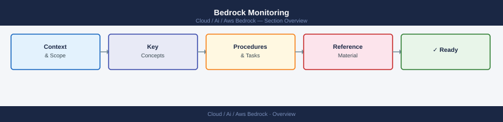

---
tags:
  - aws
  - ai
---
# Bedrock Monitoring


<div class="kb-summary">
AWS Bedrock emits CloudWatch metrics and optional invocation logs that cover latency, token usage, error rates, and throttling. Setting up monitoring early prevents blind spots in production.

*Applies to: AWS Bedrock*
</div>



```d2
direction: right

hub: "AWS Bedrock\nOperations" {shape: hexagon}
cloudwatch_metrics: "CloudWatch Metrics" {shape: rectangle}
key_metrics_reference: "Key Metrics Reference" {shape: rectangle}
invocation_logging: "Invocation Logging" {shape: rectangle}
cloudwatch_alarms: "CloudWatch Alarms" {shape: rectangle}
querying_logs_with_cloudwatch_insigh: "Querying Logs with CloudWatch Insights" {shape: rectangle}
latency_tracking_with_dashboards: "Latency Tracking with Dashboards" {shape: rectangle}

hub -> cloudwatch_metrics
hub -> key_metrics_reference
hub -> invocation_logging
hub -> cloudwatch_alarms
hub -> querying_logs_with_cloudwatch_insigh
hub -> latency_tracking_with_dashboards
```

## CloudWatch Metrics

Bedrock publishes metrics to the `AWS/Bedrock` namespace automatically — no agent or configuration needed.

```bash
# Get invocation count for a model over the last hour
aws cloudwatch get-metric-statistics \
  --namespace AWS/Bedrock \
  --metric-name Invocations \
  --dimensions Name=ModelId,Value=anthropic.claude-3-sonnet-20240229-v1:0 \
  --start-time $(date -u -d '1 hour ago' +%Y-%m-%dT%H:%M:%SZ) \
  --end-time $(date -u +%Y-%m-%dT%H:%M:%SZ) \
  --period 300 \
  --statistics Sum

# Get p99 latency
aws cloudwatch get-metric-statistics \
  --namespace AWS/Bedrock \
  --metric-name InvocationLatency \
  --dimensions Name=ModelId,Value=anthropic.claude-3-sonnet-20240229-v1:0 \
  --start-time $(date -u -d '1 hour ago' +%Y-%m-%dT%H:%M:%SZ) \
  --end-time $(date -u +%Y-%m-%dT%H:%M:%SZ) \
  --period 300 \
  --statistics p99
```

## Key Metrics Reference

| Metric | Namespace | Description |
|---|---|---|
| `Invocations` | AWS/Bedrock | Total model invocation count |
| `InvocationLatency` | AWS/Bedrock | End-to-end latency in ms |
| `InputTokenCount` | AWS/Bedrock | Input tokens consumed |
| `OutputTokenCount` | AWS/Bedrock | Output tokens generated |
| `ThrottledRequests` | AWS/Bedrock | Requests rejected due to rate limits |
| `InvocationClientErrors` | AWS/Bedrock | 4xx errors (bad input, auth) |
| `InvocationServerErrors` | AWS/Bedrock | 5xx errors (service side) |

## Invocation Logging

Enable invocation logs to capture full request/response payloads in S3 and/or CloudWatch Logs.

```bash
aws bedrock put-model-invocation-logging-configuration \
  --logging-config '{
    "cloudWatchConfig": {
      "logGroupName": "/aws/bedrock/model-invocations",
      "roleArn": "arn:aws:iam::123456789012:role/BedrockCloudWatchRole",
      "largeDataDeliveryS3Config": {
        "bucketName": "my-bedrock-logs",
        "keyPrefix": "large-payloads/"
      }
    },
    "s3Config": {
      "bucketName": "my-bedrock-logs",
      "keyPrefix": "invocations/"
    },
    "textDataDeliveryEnabled": true,
    "imageDataDeliveryEnabled": false,
    "embeddingDataDeliveryEnabled": false
  }' \
  --region us-east-1
```

Payloads larger than 100 KB are written to S3 even if CloudWatch is the primary destination.

## CloudWatch Alarms

```bash
# Alarm when throttling exceeds 10 requests in 5 minutes
aws cloudwatch put-metric-alarm \
  --alarm-name "bedrock-throttling-high" \
  --namespace AWS/Bedrock \
  --metric-name ThrottledRequests \
  --dimensions Name=ModelId,Value=anthropic.claude-3-sonnet-20240229-v1:0 \
  --statistic Sum \
  --period 300 \
  --threshold 10 \
  --comparison-operator GreaterThanThreshold \
  --evaluation-periods 1 \
  --alarm-actions "arn:aws:sns:us-east-1:123456789012:bedrock-alerts"
```

## Querying Logs with CloudWatch Insights

```bash
# Find slowest invocations in the last 24 hours
fields @timestamp, modelId, inputTokenCount, outputTokenCount, invocationLatency
| filter invocationLatency > 5000
| sort invocationLatency desc
| limit 20
```

Run in the CloudWatch Logs Insights console targeting the `/aws/bedrock/model-invocations` log group.

## Latency Tracking with Dashboards

Create a dashboard that combines latency percentiles with token throughput:

```python
import boto3, json

cw = boto3.client("cloudwatch", region_name="us-east-1")

dashboard_body = {
    "widgets": [
        {
            "type": "metric",
            "properties": {
                "metrics": [
                    ["AWS/Bedrock", "InvocationLatency", "ModelId",
                     "anthropic.claude-3-sonnet-20240229-v1:0",
                     {"stat": "p50", "label": "p50"}],
                    ["...", {"stat": "p99", "label": "p99"}]
                ],
                "period": 300,
                "title": "Bedrock Invocation Latency"
            }
        }
    ]
}

cw.put_dashboard(
    DashboardName="BedrockMonitoring",
    DashboardBody=json.dumps(dashboard_body)
)
```
