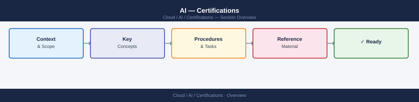

# AI — Certifications

Cloud AI certifications tracker: AWS ML Specialty, Azure AI Engineer, and OpenAI certifications with exam objectives, study resources, and progress notes.

<a class="kb-card" href="platforms/">
  <strong>Platforms</strong>
  Platforms notes, checks, references, and validation.
</a>

<a class="kb-card" href="model-concepts/">
  <strong>Model Concepts</strong>
  Model Concepts notes, checks, references, and validation.
</a>

<a class="kb-card" href="security/">
  <strong>Security</strong>
  Security notes, checks, references, and validation.
</a>

<a class="kb-card" href="practice-notes/">
  <strong>Practice Notes</strong>
  Practice Notes notes, checks, references, and validation.
</a>

<a class="kb-card" href="review-plan/">
  <strong>Review Plan</strong>
  Review Plan notes, checks, references, and validation.
</a>

