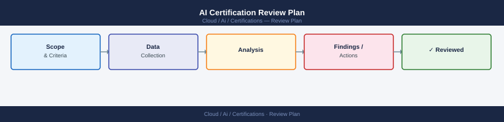

---
tags:
  - certifications
---
# AI Certification Review Plan

AI Certification Review Plan reference covering Target Exams and Timeline, 6-Week Study Schedule Template, Key Study Resources, Practice Exam Links, Weak Area Focus and 1 more sections.

## Target Exams and Timeline

| Exam | Code | Duration | Questions | Passing Score |
|---|---|---|---|---|
| AWS Certified AI Practitioner | AIF-C01 | 90 min | 85 | 700/1000 |
| Google Professional ML Engineer | PMLE | 120 min | 60 | ~70% |
| Azure AI Engineer Associate | AI-102 | 100 min | 40–60 | 700/1000 |
| Hugging Face ML Engineer | HF-MLE | Self-paced | — | — |

## 6-Week Study Schedule Template

| Week | Focus Area | Resources | Goal |
|---|---|---|---|
| Week 1 | ML fundamentals, model types | AWS Skill Builder, fast.ai | Understand supervised/unsupervised/RL |
| Week 2 | Generative AI and LLMs | DeepLearning.AI short courses | Explain transformers, embeddings, RAG |
| Week 3 | AWS AI services | AWS docs, Skill Builder labs | Know Bedrock, SageMaker, Comprehend |
| Week 4 | Responsible AI and governance | AWS whitepapers, NIST AI RMF | Map pillars, identify bias types |
| Week 5 | Security and compliance | AWS Well-Architected for AI | Data privacy, model governance |
| Week 6 | Practice exams and review | Exam-specific practice tests | Score 80%+ on practice exams |

## Key Study Resources

- AWS Skill Builder — AI Practitioner learning plan (free + subscription tiers)
- DeepLearning.AI — "Generative AI for Everyone" (free, Andrew Ng)
- fast.ai — Practical Deep Learning for Coders (free)
- Hugging Face NLP Course — huggingface.co/learn/nlp-course
- AWS Whitepapers: "An Overview of AWS Machine Learning Services", "Responsible AI"
- NIST AI Risk Management Framework (AI RMF 1.0) — nist.gov/artificial-intelligence
- Udemy: Stephane Maarek / A Cloud Guru AI Practitioner courses

## Practice Exam Links

- AWS Official Practice Exam (Exam Prep: AIF-C01) — via AWS Skill Builder
- Tutorials Dojo AIF-C01 practice exams — tutorialsdojo.com
- Whizlabs AWS AI Practitioner — whizlabs.com
- ExamTopics community questions (use with caution — verify answers)

## Weak Area Focus

| Weak Topic | Review Action |
|---|---|
| RAG vs fine-tuning decision | Study the decision tree; practice 10 scenario questions |
| Responsible AI pillars | Memorize 6 pillars with one example each |
| Bedrock service boundaries | Create a service map: Bedrock vs SageMaker vs Comprehend |
| Tokenization and context windows | Do token counting exercises with tiktoken |
| Prompt engineering techniques | Practice zero-shot, few-shot, chain-of-thought examples |

## Study Checklist

- [ ] Register for exam with a target date 6–8 weeks out
- [ ] Complete AWS Skill Builder learning plan for AIF-C01
- [ ] Finish at least one DeepLearning.AI generative AI course
- [ ] Read the AWS Responsible AI whitepaper
- [ ] Complete 3 full practice exam sets, score each
- [ ] Identify bottom 2 domains by score and do targeted review
- [ ] Re-sit practice exam in final week — aim for 80%+
- [ ] Review AWS service limits and pricing models for AI services
