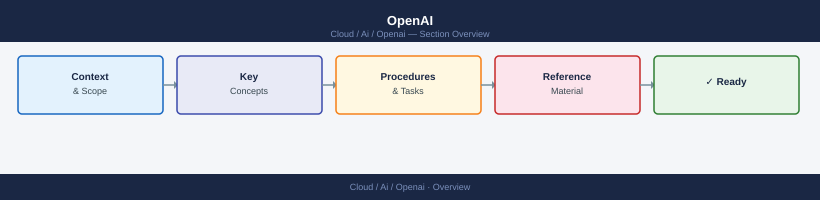

# OpenAI

<div class="kb-summary">
The OpenAI API provides REST access to GPT-4o, embedding, image generation, and transcription models via Bearer token auth. Coverage includes cost control, rate limit tiers (TPM/RPM), API key security, prompt patterns, and automation use cases.

*Applies to: OpenAI API*
</div>



<div class="kb-grid kb-grid-5">

<a class="kb-card" href="api-notes/">
  <strong>API Notes</strong>
  <span>Base URL, auth headers, request structure, response format, error codes, and rate limit behaviour for the OpenAI REST API.</span>
</a>

<a class="kb-card" href="prompt-patterns/">
  <strong>Prompt Patterns</strong>
  <span>System prompt design, few-shot examples, chain-of-thought, function calling schemas, and JSON mode usage patterns.</span>
</a>

<a class="kb-card" href="automation-use-cases/">
  <strong>Automation Use Cases</strong>
  <span>Practical integration patterns: document summarisation, classification pipelines, code generation, and structured data extraction.</span>
</a>

<a class="kb-card" href="security-review/">
  <strong>Security Review</strong>
  <span>API key rotation, org-level spend limits, prompt injection risks, data residency considerations, and key storage best practices.</span>
</a>

<a class="kb-card" href="troubleshooting/">
  <strong>Troubleshooting</strong>
  <span>Rate limit errors (429), context length exceeded, invalid API key (401), timeout handling, and token estimation with tiktoken.</span>
</a>

</div>

```d2
direction: right

center: "OpenAI API" {shape: hexagon}
quick_reference: "Quick Reference" {shape: rectangle}
common_operations: "Common Operations" {shape: rectangle}
key_considerations: "Key Considerations" {shape: rectangle}

center -> quick_reference
center -> common_operations
center -> key_considerations
```

## Quick Reference

### Model Catalog

| Model | Type | Context | Best For |
|---|---|---|---|
| `gpt-4o` | Chat / multimodal | 128k tokens | Best reasoning, vision, tool use |
| `gpt-4o-mini` | Chat | 128k tokens | Cost-efficient tasks, high volume |
| `gpt-3.5-turbo` | Chat | 16k tokens | Legacy; prefer gpt-4o-mini for new work |
| `text-embedding-3-large` | Embedding | 8191 tokens | RAG, semantic search, clustering |
| `text-embedding-3-small` | Embedding | 8191 tokens | Lightweight embeddings, lower cost |
| `dall-e-3` | Image generation | — | High-quality image synthesis |
| `whisper-1` | Audio transcription | — | Speech-to-text, multilingual |

### API Endpoints

| Endpoint | Method | Purpose |
|---|---|---|
| `/v1/chat/completions` | POST | Chat completions (GPT-4o, GPT-3.5) |
| `/v1/embeddings` | POST | Generate vector embeddings |
| `/v1/images/generations` | POST | DALL-E image generation |
| `/v1/audio/transcriptions` | POST | Whisper transcription |
| `/v1/models` | GET | List available models |

## Common Operations

```bash
# Set API key in environment
export OPENAI_API_KEY="sk-..."

# Basic chat completion
curl https://api.openai.com/v1/chat/completions \
  -H "Authorization: Bearer $OPENAI_API_KEY" \
  -H "Content-Type: application/json" \
  -d '{
    "model": "gpt-4o",
    "messages": [{"role": "user", "content": "Summarise this text: ..."}]
  }'

# Streaming response
curl https://api.openai.com/v1/chat/completions \
  -H "Authorization: Bearer $OPENAI_API_KEY" \
  -H "Content-Type: application/json" \
  -d '{"model": "gpt-4o", "messages": [...], "stream": true}'

# Generate embedding
curl https://api.openai.com/v1/embeddings \
  -H "Authorization: Bearer $OPENAI_API_KEY" \
  -H "Content-Type: application/json" \
  -d '{"model": "text-embedding-3-large", "input": "your text here"}'
```

```python
from openai import OpenAI
import tiktoken

client = OpenAI()  # reads OPENAI_API_KEY from env

# Chat completion
response = client.chat.completions.create(
    model="gpt-4o",
    messages=[
        {"role": "system", "content": "You are a helpful assistant."},
        {"role": "user", "content": "Explain VLAN tagging."}
    ]
)
print(response.choices[0].message.content)

# Estimate token count before sending
enc = tiktoken.encoding_for_model("gpt-4o")
tokens = enc.encode("your prompt text")
print(f"Token count: {len(tokens)}")

# Function calling
tools = [{
    "type": "function",
    "function": {
        "name": "get_server_status",
        "description": "Returns current CPU and memory for a host",
        "parameters": {
            "type": "object",
            "properties": {"hostname": {"type": "string"}},
            "required": ["hostname"]
        }
    }
}]
response = client.chat.completions.create(
    model="gpt-4o", messages=[...], tools=tools
)
```

## Key Considerations

- **Cost:** Output tokens are priced at roughly 2-3x input tokens. Use `tiktoken` to estimate costs before running batch jobs. Set org-level spend limits in the OpenAI dashboard as a hard safety net.
- **Rate limits:** Limits are per organisation and per tier (Tier 1-5) — measured in RPM (requests per minute) and TPM (tokens per minute). Implement exponential backoff on 429 responses.
- **Model selection:** Prefer `gpt-4o-mini` for high-volume or low-complexity tasks; reserve `gpt-4o` for tasks requiring strong reasoning or vision. Avoid `gpt-3.5-turbo` for new integrations.
- **Security:** Never log full request/response bodies that contain API keys or sensitive user data. Store keys in a secrets manager (Vault, AWS Secrets Manager) — never in source control. Prefer server-side key usage over client-side exposure.
- **Context window:** At 128k tokens, large context is available but not free — long contexts increase latency and cost. Chunk documents and use embeddings + RAG instead of stuffing entire documents into the prompt.
- **Data privacy:** By default, data sent to the OpenAI API may be used for model improvement. Use the Zero Data Retention (ZDR) API endpoint or enterprise tier if data residency or privacy requirements apply.
