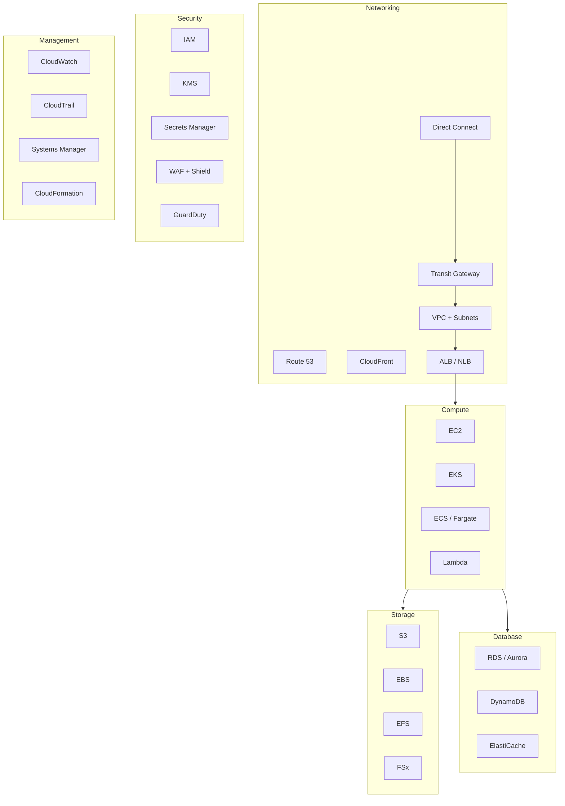

# AWS — Architecture Components

Core AWS service categories and platform capabilities used in this environment.

## Service Map

## Networking

| Service | Purpose | Key config |
|---|---|---|
| **VPC** | Isolated virtual network — all resources live inside a VPC | CIDR, public/private subnets, route tables, NACLs |
| **Transit Gateway** | Hub connecting multiple VPCs and on-prem via a single gateway | TGW attachments, route domains |
| **Direct Connect** | Dedicated private circuit from on-prem to AWS | VIFs (private/public), BGP, Direct Connect Gateway |
| **Route 53** | DNS — public/private hosted zones, health checks, traffic routing | Alias records, resolver endpoints for hybrid DNS |
| **ALB / NLB** | Layer 7 / Layer 4 load balancing | Target groups, listener rules, health checks, WAF attachment |
| **CloudFront** | CDN for static content and API acceleration | Distributions, origins, cache behaviours, OAC |
| **Security Groups** | Stateful instance-level firewall | Inbound/outbound rules by port, protocol, CIDR or SG reference |
| **NACLs** | Stateless subnet-level ACLs (fallback) | Applied at subnet; allow/deny by rule number |

## Compute

| Service | Purpose | Notes |
|---|---|---|
| **EC2** | Virtual machines | Instance types, placement groups, Reserved vs On-Demand vs Spot |
| **Auto Scaling Groups** | Horizontal scaling of EC2 fleets | Launch templates, scaling policies (target tracking, step) |
| **EKS** | Managed Kubernetes | Node groups vs Fargate profiles, OIDC for IRSA |
| **ECS / Fargate** | Container orchestration — serverless option available | Task definitions, services, capacity providers |
| **Lambda** | Serverless functions — event-driven | 15-min max, memory 128MB–10GB, X-Ray tracing |

## Storage

| Service | Purpose | Notes |
|---|---|---|
| **S3** | Object storage | Bucket policies, versioning, lifecycle rules, replication |
| **EBS** | Block storage for EC2 | gp3 default; io2/io2 Block Express for high IOPS; snapshots |
| **EFS** | Shared NFS — multi-AZ | General Purpose vs Max I/O, Bursting vs Provisioned throughput |
| **FSx for Windows** | Managed Windows file server (SMB) | Active Directory integration, DFS replication |
| **FSx for ONTAP** | Managed NetApp ONTAP | Multi-protocol, SnapMirror, tiering to S3 |

## Database

| Service | Purpose | Notes |
|---|---|---|
| **RDS** | Managed relational DB — MySQL, PostgreSQL, SQL Server, Oracle | Multi-AZ deployments, read replicas, automated backups |
| **Aurora** | MySQL/PostgreSQL-compatible — higher throughput | Aurora Serverless v2 for variable workloads |
| **DynamoDB** | Managed NoSQL key-value + document | On-demand vs provisioned capacity, DAX cache, global tables |
| **ElastiCache** | In-memory cache — Redis or Memcached | Redis Cluster mode, auth tokens, encryption in transit |

## Security

| Service | Purpose | Notes |
|---|---|---|
| **IAM** | Identity and access management | Roles, policies, permission boundaries, OIDC federation |
| **KMS** | Key management — encryption at rest | CMK vs AWS-managed keys; key policies; key rotation |
| **Secrets Manager** | Secret rotation and storage | Auto-rotation for RDS; cross-account access via resource policy |
| **WAF** | Web Application Firewall | Rule groups, managed rule sets (AWS Managed Rules + OWASP core) |
| **Shield** | DDoS protection | Shield Standard (free); Shield Advanced for L3/L4/L7 |
| **GuardDuty** | Threat detection — VPC flow logs, DNS, CloudTrail | Findings → EventBridge → SNS/Lambda response |
| **Security Hub** | Aggregated findings across accounts | CIS Benchmark, AWS Foundational Security Standard |

## Management and Observability

| Service | Purpose | Notes |
|---|---|---|
| **CloudWatch** | Metrics, logs, alarms | Log groups, metric filters, composite alarms, dashboards |
| **CloudTrail** | API audit log | Multi-region trail to S3; CloudWatch Logs integration |
| **AWS Config** | Resource configuration history and compliance | Config rules, conformance packs, remediation actions |
| **Systems Manager** | Fleet management without bastion hosts | Session Manager, Patch Manager, Parameter Store, Run Command |
| **CloudFormation** | Infrastructure as code | Stacks, nested stacks, change sets, drift detection |
| **Trusted Advisor** | Cost, security, and performance recommendations | Business/Enterprise support required for full checks |

## Common Port and Protocol Reference

| Service | Protocol | Port | Direction |
|---|---|---|---|
| EC2 SSH | TCP | 22 | Inbound (restrict to management CIDR or SSM) |
| RDS PostgreSQL | TCP | 5432 | Inbound from app SG only |
| RDS MySQL | TCP | 3306 | Inbound from app SG only |
| ElastiCache Redis | TCP | 6379 | Inbound from app SG only |
| ALB HTTPS | TCP | 443 | Inbound from 0.0.0.0/0 or CloudFront prefix list |
| ALB HTTP redirect | TCP | 80 | Inbound — redirect to 443 |
| EFS NFS | TCP | 2049 | Inbound from compute SG within VPC |
